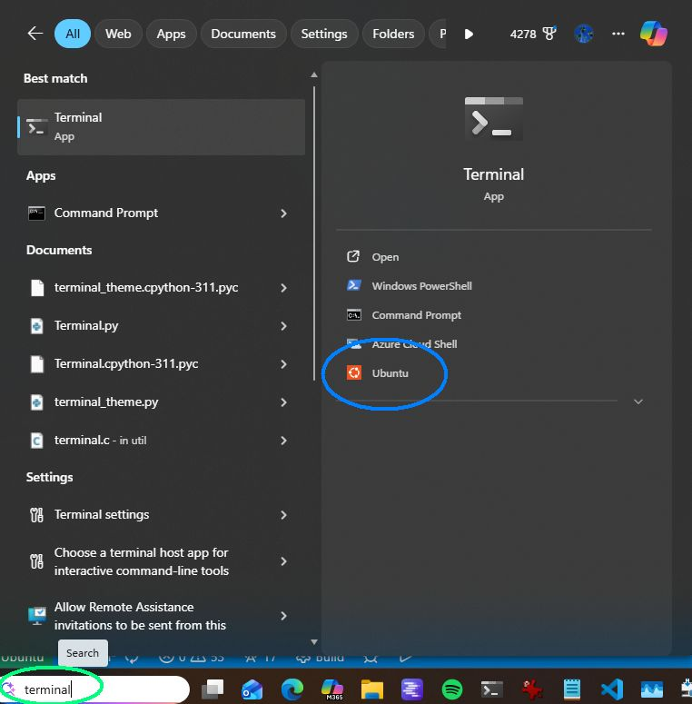
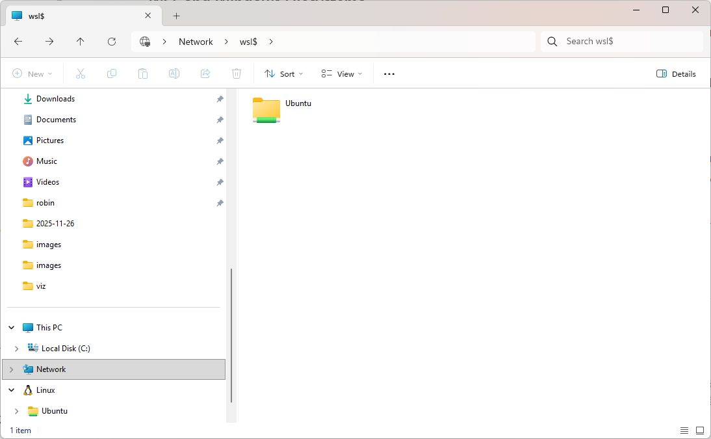
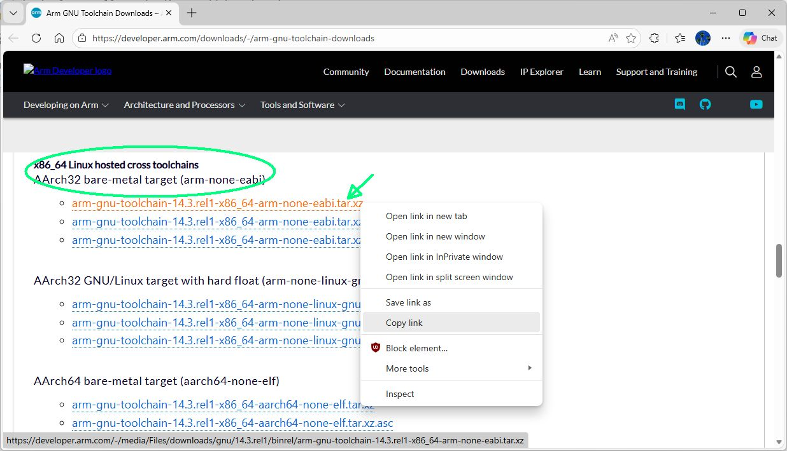
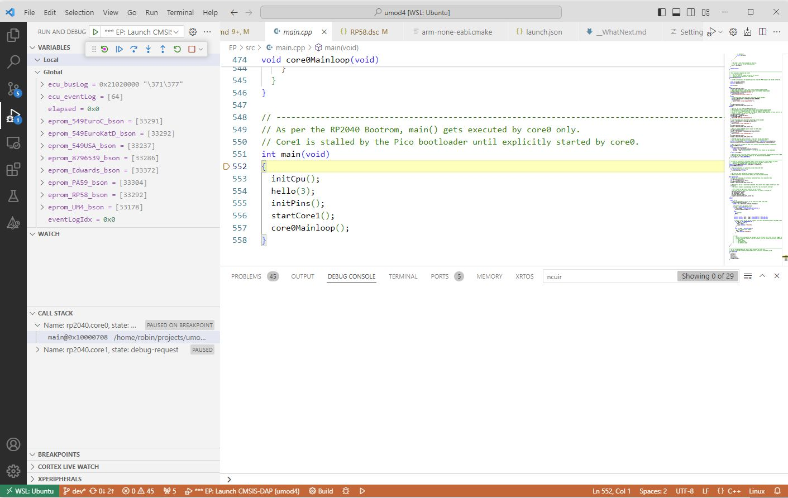

# Umod4 Project

This document explains how to set up a machine so that it can build the umod4 project.

To set expectations: if you are a Gen1 Aprilia enthusiast more than a software person, be warned that this project is not trivial.
It is significantly more complicated than loading an Arduino sketch and going riding!
To get the project working requires building tools and executables for four separate processors:

1) 68HC11 assembly code for ECU firmware
1) C, C++ and assembly language for ARM Cortex M0+ for the WP processor (RP2040), and ARM Cortex M33 for the EP processor (RP2350).
1) various C, C++, and Python tools that will run on the development host (an x86 PC or ARM Raspberry Pi)

## Development System Overview

Linux is required to build this project.
The development system to be created has been tested on three different OS/machine combinations:

1) an x86-64 Windows machine running Ubuntu via Windows Subsystem for Linux (WSL2)
1) an x86-64 machine running Linux Mint 22
1) a ARM-based Raspberry Pi 5 running Raspberry Pi OS, its own flavor of Linux

Once the tools are installed, all project development will occur directly within the VS Code Integrated Development Environment (IDE): editing, building, flashing, and debugging of the hardware.
VS Code is available for x86 and ARM, and runs under Windows WSL2 as well as other linux distros.
It might be possible to use an IDE other than VS Code, but you are on your own if you do.
Part of that is because certain aspects of the build/run/debug process are baked into VS Code setup files and extensions.
If you _really_ want to use a different IDE, then I will assume that you are capable of figuring out what you need to do based on the VS Code instructions that follow.

## Prep The Development System

The list of the high-level steps to get a build system working on Windows is shown below.
It's a long list, but it's not overly difficult, and it only needs to happen once.

The instructions assume that you will be using a Window machine and running WSL2 linux under Windows.
If you choose to build the system on a pure Linux machine instead of Windows/WSL2, then you probably already know what you are doing and can figure out what you should be doing based on these instructions.

* [Install WSL2](#install-wsl2)
  * WSL2 Ubuntu Linux
* [Windows Terminal App](#windows-terminal-app)
* [Install VS Code](#vs-code)
  * Install a bunch of VS Code extensions
* [Install Linux software](#linuxwsl2-software-installation)
  * [Host Tools](#install-linux-host-tools)
  * [Build a 68HC11 toolchain](#build-68hc11-toolchain) from source (requited to create Aprilia ECU software)
  * [Download ARM Tools](#downloading-arm-tools-for-x86-pc)
  * [OpenOCD](#install-openocd), Interfaces GDB to on-chip debugging silicon
* [Prepare a 'projects' directory in Linux](#project-development-setup)
  * Install Pi Pico software
    * [Raspberry Pi Pico-SDK](#rpi-sdk)
    * [Picotool](#picotool)
  * [Install this project from github](#getting-the-umod4-source-code)

Once all the software is successfully installed, you will be able to use VS Code to:

* Configure the project build
* Build the project software
* Use a hardware debugger to flash the code onto a umod4 circuit board

The following sections detail how to do the items listed, above.

## Install WSL2

WSL (Windows Subsystem for Linux) runs a virtualized linux kernel inside Windows.
If you haven't used WSL2 before, it's a real linux kernel running in a Windows virtual environment.
There is no need to do things like dual-boot Windows/Linux or anything like that: Windows and WSL2 run simultaneously, side-by-side.

The WSL2 installation process is defined [here](https://learn.microsoft.com/en-us/windows/wsl/install).
Follow those instructions and all will be well.
But here is the short version. In the standard windows search box, type 'powershell'. Select the option to "run as administrator".
 When the window opens, type the following commands:

```bash
wsl --install
wsl --install -d Ubuntu
```

The first install installs WSL2 itself.
The second install installs a generic Ubuntu distro.

There are other distro choices, but the instructions that follow might have some very minor dependencies on you installing Ubuntu. To see the other choices available directly from Microsoft sources, type:

```bash
wsl --list --online
```

## Windows Terminal App

Once WSL2/Ubuntu has been installed, go to the Microsoft store and download the "[Windows Terminal](https://apps.microsoft.com/detail/9n0dx20hk701?hl=en-us&gl=US)" free app.
Terminal works great for interacting with WSL2.
It supports multiple terminal windows using a tabbed interface which is nice.

**Note:** From this point on, any of the instructions in this document that are executed from a Linux command line will be using a Windows Terminal window that is running Ubuntu/WSL.

* Open the terminal app by typing 'terminal' into the Windows search box.
* On the title bar, click the small down-arrow to get a bunch of options.
* Find the 'settings' option and click it.
* At the bottom left of the settings screen, you will see "Add New Profile".
Click that.
* Add a new empty profile.
Give it a name, like 'wsl-Ubuntu'.
* Change the 'command line' option to be '%SystemRoot%\System32\wsl.exe -d Ubuntu'.
* In the Starting Directory option, uncheck the 'Use Parent Process Directory' option.
* Enter '~' as the starting directory.
* Click 'save'

There are other options you can play with (like fonts and colors), but those mentioned above are the required options to be changed.

If you click the same little down arrow on the title bar now, you will see a new entry with the name you entered earlier: 'wsl-Ubuntu'.
Click the 'wsl-ubuntu' selection.

The linux boot will takes a few seconds the very first time that it runs.
You will be asked for a user name and password for your initial Ubuntu user account.
You can use the same user name as your windows account, or create a different user name.
The new user name is used by linux only.
The new user name will automatically be given 'sudo' privileges.

From this point on, when you type 'terminal' in the windows search box, you will have the option to directly select your new Ubuntu distro:



Use a terminal window to get your new WSL2 Linux system.
Get the system software up to date by typing:

```bash
sudo apt update
sudo apt upgrade
```

The first time around, these commands may install a bunch of updates.
You should run this command pair once in a while to keep your Linux distro up-to-date for application updates and security patches.

### WSL and Windows Filesystems

Both WSL and Windows run simultaneously, but each has its own separate filesystem.
Even so, WSL2 arranges for the two filesystems get cross-mounted so that each one is accessable from the other.

From Windows, the root of all the distros that may be installed is located at '\\wsl$' or \\wsl.localhost'. Appending the distro name takes you to the root of that distro's filesystem, as shown below:



Going the other way is just as easy.
In Ubuntu, each Windows drive letter automatically gets mounted under '/mnt'.
Doing an 'ls -l /mnt/c' in a linux terminal window will show you the contents of your top-level directory on Windows drive 'C:'.

Linux commands like 'cp' or 'mv' operate seamlessly on both filesystems.
If you are a linux person, it's nice to be able to use linux commands like 'find' and 'grep' on the directories inside your Windows machine.

## Windows Software Installation

There are a few programs that need to be installed on the development host.

### VS Code

VS Code is a software IDE (Integrated Development Environment) that runs in Windows.
Basically, it is an extremely powerful text editor, with all kinds of additions to help you develop writing code.
One feature of VS Code is that it can edit from remote sources.
If VS Code is running on a Windows machine, as a Windows executable, it will seamlessly connect to the 'remote' WSL2 linux environment on the same machine to allow you to edit the project files in the linux filesystem.

Official Microsoft installation instructions are located [here](https://code.visualstudio.com/docs/setup/windows).
If that link goes dead, just google 'installing VS Code', and find a Microsoft link that tells you how to do it.

If you are developing strictly on a linux machine, VS Code can be installed as a native linux app using .deb or .rpm mechanisms.
Google for the VS Code linux download page and there will be instructions.

Once you have VS Code installed, you need to add a bunch of extensions, as described in the next section.

#### VS Code Extensions

One of VS Code's best features is that it is amazingly extensible.
People all over the world write useful "extensions" that add new features to the editor.
This project needs a bunch of extensions to be installed.
To install the extensions:

* Start VS Code, but don't open any files or directories just yet.
* Click the 'extensions' icon on the left side ribbon (icon looks like 3 boxes with a 4th box floating above the 3 boxes)
* A search box will open saying 'Search Extensions in Marketplace'

Search for each of the extensions listed below and install each one in turn when given the chance:

* C/C++ (by Microsoft)
* C/C++ Extension pack (by Microsoft)
* Cortex-debug
* MemoryView
* RTOS Views
* Markdown Preview Github Styling
* markdownlint
* Python (by Microsoft)

The C/C++ Extension Pack should install a couple of other extensions, namely: CMake, CMake Tools, and Themes.

Note that these extensions run as windows apps on Windows versions of VS Code and as linux apps on either linux versions of VS Code, or Windows versions of VS Code that are using a remote connection to a linux machine.
What this means is that you might need to install linux versions of these extensions later, if you use Windows in its remote editor mode.
VS Code will let you know if you need to install the linux versions later.

## Linux/WSL2 Software Installation

Before starting the installation process for all of the Linux software, make sure your linux machine (virtual or otherwise!) is up to date. Use a terminal window talking to your linux machine:

```bash
sudo apt update
sudo apt upgrade
```

## Create a 'projects' Directory

A lot of the software we will be installing needs to be installed in a fashion that certain parts can find other parts.
To that end, we will be putting everything inside a directory called 'projects' located inside your home directory.
Create that directory now:

```bash
mkdir ~/projects
```

## Create a Local Bin Directory

This project creates a few special executables to help build the software.
Rather than put these tools in the standard system-wide installation locations,
the build system will place them in a user-specific "~/.local/bin directory".

If that directory does not exist, use your terminal window to create it via the following:

```bash
mkdir -p ~/.local/bin
```

The standard Ubuntu "\~/.profile" you got with your fresh distro will automatically add your new "\~/.local/bin" directory to the PATH variable.
You will either need to close your terminal window and open a new one, or you can just re-run your .profile via:

```bash
. ~/.profile
```

Check your PATH to verify that "~/.local/bin" directory is on it now:

```bash
echo $PATH|tr ':' '\n'|grep '[.]local'
/home/<your-user-name>/.local/bin
```

If your .profile is not adding "\~/.local/bin" to your path, edit your '\~/.profile' to add the following lines:

```bash
# set PATH so it includes user's private bin if it exists
if [ -d "$HOME/.local/bin" ] ; then
    PATH="$HOME/.local/bin:$PATH"
fi
```

Log out and log in again (or type 'source ~/.profile'), and verify that '~/.local.bin' is on your PATH.

### Install Linux Host Tools

A number of tools that need to run on the host machine need to be installed.
It is possible that they are already installed in the fresh WSL distro, but it is harmless to ask to reinstall them.
Install them as below:

```bash
sudo apt install gcc g++ git unzip cmake ninja-build libncurses5-dev libncursesw5-dev
```

The gcc and g++ compilers installed above generate code for your Linux host machine, not the ARM chips on the Pico boards. The Pico SDK expects to find the host g++ compiler using an environment variable called 'CXX'.
Run the following command to add the appropriate CXX definition to your .bashrc file:

```bash
echo "export CXX=/usr/bin/g++" >> ~/.bashrc
```

Remember to re-run your .bashrc so that the change you just made takes effect:

```bash
. ~/.bashrc
```

#### Python

The umod4 system uses Python3 for some utility programs.
Python3 is typically part of Linux distributions, so you probably do not need to install it.
The umod4 project does require using Python virtual enviroments so that it can install various libraries as the build process runs.
To add that capablility, find out what version of python3 is on your system, then do the following, making sure that the version number for the install matches the first two numbers reported by the --version command ("3.10" in the example, below):

```bash
$ python3 --version
Python 3.10.12
$ sudo apt install python3.10-venv
```

#### Git and Line Endings

We need to make a small configuration change to the git program installed in the previous step.
The project's Git repository always has Unix-style LF line endings.
Configuring the git setting 'core.autocrlf' to 'false' tells Git to _not_ change files to use CRLF-style endings when it checks stuff out onto a Windows machine.
VS Code on Windows operates just fine on LF-style endings so there is no need to add CR characters just because it is a Windows machine.

To avoid the whole CR mess when working with Windows, type the following in your WSL2 terminal window:

```bash
git config --global core.autocrlf false
```

### Build 68HC11 Toolchain

The Gen 1 ECU's processor is a Motorola M68HC11.
The C compiler for the HC11 has not been supported since GCC version 3.4.6, back in the early 2000's.
Fortunately, for the purposes of the building the UM4 software, we don't need a full 68HC11 C compiler, we only need an assembler.
And amazingly enough, a modern GCC 'binutils' package still contains everything we need to target the ECU's 68HC11:

* a 68HC11 assembler
* a linker
* an objcopy utility

The only downside is that a 68HC11 version of the binutils is not something that can just be installed via 'apt', but will need to be built from source code.
Fortunately, this is quite easy:

1) Go to the [GNU Binutils](https://www.gnu.org/software/binutils/) page
2) Find out what the latest version of the binutils is (2.42 at the time this page was written)

Run the commands below, replacing version "2.42" with whatever version you are using.
Or if you are lazy, just copy the commands below to install version 2.42, which is known to work fine.
The commands assume that you would like to put your binutils source in a directory called ~/binutils/binutils-2.42.
This naming convention allows you to support multiple versions of the binutils, should that be useful.

```bash
sudo apt install texinfo
cd ~
mkdir binutils
cd binutils
wget https://ftp.gnu.org/gnu/binutils/binutils-2.42.tar.gz
tar zxvf binutils-2.42.tar.gz
mv binutils-2.42 binutils-m68hc11-elf-2.42
cd binutils-m68hc11-elf-2.42
./configure --prefix=$HOME/.local --target=m68hc11-elf
make
```

The 'make' operation will take a couple minutes.
Assuming that 'make' completed without errors, install the tools and then make sure they ended up in the right place.
You should see a whole bunch of new executable files all relating to the m68hc11 processor:

```bash
$ make install
$ ls -l ~/.local/bin
total 86244
-rwxr-xr-x 1 robin robin 4964128 Aug  7 07:09 m68hc11-elf-addr2line
-rwxr-xr-x 2 robin robin 5150512 Aug  7 07:09 m68hc11-elf-ar
-rwxr-xr-x 2 robin robin 6816200 Aug  7 07:09 m68hc11-elf-as
-rwxr-xr-x 1 robin robin 4911176 Aug  7 07:09 m68hc11-elf-c++filt
-rwxr-xr-x 1 robin robin  125992 Aug  7 07:09 m68hc11-elf-elfedit
-rwxr-xr-x 1 robin robin 5556088 Aug  7 07:09 m68hc11-elf-gprof
-rwxr-xr-x 4 robin robin 8066152 Aug  7 07:09 m68hc11-elf-ld
-rwxr-xr-x 4 robin robin 8066152 Aug  7 07:09 m68hc11-elf-ld.bfd
-rwxr-xr-x 2 robin robin 5030672 Aug  7 07:09 m68hc11-elf-nm
-rwxr-xr-x 2 robin robin 5792040 Aug  7 07:09 m68hc11-elf-objcopy
-rwxr-xr-x 2 robin robin 8331408 Aug  7 07:09 m68hc11-elf-objdump
-rwxr-xr-x 2 robin robin 5150544 Aug  7 07:09 m68hc11-elf-ranlib
-rwxr-xr-x 2 robin robin 4325152 Aug  7 07:09 m68hc11-elf-readelf
-rwxr-xr-x 1 robin robin 4954320 Aug  7 07:09 m68hc11-elf-size
-rwxr-xr-x 1 robin robin 4966904 Aug  7 07:09 m68hc11-elf-strings
-rwxr-xr-x 2 robin robin 5792040 Aug  7 07:09 m68hc11-elf-strip
```

Finally, do a trivial test of the assembler by typing the commands, below.

```bash
$ cd ~
$ m68hc11-elf-as --version
GNU assembler (GNU Binutils) 2.42
Copyright (C) 2024 Free Software Foundation, Inc.
This program is free software; you may redistribute it under the terms of
the GNU General Public License version 3 or later.
This program has absolutely no warranty.
This assembler was configured for a target of `m68hc11-elf'.
```

The important part is that the new assembler knows it has been configured to target "m68hc11-elf", which represents the processor inside the ECU.
If the system was not able to find the m68hc11-elf-as executable, make sure that "~/.local/bin" is on your PATH, as described earlier in this document.

### Install ARM Cross-Compiler Toolchain

ARM cross compilers are required to build code for the ARM processors used by this project.
A cross-compiler runs on a particular machine architecture (like x86), but produces code for a different machine architecture (ARM, in this case).
We will set things up so that your PC can have access to multiple versions of the ARM cross compiler toolchain.

#### Preparing a Tools Directory

We need to prepare a place for the cross-compilation tools to live.
There are many ways to do that, but the project files are set up to expect the tools to end up in a particular hierarchy, as shown below:

```text
/opt
└── arm
    └── arm-none-eabi
        └── 14.2.rel1

```

Subsequent versions like some hypothetical xx.y version would be downloaded into the same arm-none-eabi directory.
All the installed versions would live side-by-side, as shown:

```text
/opt
└── arm
    └── arm-none-eabi
        ├── 14.2.rel1
        └── xx.y.rel1
```

To set this up, (and assuming that the version you downloaded was named 14.2.rel1), type the following to create the basic directory structure:

```bash
sudo mkdir -p /opt/arm/arm-none-eabi/14.2.rel1
```

You will be able switch over to the new tools or switch back to the old ones by just changing an appropriate CMake toolchain file to point at the proper directory.
This really helps keeping old projects alive when some new release breaks compatibilty with your old project: the old project can just continue to use the old tools.

Now that the toolchain has a place to live, it's time to get it, then install it.

#### Downloading ARM Tools For x86 PC

To get the Arm cross-compiler software installed, start off by downloading an appropriate toolchain from the Arm download page located [here](https://developer.arm.com/downloads/-/arm-gnu-toolchain-downloads).
Click that link to view the download page.
Assuming that your PC host is an x86 machine capable of running linux/WSL2, scroll down until you see the section called:

```x86_64 Linux hosted cross toolchains```

Inside that section, you will see a heading:

```AArch32 bare-metal target (arm-none-eabi)```

What you are looking for is:

```arm-gnu-toolchain-14.2.rel1-x86_64-arm-none-eabi.tar.xz```

Pictorially, you are looking for this entry on the webpage:



The version number in the example (14.2.rel1) may have changed since this document was last updated, so just locate the most recent version, whatever it is.
Don't download the file though, just right click the link and select "copy link", then skip to [Downloading & Installing](#downloading--installing)

#### Tools For ARM Raspberry Pi 5

If you are developing on a Pi 5, scroll down the ARM download page until you see the section titled 'AArch64 Linux hosted cross toolchains'. You want the version 'AArch32 bare-metal target (arm-none-eabi)', downloaded via the file 'arm-gnu-toolchain-14.2.rel1-aarch64-arm-none-eabi.tar.xz'. As with the x86 instructions, don't actually download the file, but right-click the link and select 'copy link'.

#### Downloading & Installing

Assuming that the link to the toolchain on the ARM download website is still in your copy buffer, you can paste it onto your command line after typing the 'wget' command to avoid a bunch of typing in the example below.
Make sure you are in the proper directory before downloading the code, then get it using 'wget':

```bash
cd /opt/arm/arm-none-eabi/14.2.rel1
sudo wget https://developer.arm.com/-/media/Files/downloads/gnu/14.2.rel1/binrel/arm-gnu-toolchain-14.2.rel1-x86_64-arm-none-eabi.tar.xz
```

The version number in the example above may not match what you downloaded.
Regardless, if you downloaded some version, you should have a very large archive file in your 14.2.rel1 (or equivalent) directory:

```bash
$ ls -l
-rw-r--r-- 1 root root 149739784 Dec  6 06:07 arm-gnu-toolchain-14.2.rel1-x86_64-arm-none-eabi.tar.xz
```

Next up is to extract the files from the archive that was downloaded.
One problem (at least, for me) is that every single file in the entire archive is prepended with an annoyingly long initial directory name: "arm-gnu-toolchain-*.*Rel*-x86_64-arm-none-eabi", where the '*' characters represent specific version numbers.

It might be useful if a system needed to install cross compilers for every single Arm architecture, but this project doesn't need that level of complexity.
To get rid of that long pathname, extract files in the archive using the following command:

```bash
# assuming you are still in /opt/arm/arm-none-eabi/14.2.rel1 from the previous download step:
sudo tar xf ./arm-gnu-toolchain-14.2.rel1-x86_64-arm-none-eabi.tar.xz --strip-components 1
```

Once tar completes, the cross-compilation executable tools will be located at /opt/arm/arm-none-eabi/14.2.rel1/bin.
Verify that the new tools are functioning by running gcc directly from its bin directory:

```bash
$ ./bin/arm-none-eabi-gcc --version
arm-none-eabi-gcc (Arm GNU Toolchain 14.2.Rel1 (Build arm-14.52)) 14.2.1 20241119
Copyright (C) 2024 Free Software Foundation, Inc.
```

Do __not__ add the cross-compiler's bin directory to your PATH variable.
We will be using CMake's 'toolchain' mechanism to tell the build system how to find the ARM tools so they do not need to go on your PATH.

Verify that GDB runs, too:

```bash
$ ./bin/arm-none-eabi-gdb --version
GNU gdb (Arm GNU Toolchain 14.2.Rel1 (Build arm-14.52)) 15.2.90.20241130-git
Copyright (C) 2024 Free Software Foundation, Inc.
```

#### Updates When Installing a New Version of ARM tools

_This section only applies if you install a new version of the ARM tools, or if you ever need to update a project to use different tools._

The project will contain a toolchain file, which explains where to find the ARM toolchain you just installed.
For the project we will be installing later, the toolchain file will be located at 'cmake/toolchains/arm-none-eabi.cmake'.
If you were to install new ARM tools, you could change your toolchain file to use them by editing the 'arm-none-eabi.cmake' file to point at the new tools.

If the version number of the tools has changed for you, edit the toolchain file to reflect your new version number and save it.

### Install OpenOCD

_At some point, the RP2xxx support will exist in the Ubuntu distribution and installing OpenOCD will be as simple as "sudo apt install openocd".
But for now, it needs to be built from source, as described in this next section._

OpenOCD is the "Open On-Chip Debugger" software tool.
GDB uses OpenOCD to talk to the silicon debug unit inside the chip being debugged.
OpenOCD has been around forever, but it needs to run a special version for the Pi Pico boards because the RP2xxx processors on those boards are dual core.

Install source code for OpenOCD, making sure to get the sources from raspberrypi where the RP2xxx support is located:

```bash
cd ~/projects
git clone https://github.com/raspberrypi/openocd.git
git submodule init
git submodule update
```

You will need to install a bunch of packages for building OpenOCD:

```bash
sudo apt install libusb-1.0-0 libusb-1.0-0-dev libhidapi-dev libtool texinfo pkg-config make
```

Finally, build OpenOCD:

```bash
cd ~/projects/openocd
./bootstrap
./configure --enable-ftdi --enable-sysfsgpio --enable-bcm2835gpio --enable-cmsis-dap --enable-internal-jimtcl
make
sudo make install
openocd --version
```

The fun never ends with openocd though.
We need to give ourselves permission to access the USB debug probe so that we don't have to use sudo all the time.
For that, we create another rules file as follows:

```bash
sudo sh -c 'printf "# Pi Pico CMSIS-DAP USB debug probe\nATTRS{idProduct}==\"000c\", ATTRS{idVendor}==\"2e8a\", MODE=\"666\", GROUP=\"plugdev\"\n" >> /etc/udev/rules.d/46-probe.rules'
```

Finally, we trigger reloading the new rules file we just created:

```bash
sudo udevadm control --reload
sudo udevadm trigger
```

From now on, the rules will be reapplied every time WSL starts.

## Project Development Setup

The next step is to start filling out the project directory structure.
There is a fair amount of software source that needs to be installed, and a some of it needs to know where other parts of it are located.
By installing things as decribed in the sections that follows, the various bits of the system will be able to find each other.

### Development Directory Structure

The main part of the project directory involves the Pico SDK (Software Development Kit) is quite large, at over 600 megabytes.
The SDK could be installed by cmake as sub-piece of each of your Pico projects, but replicating the entire SDK for every project in your sytem that might need it is a giant waste of disk storage.
Instead, we will set things up so that all projects will share a single SDK installation.
We do this by storing the SDK at a well-known location in the 'projects' directory.
We then tell the individual Pico development projects where to find it.
This also allows us to store multiple versions of the SDK, enabling old projects to use old SDK versions without forcing them to uipgrade.

Pictorially, we want to end up with a directory structure that has this general form:

```text
/home/<your-user-name>/
└── projects/
    ├── openocd       (a special version for debugging RP2xxx chips)
    ├── pico-examples (sample code for SDK applications)
    ├── pico-sdk      (may contain multiple versions of the SDK over time)
    │   ├── 1.5.1     (predates the Pico/RP2040 only)
    │   ├── 2.0.0     (first version that supports Pico and Pico2)
    │   └── 2.1.1     (the most version, at time of writing)
    └── umod4         (where our umod4 sosftware project gets stored)
```

### RPi SDK

The Raspberry Pi Software Development Kit (SDK) is a collection of software tools and code libraries that make it easier to work with the RP2xxx processor chips.

The SDK can be installed in a number of fashions.
For various reasons, we will install it using Git.

First, we create the top-level directory inside the projects directory that will contain all the SDK versions:

```bash
cd ~/projects
mkdir pico-sdk
cd pico-sdk
```

Next, we clone the 'master' branch of the pico-sdk into the new directory:

```bash
git clone https://github.com/raspberrypi/pico-sdk
```

Rename pico-sdk to reflect the SDK branch that we will be checking out:

```bash
mv pico-sdk 2.1.1
```

Now we tell git that we actually want to lock this cloned branch to the "2.1.1" tag on the master branch:

```bash
cd 2.1.1
git checkout 2.1.1
```

Our new branch tag now matches its directory name.
As always, update the new branch so that it can do WiFi and Bluetooth for Pico[2]-W:

```bash
git submodule update --init
```

Now, we make FreeRTOS for the Pico family available to any project using this version of the SDK:

```bash
git submodule add https://github.com/FreeRTOS/FreeRTOS-Kernel
cd FreeRTOS-Kernel
git submodule update --init
```

Finally, we need to create an environment variable used by various parts of the build system to explain where to find the version of SDK they should be using:

```bash
echo "export PICO_SDK_PATH=/home/$(id -u -n)/projects/pico-sdk/2.1.1" >> ~/.bashrc
```

Either close the terminal and reopen it, or execute ". ~/.bashrc" to make sure that the variable is defined in your current shell.

## Picotool

Picotool is a tool used by the SDK to perform various tasks while building project binaries.
In theory, the SDK will build picotool as needed.
In practice, this approach does not always work.
I have had better luck arranging to build the 'picotool' once, and then intalling in my .local/bin where all my projects can use the same executable.
To that end, do the following:

```bash
cd ~/projects
git clone https://github.com/raspberrypi/picotool
cd picotool
mkdir build
cd build
cmake -DCMAKE_INSTALL_PREFIX=~/.local ..
make
make install
```

The 'make install' step will install the picotool executable in your ".local/bin" directory.
Prove to yourself that picotool exists, and is being found in your own ".local/bin":

```bash
$ which picotool
/home/<your-name-here>/.local/bin/picotool
```

Finally, do the following so that you can use picotool without needing sudo:

```bash
cd ~/projects/picotool
sudo cp udev/99-picotool.rules /etc/udev/rules.d/
```

## Getting the Umod4 Source Code

It is finally time to get the umod4 code loaded onto your system!

Click on the 'source control' icon from the ribbon on the left side of the VS Code window.
As in the RPi SDK section, select 'clone repository', then 'clone from Github', and type 'mookiedog/umod4' in the search box.
Select the highlighted 'mookiedog/umod4' item from the list.
A window will ask where you want to store the repository.
Like before, navigate to your home directory, and click into the projects directory, then click 'ok'.

When it completes, your 'projects' directory structure should show you a new umod4 directory:

```text
projects
    ├── FreeRTOS-Kernel
    ├── openocd
    ├── pico-sdk
    └── umod4
```

Your VS Code window should show a bunch files.
In fact, if you select the file "BUILDING.md' by clicking it, you will see the file that contains what you are reading right now.

## Building Umod4

It should be clear by now that the umod is not a particularly simple system to get working!
But you are finally ready to try and build it.
In your VS code window that you used to get the umod4 code from Github, hit 'F1' then type 'delete', but don't hit return.
A bunch of selections related to the topic of 'deleting' will appear in a dropdown list.
Click the list item called '__CMake: Delete Cache and Reconfigure__'.

If a window pops up asking you to specify a toolkit, select 'unspecified'.
The project will set up the toolkit by itself.

After some amount of time, that operation should finish without errors.
It should produce a bunch of messages in the VS Code 'output' window that looks something like this:

```text
[main] Configuring project: umod4
[proc] Executing command: /usr/bin/cmake -DCMAKE_BUILD_TYPE:STRING=Debug -DCMAKE_EXPORT_COMPILE_COMMANDS:BOOL=TRUE --no-warn-unused-cli -S/home/robin/projects/umod4 -B/home/robin/projects/umod4/build -G Ninja
[cmake] Not searching for unused variables given on the command line.
[cmake] -- The C compiler identification is GNU 11.4.0
[cmake] -- The CXX compiler identification is GNU 11.4.0
[cmake] -- Detecting C compiler ABI info
[cmake] -- Detecting C compiler ABI info - done
[cmake] -- Check for working C compiler: /usr/bin/cc - skipped
[cmake] -- Detecting C compile features
[cmake] -- Detecting C compile features - done
[cmake] -- Detecting CXX compiler ABI info
[cmake] -- Detecting CXX compiler ABI info - done
[cmake] -- Check for working CXX compiler: /usr/bin/c++ - skipped
[cmake] -- Detecting CXX compile features
[cmake] -- Detecting CXX compile features - done
[cmake] -- Fetching littlefs project...
[cmake] -- ...Fetched littlefs!
[cmake] -- Beginning ExternalProject_Add: tools
[cmake] -- Beginning ExternalProject_Add: ecu
[cmake] -- Beginning ExternalProject_Add: EP
[cmake] -- Beginning ExternalProject_Add: WP
[cmake] -- Configuring done
[cmake] -- Generating done
[cmake] -- Build files have been written to: /home/robin/projects/umod4/build
```

You should see CMake correctly identify your target board and find the cross compilers that you installed.

The important part is that the messages end with "Build files have been written to: ..." which means, no errors.

Assuming that the system configured without errors, you finally get to build the project.
In the VS Code window, hit key 'F7' to build everything.
The VS Code output window will display tons of messages as everything runs.
If it all goes according to plan, you will see the following down at the very bottom of all those messages:

```text
[build] Build finished with exit code 0
```

The exit code of 0 means **"All Is Good"**.
A non-zero exit code means that some part of the build failed.
If you get a non-zero exit code, scroll back to the top of the message output window, then scan down through all the output until you see the first error message appear.
Then, fix the error.
I know, I know, maybe not so simple...

**Important:** the CMake process is designed to put anything that gets generated or created by the build process into a directory called 'build', located under the main "projects/ptwd" directory.
The way things are set up, it is *always* safe to delete the entire contents of the build directory because anything in that directory can be re-created automatically.
Sometimes, things can get out of sync in the CMake build process.
It usually happens after making changes to one of the CMakeLists.txt files in the system.
If things are acting weird, the nuclear option to get back on track is to:

1) delete the entire 'build' directory
1) hit "F1", then type "CMake: delete cache and reconfigure"
1) hit "F7" to rebuild everything

## Interlude

Now would be a good time to take a deep breath and look around the system.
Looking inside the main directory, you will see a few subdirectories containing various parts of the project:

* **ecu**: This sub-project generates the special **UM4** data-logging software that will run inside the Aprilia ECU
* **EP**: the **E**prom **P**rocessor.
The EP is a Raspberry Pi RP2040 processor that pretends to be the EPROM that plugs into the ECU EPROM socket.
It is responsible for creating an EPROM image that it will feed to the 68HC11 processor in the ECU.
It is also responsible for accepting the ECU data stream that is generated by the data-logging software and forwarding it to the WP.
* **WP**: the **W**ireless **P**rocessor.
The WP is a Raspberry Pi Pico-W board, also containing an RP2040 processor like the EP.
The WP takes the incoming ECU data stream from the EP and logs it to a micro SD card.
Simultaneously, it logs position and velocity data from an on-board GPS module.
In the future, the WP will be extended to dump logs off the bike via WiFi, and add features like EPROM image selection.
* **eprom_lib**: This sub-project contains information about many of the stock EPROMs used by the Gen1 ECU.
The information takes the form of JSON documents because that makes them fairly human-readable, but easily processed into machine-readable BSON documents that get included into the EP build.
From a rider's standpoint, it means that every umod4 board can contain many, many EPROM images.
Things are set up so that the actual image that is presented to the ECU can be combined from more than one EPROM.
Typically, one would combine the UM4 ECU logging firmware with the maps from some other EPROM.
This effectively converts an any RP58-compatible stock EPROM into a data-logging EPROM.
Of course, the system also supports running any .bin file for whatever EPROM you happen to have laying around.

## Running Umod4

If by some miracle the system built successfully, the next step would be to run it by using the debugger to flash the software on a umod4 circuit board.
But for that, you would need an Ultramod4 circuit board and an ECU that has been modified to accept it.
And that's where things will stop for a while because currently, I am the only one in the world who has working umod4 hardware.

In the meantime, thanks for checking out this project.

## Debugging

*For documentation purposes, here's some of the next steps.
From here on, you would need a umod4 PCB and a slightly modified ECU.*

The umod4 project contains a '.vscode/launch.json' file which tells VS Code how to work with the debugger hardware.

Sadly, there is a bug in either CMake or VS Code or both which results in VS Code not knowing how to find the executables produced by the CMake 'ExternalProject_Add()' comamnds.
Hopefully, this will get fixed at some point.
But for now, the 'launch.json' file is modified so that it creates an explicit command to flash and debug the EP and WP portions of the umod4 project.

### Getting WSL To See a Debug Probe

Ownership of USB devices is one of the few non-seamless issues for WSL under windows.
When you plug a USB device into a Windows machine, Windows owns it by default, as opposed to WSL.
There is a software package that allows you to tell Windows to give control of a specific USB device to WSL.

Plug your [Raspberry Pi Pico Debug Probe](https://www.raspberrypi.com/documentation/microcontrollers/debug-probe.html) into a USB port on your Windows machine.

Using your terminal app, open a Windows powershell or cmd prompt in administrator mode.
Do NOT use a linux terminal window!
Type the following:

```text
winget install --interactive --exact dorssel.usbipd-win
```

It will download and run an installer.
Do what the installer says.

Still from your powershell 'administrator' window, type "usbipd list" as below.
You will get back something like this, obviously depending on the USB devices that are attached to your own machine:

```text
PS C:\Users\robin> usbipd list
Connected:
BUSID  VID:PID    DEVICE                                                        STATE
6-2    062a:4102  USB Input Device                                              Not shared
8-2    2e8a:000c  CMSIS-DAP v2 Interface, USB Serial Device (COM5)              Shared
8-3    046a:010d  USB Input Device                                              Not shared
8-4    2357:012e  TP-Link Wireless USB Adapter                                  Not shared
8-5    0bda:2550  Realtek Bluetooth 5.1 Adapter                                 Not shared

Persisted:
GUID                                  DEVICE
```

The debug device will be the one with "CMSIS-DAP" in its name.
In this case, its busID is 8-2.
It will be different on your system.
Make a note of the busID, then do the following in your powershell administrator window:

```text
usbipd bind --busid 8-2
```

The 'bind' operation is a one-time administrator-level operation that tells Windows that it is allowed to share the device with WSL from now on.

You can now close the powershell administrator window and open a regular (non-administrator) powershell window as one of the tabs inside your terminal app.

To connect the debugger to WSL, use the regular powershell window to type the 'list' and 'attach' commands as shown below:

```text
PS C:\Users\robin> usbipd list
Connected:
BUSID  VID:PID    DEVICE                                                        STATE
6-2    062a:4102  USB Input Device                                              Not shared
8-2    2e8a:000c  CMSIS-DAP v2 Interface, USB Serial Device (COM5)              Shared
8-3    046a:010d  USB Input Device                                              Not shared
8-4    2357:012e  TP-Link Wireless USB Adapter                                  Not shared
8-5    0bda:2550  Realtek Bluetooth 5.1 Adapter                                 Not shared

Persisted:
GUID                                  DEVICE
PS C:\Users\robin>usbipd attach --wsl --busid 8-2
```

At this point, Windows will have given control of the debugger to WSL.
If you reboot your machine, or if you unplug the debugger and plug it back in, you will need to repeat the powershell 'list' and 'attach' commands to give control back to WSL.
The busID can change on reboot, so pay attention to what 'list' tells you!

### Starting the Debugger

At the moment, there is a bug in VS Code CMake that does not allow executables from subprojects to be found, meaning that you can't select them as part of starting the debugger in the normal fashion.
To get around that, when you are ready to debug, type "F1", then "Debug: Select And Start Debugging".
That will bring up a window of all the launch configurations as menu choices.
Click the first one, named '*** EP: Launch CMSIS-DAP'.

And finally, you should see something like this:



There you are: the EP code has been flashed into the EP processor on the umod4 board.
The debugger has stopped execution at the first line of main() (that's why it is highlighted in yellow).
The EP processor is ready to load an EPROM image and start feeding those instructions to the ECU when when you hit "F5".

Congratulations if you made it this far.

I know it was not a simple process to replicate, or to create in the first place.
I only got it working due to tons of people on the internet who ran into all the same problems as I did, but somehow were smart enough to figure out the issues, and more critically, to document their successes in places where DuckDuckGo could find them for me.

## Whats Next

Short version: For all that has happened so far, there is still a long way to go.

### ECU Firmware

At the moment, the ECU data logging firmware logs a certain amount of stuff as the bike runs.
I would really like to mod the firmware so that it logs the exact table entries it is using as it performs its calculations.
That way, if the engine does something you don't like, you would have the ability to look back and see what part of the maps it was using when the bad behavior happened.

### EP Firmware

The EP firmware is in good shape.
It needs a two-way communication mechanism to be created so that the WP can send it commands.
These commands would be used for things like EPROM selection or map updates.
Right now, that gets done at build time.
Ultimately, it would be better if the WiFi/Bluetooth capabilities of the WP could be extended to allow a user to use their phone to pick an EPROM to run, or a set of maps to use before a ride.

### WP Firmware

The WP is an experimental work in progress.
It has minimal capabilities right now.
It can configure the GPS and log the GPS position and velocity data.
Or at least, it used to be able to do so.
I have not debugged SD card code yet since it ran on the umod version 3.
I am in the process of switching over from using FAT-formatted micro SD cards to using LittleFS.
LittleFS is designed for flash file systems, and is significantly more reliable than FAT.
I need to do some performance testing before making the change.

The biggest issue is that I'm not sure that the RPi Pico-W board I am using as the WP will have enough WiFi horsepower to do all the wifi work that I am imagining.
An obvious solution would be to use a more powerful board like a Pi Zero 2W, but boards like that draw so much power that it worries me that the ECU power supply would not be able to handle it.
The initial goal will be to see if the current Pico-W design can get the job done, even if it is kind of slow.
If so, the ECU power supply will be fine.
Time (and experiments) will tell.

### EPROM Library

I would like to get the .dsc files that describe the various EPROMs that exist in the world up to date, as far as possible.
If nothing else, the .dsc files will be a useful historical record for people I see googling "what is this XYZ Aprilia Eprom?"

### Umod4 PCB Hardware

Another big area to work on.
The good news is that I have created version 1 PCBs, and with a couple of cuts and jumpers, they do work.
The EP hardware has been proven to work perfectly, fooling the ECU's processor into thinking that it is just another EPROM in the ECU's EPROM socket.
The ECU has no idea that it's a very special "EPROM", at that!
I'm proud of that.

The less good news is that in the time that has elapsed since my first boards were made, I'm sure that some of the parts on the board have gone out of stock, or worse yet, become obsolete at the fab house I use to make the boards.
It will be a bunch of tedious work to go through every part on the board, verify its current availability, spec a new part if not, and finally get a new set of boards built.

I was holding off on making any more boards until I knew if the WP would be powerful enough.
If not, it will take a major board redesign to spec and design in a more powerful wireless processor.
I'm running into physical space limitations too, so just because I can find a more powerful wireless processor does not mean that it will fit on the board.
So I would like to write some code and do some experiments to see if the Pico W is up to the task.

Another big job is that the board's CAD design should get ported from using Eagle to using something like Kicad.
I've used Eagle forever, but it is not supported anymore and it is not open-source.
In some regards, I don't care because my old version of Eagle still works great and produces files that the fab houses accept and process correctly.
But if this project is still around in another 20 years, the design really should get migrated into Kicad at some point.
That will be another ton of work, ...for some other day.

## Final Thoughts

So that's where things stand. I will probably always be working on some aspect of this project because that's what "fun" looks like to me.
Weird, I know, but fun comes in many forms.


