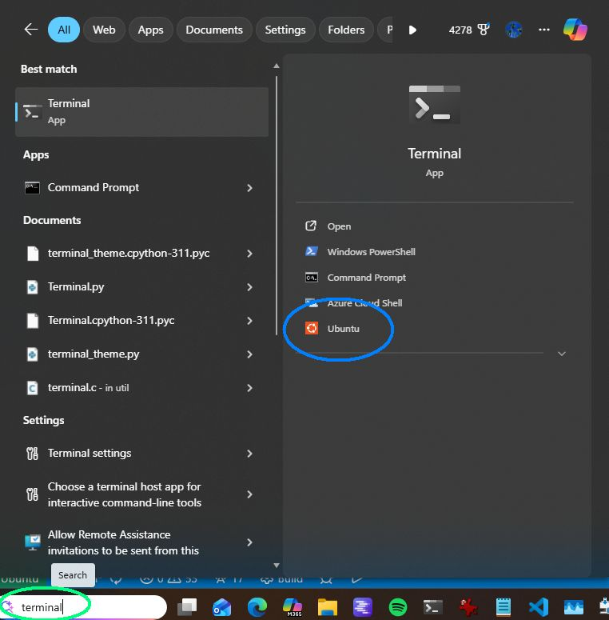
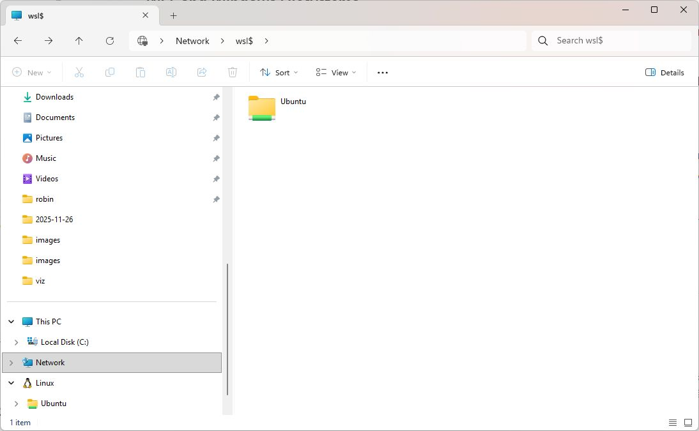
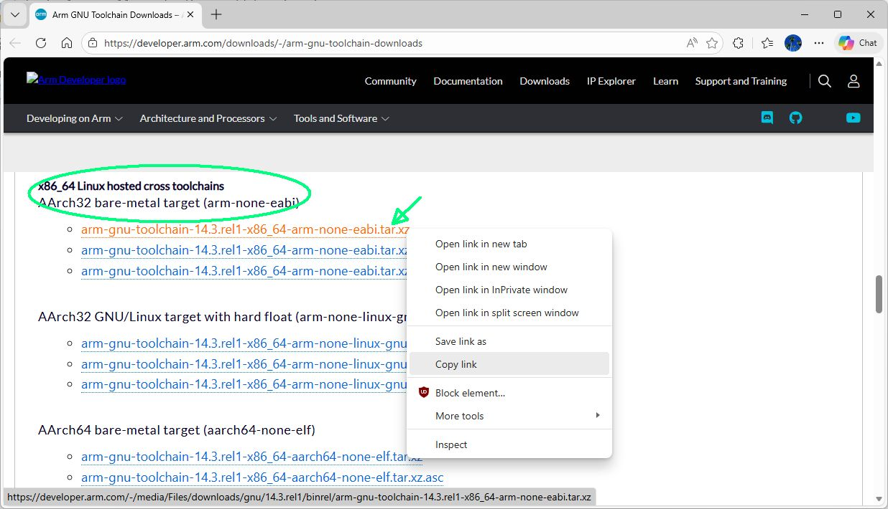
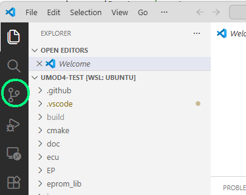

# Umod4 Project

This document explains how to set up a Windows development machine to build the umod4 project using WSL Linux.

_If you are a linux person, I assume that you are familiar with a lot of what follows. These same instructions will work: just skip the Windows-specific stuff._

To set expectations: if you are a Gen1 Aprilia enthusiast more than a software person, be warned that getting this project installed is not trivial.
It is significantly more complicated than loading an Arduino sketch and going riding!

One reason is that the project requires building tools and executables for four separate processors in a number of different programming languages:

1) 68HC11 assembly code for ECU firmware
2) C, C++ and assembly language for ARM Cortex M0+ for the EP processor (RP2040), and ARM Cortex M33 for the WP processor (RP2350).
3) various C, C++, and Python tools that will run on the development host (an x86 PC or ARM Raspberry Pi)

This guide is aimed at helping non-experts get it working.
If you know what you are doing, you should have no problems.

The goal: once everything is set up, rebuilding the entire system is as easy as pushing the `f7` key.

## Troubleshooting

If you hit a wall during this process, open an issue at [github.com/mookiedog/umod4/issues](https://github.com/mookiedog/umod4/issues).
Use the issue reporting system to describe what step you're on, what problem you have encountered or what error you are seeing, and I'll try to help.
Reporting the issues will help make the this setup process as simple and accurate as possible.

## Development System Overview

Linux is __required__ to build this project.
The development system has been tested on two different OS/machine combinations:

1) an x86-64 Windows machine running Ubuntu via Windows Subsystem for Linux (WSL2)
2) an x86-64 machine running Linux Mint 22

Once the tools are installed, all project development occurs directly within the VS Code Integrated Development Environment (IDE): editing, building, flashing, and debugging of the hardware.
VS Code runs under Windows WSL2 as well as other linux distros.

## Prep The Development System

The list of the high-level steps to get a build system working on Windows is shown below.
It's a long list, but it's not overly difficult, and it only needs to happen once.

The instructions assume that you will be using WSL2 linux under Windows.
If you choose to install this system on a pure Linux machine instead of Windows/WSL2, then you probably already know what you are doing.

The high-level steps:
* [Install WSL2](#install-wsl2)
  * [Set up WSL Networking](#set-up-wsl-networking)
  * [Set up Windows Firewall](#add-windows-networking-firewall-rules)
* [Install Windows Terminal App](#windows-terminal-app)
* [Install VS Code](#vs-code)
  * [Install VS Code extensions](#vs-code-extensions)
* [Install Linux software](#linuxwsl2-software-installation)
  * [Host Tools](#install-linux-host-tools)
  * [Avahi](#avahi)
  * [Python](#python)
  * [Build a 68HC11 toolchain](#build-68hc11-toolchain) (required to create Aprilia ECU software)
  * [Download ARM Tools](#get-the-download-link)
  * Build [OpenOCD](#install-openocd) for on-chip debugging of EP/WP
* [Prepare a 'projects' directory](#project-development-setup)
  * [Install the Raspberry Pi Pico SDK](#rpi-sdk)
  * [Install the umod4 repository from github](#getting-the-umod4-source-code)

Once all the software is successfully installed, you will use VS Code to:

* [Configure the project build](#configuration)
* [Build the project software](#building)
* Use a [hardware debugger](#running-umod4) to run code onto a umod4 circuit board

The following sections detail how to do the items listed, above.

## Install WSL2

WSL (Windows Subsystem for Linux) runs a virtualized linux kernel inside Windows.
If you haven't used WSL2 before, it's a real linux kernel running in a Windows virtual environment.
There is no need to do things like dual-boot Windows/Linux or anything like that: Windows and WSL2 run simultaneously, side-by-side.

The WSL2 installation process is defined [here](https://learn.microsoft.com/en-us/windows/wsl/install).
Follow those instructions and all will be well.
But here is the short version. In the standard windows search box, type 'powershell'. Select the option to "run as administrator".
 When the window opens, type the following commands:

```bash
wsl --install
wsl --install -d Ubuntu
```

The first install installs WSL2 itself, which is the virtual machine mechanism required to run any linux distro.
The first install may require you to reboot your machine in order to enable the virtual machine features.
If so, it will only be required this one time.
The second install installs a generic Ubuntu distro.
Unless you have some favorite distro and know what you are doing, just install Ubuntu.

### Set Up WSL Networking

By default, WSL creates its own virtual network for the WSL virtual machine.
This means that the umod4 on the motorbike will not be able to see the server running on WSL.
To fix this, we use 'mirrored' mode so that WSL shares the same IP address and network interface as your PC.

To set up mirrored network mode in WSL, you need to edit the .wslconfig file in your Windows user directory (i.e. `C:\users\<your-user-name>\.wslconfig`).
You can use Notepad or any other windows editor.
Add a line 'networkingMode=mirrored' under the [wsl2] section:

```txt
[wsl2]
networkingMode=mirrored
```

If there is no [wsl2] section in the file (or if the `.wslconfig` file does not exist), just add both the lines shown above.
Write the file, then restart your WSL distribution by typing 'wsl --shutdown' in a PowerShell window.
Open a new WSL bash terminal window to restart WLS, then type:

```bash
robin@Morty:~$ hostname -I
192.168.1.198
robin@Morty:~$ ipconfig.exe | findstr.exe IPv4
   IPv4 Address. . . . . . . . . . . : 192.168.1.198
```

The 'hostname' command reports what WSL thinks the IP address is.
The 'ipconfig.exe' command reports what Windows thinks the IP address is.
Both commands should now return the same IP address.

### Add Windows Networking Firewall Rules

We need to adjust the Windows firewall settings so that the motorbike and the server can chat with each other.

Start by opening Windows Firewall, Advanced Settings:

* Press the __Windows key__, type __Windows Defender Firewall__, click it
* On the left, click __Advanced settings__: a new window opens
* Click __Inbound Rules__ in the left panel

#### Create Rule 1 — TCP port 8080 (to allow log file uploads)

* Click __New Rule...__ (located in the right panel)
* Select __Port__ → click __Next__
* Select __TCP__, type `8080` in the port box → click __Next__
* Select __Allow the connection__ → click __Next__
* Leave all three boxes checked (Domain, Private, Public) → click __Next__
* Name it `umod4_server` → click __Finish__

#### Create Rule 2 — UDP port 8081 (to allow umod4 device check-ins)

* Click __New Rule...__ (just like before)
* Select __Port__ → click __Next__
* Select __UDP__, type `8081` in the port box → click __Next__
* Select __Allow the connection__ → click __Next__
* Leave all three boxes checked → click __Next__
* Name it `umod4 Server UDP Check-in` → click __Finish__

No outbound firewall rules are needed.
Windows allows all outbound connections by default, so the umod4 server can reach the umod4 device on the motorbike without any additional configuration.

## Windows Terminal App

Once WSL2/Ubuntu has been installed, go to the Microsoft store and download the "[Windows Terminal](https://apps.microsoft.com/detail/9n0dx20hk701?hl=en-us&gl=US)" free app.
Terminal works great for interacting with WSL2.
It supports multiple terminal windows using a tabbed interface which is nice.

__Note:__ From this point on, any of the instructions in this document that are executed from a Linux command line will be using a Windows Terminal window that is running Ubuntu/WSL.

* Open the terminal app by typing 'terminal' into the Windows search box.
* On the title bar, click the small down-arrow to get a bunch of options.
* Find the 'settings' option and click it.
* At the bottom left of the settings screen, you will see "Add New Profile".
Click that.
* Add a new empty profile.
Give it a name, like 'wsl-Ubuntu'.
* Change the 'command line' option to be '%SystemRoot%\System32\wsl.exe -d Ubuntu'.
* In the Starting Directory option, uncheck the 'Use Parent Process Directory' option.
* Enter '\~' as the starting directory.
  On linux, '\~' means your home directory.
  You can use '\~' as a shortcut when typing any pathname involving your home directory.
  For example, 'cd \~' will change back to your home directory saving you from typing "/home/<username>".
* Click 'save'

There are other options you can play with (like fonts and colors), but those mentioned above are the required options to be changed.

If you click the same little down arrow on the title bar now, you will see a new entry with the name you entered earlier: 'wsl-Ubuntu'.
Click the 'wsl-ubuntu' selection.

The linux boot will take a few seconds the very first time that it runs.
You will be asked for a user name and password for your initial Ubuntu user account.
You can use the same user name as your windows account, or create a different user name.
The new user name is used by linux only.
The new user name will automatically be given 'sudo' privileges.
The "su" of "sudo" means 'Super User'.
It's the equivalent of having system administrator privileges on a Windows machine.

From this point on, when you type 'terminal' in the windows search box (the green circle, below), you will have the option to directly select your new Ubuntu distro (the blue circle, below):



Once you have a single terminal window open, you can open more bash shells as separate tabs in the same terminal window.
To try that, look at the top of the terminal window.
You will see a 'Ubuntu' tab, a '+' icon, and an upside-down caret '^'.
The '+' icon opens a new tab using your default choice of what to run in that tab.
The upside-down caret lets you select what to run in the new tab.
Selecting 'Ubuntu' opens a new WSL linux tab.
You can even run a Windows Powershell or old-fashioned Windows Command Prompt, if needed.

### WSL and Windows Filesystems

WSL and Windows run simultaneously, but each has its own separate filesystem.
Even so, WSL2 arranges for the two filesystems get cross-mounted so that each one is accessible from the other.

From Windows, the root of all the distros that may be installed is located at '\\\\wsl$' or '\\wsl.localhost'. Appending the distro name takes you to the root of that distro's filesystem, as shown below:



Windows 11 will show you the root of your new Ubuntu distribution on the left side of the explorer window, down at the bottom.
Double click the Ubuntu folder like any other to see inside it.
Your new linux home directory will be accessible by double clicking Ubuntu, then double clicking 'home', then double clicking your user name.

Having Linux access the Windows machine is just as easy.
In Ubuntu, each Windows drive letter automatically gets mounted under '/mnt'.
Doing an `ls -l /mnt/c` in a linux terminal window will show you the contents of your top-level directory on Windows drive 'C:'.

Linux commands like 'cp' or 'mv' operate seamlessly on both filesystems.
If you are a linux person, it's nice to be able to use linux commands like 'find' and 'grep' on the directories inside your Windows machine.

### WSL and Windows Executables

WSL is set to to run any Windows executable that is on your Windows PATH environment variable.
WSL automatically includes all the directories on your Windows PATH variable to the end of your WSL PATH.
To execute any Windows command in a WSL window, just type its full name including the Windows `.exe` suffix.
For example, if you type `explorer.exe .` in a WSL terminal window, it will open a standard Windows explorer window pointing at your current directory (the `.` means the current directory).

## Windows Software Installation

There are a few programs that need to be installed on the development host.

### VS Code

VS Code is a software IDE (Integrated Development Environment) that runs in Windows.
Basically, it is an extremely powerful text editor, with all kinds of additions to help you write code.
One feature of VS Code is that it can edit from remote sources.
If VS Code is running on a Windows machine, as a Windows executable, it will seamlessly connect to the 'remote' WSL2 linux environment on the same machine to allow you to edit the project files in the linux filesystem.

Official Microsoft installation instructions are located [here](https://code.visualstudio.com/docs/setup/windows).
If that link goes dead, just google 'installing VS Code', and find a Microsoft link that tells you how to install VS Code.

If you are developing strictly on a linux machine, VS Code can be installed as a native linux app using .deb or .rpm mechanisms.
Google for the VS Code linux download page and there will be instructions.

Once you have VS Code installed, you need to add a bunch of extensions, as described in the next section.

#### VS Code Extensions

One of VS Code's best features is that it is amazingly extensible.
People all over the world write useful "extensions" that add new features to the editor.
This project needs a bunch of extensions to be installed.
To install the extensions:

* Start VS Code, but don't open any files or directories just yet.
* Click the 'extensions' icon on the left side ribbon (icon looks like 3 boxes with a 4th box floating above the 3 boxes)
* A search box will open saying 'Search Extensions in Marketplace'

Search for each of the extensions listed below and install each one in turn when given the chance:

* C/C++ (by Microsoft)
* C/C++ Extension pack (by Microsoft)
* Cortex-debug
* MemoryView
* RTOS Views
* Markdown Preview Github Styling
* markdownlint
* Python (by Microsoft)

The C/C++ Extension Pack should install a couple of other extensions, namely: CMake, CMake Tools, and Themes.

Note that these extensions run as windows apps on Windows versions of VS Code and as linux apps on either linux versions of VS Code, or Windows versions of VS Code that are using a remote connection to a linux machine.
What this means is that you might need to install linux versions of these extensions later, if you use Windows in its remote editor mode.
VS Code will let you know if you need to install the linux versions later.

## Linux/WSL2 Software Installation

Before starting the installation process for all of the Linux software, make sure that all the software on your linux machine is up to date. Type the following into a terminal window:

```bash
sudo apt update
sudo apt upgrade
```

The Linux "update/upgrade" sequence is basically the same as a "Windows Update" scan.
You need to type 'sudo' because installing software can only be performed by the super user.
Use your new linux password when sudo asks for it.
The first time around, these commands may install a bunch of updates.
You should run this command pair once in a while to keep your Linux distro up-to-date for application updates and security patches.

## Create a 'projects' Directory

A lot of the software we will be installing needs to be installed in a fashion that certain parts can find other parts.
To that end, we will be putting everything inside a directory called 'projects' located inside your home directory.
Create that directory now:

```bash
mkdir ~/projects
```

## Create a Local Bin Directory

This project creates a few special executables to help build the software.
Rather than put these tools in the standard system-wide installation locations,
the build system will place them in a user-specific ``~/.local/bin`` directory.

The following command will create that directory if it does not already exist, then add it to your PATH:

```bash
mkdir -p ~/.local/bin
. ~/.profile
```

Check your PATH variable to verify that your ".local/bin" directory is part of it:

```bash
echo $PATH|tr ':' '\n'|grep '[.]local'
/home/<your-user-name>/.local/bin
```

If your .profile is not adding "\~/.local/bin" to your path, run the following commands to append the required lines to it:

```bash
cat >> ~/.profile << 'EOF'
# set PATH to include a user's private bin directory if it exists
if [ -d "$HOME/.local/bin" ] ; then
    PATH="$HOME/.local/bin:$PATH"
fi
EOF
. ~/.profile
```

Re-run the previous 'echo' command to verify that your ``.local/bin`` directory is on your path now.

### Install Linux Host Tools

A number of tools that need to run on the host machine need to be installed.
It is possible that they are already installed in the fresh WSL distro, but it is harmless to ask to reinstall them.
Install them as below:

```bash
sudo apt install gcc g++ git unzip cmake jq ninja-build libncurses5-dev libncursesw5-dev
```

The ``gcc`` and ``g++`` compilers installed above generate code for your Linux __host__ machine, not the ARM chips on the Pico boards. The Pico SDK expects to find the host g++ compiler using an environment variable called 'CXX'.
Run the following commands to add the appropriate CXX definition to your .bashrc file and update your environment:

```bash
echo "export CXX=/usr/bin/g++" >> ~/.bashrc
. ~/.bashrc
```

#### Avahi

The avahi tools supply mDNS functionality needed by `flash_EP` to resolve device names on the home network.
To install them, type:

```bash
sudo apt install avahi-daemon avahi-utils libnss-mdns
```

`avahi-daemon` handles `.local` hostname resolution.
`avahi-utils` provides the `avahi-resolve-host-name` command that `flash_EP` uses for fast resolution (bypassing a WSL2 glibc/D-Bus issue that makes the standard resolver take ~9 seconds for `.local` names).

WSL2 does not auto-start services, so configure it to start avahi-daemon automatically on every WSL startup.
Edit `/etc/wsl.conf` (as root) and add or update the `[boot]` section:

```ini
[boot]
command = service avahi-daemon start
```

If the file already has a `[boot]` section, add the `command` line to it — do not create a second `[boot]` section.

Then restart WSL once from a PowerShell window for the change to take effect:

```powershell
wsl --shutdown
```

#### Python

The umod4 system uses Python3 for some utility programs, as well as the visualizer if you choose to run the visualizer from inside the umod4 project tree.
Python3 is typically part of Linux distributions, so you probably do not need to install it.
The umod4 project does require using Python virtual environments so that it can install various libraries as the build process runs.
To add that capability, find out what version of python3 is on your system, then do the following, making sure that the version number for the install matches the first two numbers reported by the --version command ("3.10" in the example, below):

```bash
$ python3 --version
Python 3.10.12
$ sudo apt install python3.10-venv
```

#### Git and Line Endings

We need to make a small configuration change to the git program installed in the previous step.
The project's Git repository always has Unix-style LF line endings.
Configuring the git setting 'core.autocrlf' to 'false' tells Git to _not_ change files to use CRLF-style endings when it checks stuff out onto a Windows machine.
VS Code on Windows operates just fine on LF-style endings so there is no need to add CR characters just because it is a Windows machine.

To avoid the whole CR mess when working with Windows, type the following in your WSL2 terminal window:

```bash
git config --global core.autocrlf false
```

### Build 68HC11 Toolchain

The Gen 1 ECU's processor is a Motorola M68HC11.
The C compiler for the HC11 has not been supported since GCC version 3.4.6, back in the early 2000's.
Fortunately, for the purposes of the building the UM4 software, we don't need a full 68HC11 C compiler, we only need an assembler.
And amazingly enough, a modern GCC 'binutils' package still contains everything we need to target the ECU's 68HC11:

* a 68HC11 assembler
* a linker
* an objcopy utility

The only downside is that a 68HC11 version of the binutils is not something that can just be installed via 'apt', but will need to be built from source code.
Fortunately, this is quite easy:

1) Go to the [GNU Binutils](https://www.gnu.org/software/binutils/) page
2) Find out what the latest version of the binutils is (2.42 at the time this page was written)

Run the commands below, replacing version "2.42" with whatever version you are using.
Or if you are lazy, just copy the commands below to install version 2.42, which is known to work fine.
The commands assume that you would like to put your binutils source in a directory called ~/binutils/binutils-2.42.
This naming convention allows you to support multiple versions of the binutils, should that be useful.

```bash
sudo apt install texinfo
cd ~
mkdir binutils
cd binutils
wget https://ftp.gnu.org/gnu/binutils/binutils-2.42.tar.gz
tar zxvf binutils-2.42.tar.gz
mv binutils-2.42 binutils-m68hc11-elf-2.42
cd binutils-m68hc11-elf-2.42
./configure --prefix=$HOME/.local --target=m68hc11-elf
make
```

The 'make' operation will take a couple minutes.
Assuming that 'make' completed without errors, install the tools and then make sure they ended up in the right place.
You should see a whole bunch of new executable files all relating to the m68hc11 processor:

```bash
$ make install
$ ls -l ~/.local/bin
total 86244
-rwxr-xr-x 1 robin robin 4964128 Aug  7 07:09 m68hc11-elf-addr2line
-rwxr-xr-x 2 robin robin 5150512 Aug  7 07:09 m68hc11-elf-ar
-rwxr-xr-x 2 robin robin 6816200 Aug  7 07:09 m68hc11-elf-as
-rwxr-xr-x 1 robin robin 4911176 Aug  7 07:09 m68hc11-elf-c++filt
-rwxr-xr-x 1 robin robin  125992 Aug  7 07:09 m68hc11-elf-elfedit
-rwxr-xr-x 1 robin robin 5556088 Aug  7 07:09 m68hc11-elf-gprof
-rwxr-xr-x 4 robin robin 8066152 Aug  7 07:09 m68hc11-elf-ld
-rwxr-xr-x 4 robin robin 8066152 Aug  7 07:09 m68hc11-elf-ld.bfd
-rwxr-xr-x 2 robin robin 5030672 Aug  7 07:09 m68hc11-elf-nm
-rwxr-xr-x 2 robin robin 5792040 Aug  7 07:09 m68hc11-elf-objcopy
-rwxr-xr-x 2 robin robin 8331408 Aug  7 07:09 m68hc11-elf-objdump
-rwxr-xr-x 2 robin robin 5150544 Aug  7 07:09 m68hc11-elf-ranlib
-rwxr-xr-x 2 robin robin 4325152 Aug  7 07:09 m68hc11-elf-readelf
-rwxr-xr-x 1 robin robin 4954320 Aug  7 07:09 m68hc11-elf-size
-rwxr-xr-x 1 robin robin 4966904 Aug  7 07:09 m68hc11-elf-strings
-rwxr-xr-x 2 robin robin 5792040 Aug  7 07:09 m68hc11-elf-strip
```

Finally, do a trivial test of the assembler by typing the commands, below.

```bash
$ cd ~
$ m68hc11-elf-as --version
GNU assembler (GNU Binutils) 2.42
Copyright (C) 2024 Free Software Foundation, Inc.
This program is free software; you may redistribute it under the terms of
the GNU General Public License version 3 or later.
This program has absolutely no warranty.
This assembler was configured for a target of `m68hc11-elf'.
```

The important part is that the new assembler knows it has been configured to target "m68hc11-elf", which represents the processor inside the ECU.
If the system was not able to find the m68hc11-elf-as executable, make sure that "~/.local/bin" is on your PATH, as described earlier in this document.

### Install ARM Cross-Compiler Toolchain

ARM cross-compilers are required to build code for the ARM processors used by this project.
A cross-compiler runs on your x86 PC but generates code for the ARM processors inside the umod4.

The build system expects the cross-compiler toolchains to be installed under `/opt/arm/arm-none-eabi/`, one subdirectory per version:

```text
/opt/arm/arm-none-eabi/
    ├── 14.2.rel1    example of an older version (if any)
    └── 15.2.rel1    the most recent version
```

This layout lets you switch toolchain versions by editing one CMake file.
It also means that old projects aren't forced to upgrade when a new release comes out.

#### Get the Download Link

Go to the [Arm GNU Toolchain download page](https://developer.arm.com/downloads/-/arm-gnu-toolchain-downloads).

* __x86 PC / WSL2:__ scroll to _x86_64 Linux hosted cross toolchains_ → _AArch32 bare-metal target (arm-none-eabi)_ → the `.tar.xz` file.

The download page looks like this:



__Don't click the link to download it.__
Instead: Right-click the link and choose "Copy link address."

The filename tells you the version number — for example `arm-gnu-toolchain-15.2.rel1-x86_64-arm-none-eabi.tar.xz` means the version is `15.2.rel1`.

#### Download and Install

Set `ARM_VERSION` to the version string you just identified from the filename:

```bash
ARM_VERSION=15.2.rel1
echo $ARM_VERSION
```

Double-check that the version that gets printed from the commands above matches the version on the download page.
If not, retry those commands with the proper version name.

Once ARM_VERSION is correct, execute the following:

```bash
sudo mkdir -p /opt/arm/arm-none-eabi/$ARM_VERSION
cd /opt/arm/arm-none-eabi/$ARM_VERSION
```

For the next command, you will be pasting in the link that you copied from the download webpage a few steps back:

```bash
sudo wget <paste the link you copied here>
```

If wget succeeded, type the following to extract the archive:

```bash
sudo tar xf arm-gnu-toolchain-*.tar.xz --strip-components 1
```

The `--strip-components 1` strips a very long directory prefix that ARM buries inside the archive.

Once tar completes, verify the tools work by asking them what version they are:

```bash
$ ./bin/arm-none-eabi-gcc --version
arm-none-eabi-gcc (Arm GNU Toolchain 15.2.Rel1 (Build arm-15.86)) 15.2.1 20251203

$ ./bin/arm-none-eabi-gdb --version
GNU gdb (Arm GNU Toolchain 15.2.Rel1 (Build arm-15.86)) 16.3.90.20250906-git
```

Do __not__ add the `bin` directory to your PATH.
The umod4 project's build system will locate it automatically from the `/opt/arm/arm-none-eabi` structure.

### Install OpenOCD

_At some point, the RP2xxx support will exist in the Ubuntu distribution and installing OpenOCD will be as simple as "sudo apt install openocd".
But for now, it needs to be built from source, as described in this next section._

OpenOCD is the "Open On-Chip Debugger" software tool.
GDB uses OpenOCD to talk to the silicon debug unit inside the chip being debugged.
OpenOCD has been around forever, but it needs to run a special version for the Pi Pico boards because the RP2xxx processors on those boards are dual core.

Install source code for OpenOCD, making sure to get the sources from raspberrypi where the RP2xxx support is located:

```bash
cd ~/projects
git clone https://github.com/raspberrypi/openocd.git
cd openocd
git submodule init
git submodule update
```

You will need to install a bunch of packages for building OpenOCD:

```bash
sudo apt install libusb-1.0-0 libusb-1.0-0-dev libhidapi-dev libtool texinfo pkg-config make
```

Finally, build OpenOCD:

```bash
cd ~/projects/openocd
./bootstrap
./configure --enable-ftdi --enable-sysfsgpio --enable-bcm2835gpio --enable-cmsis-dap --enable-internal-jimtcl
make
sudo make install
openocd --version
```

The fun never ends with openocd though.
We need to give ourselves permission to access the USB debug probe so that we don't have to use sudo all the time.
For that, we create another rules file as follows:

```bash
sudo sh -c 'printf "# Pi Pico CMSIS-DAP USB debug probe\nATTRS{idProduct}==\"000c\", ATTRS{idVendor}==\"2e8a\", MODE=\"666\", GROUP=\"plugdev\"\n" >> /etc/udev/rules.d/46-probe.rules'
```

Finally, we trigger reloading the new rules file we just created:

```bash
sudo udevadm control --reload
sudo udevadm trigger
```

From now on, the rules will be reapplied every time WSL starts.

## WSL2: USB Device Sharing

_If you are on native Linux (not Windows/WSL2), skip this section._

By default, USB devices plugged into a Windows machine are owned by Windows — WSL cannot see them.
`usbipd` solves this by sharing ("binding") specific device types from Windows to WSL.
The project includes a script that does this binding for all the USB devices you will need as a developer.

### Bind vs. Attach

There are two distinct usbipd operations:

- __Bind__ (`usbipd bind`): a one-time, persistent grant that says "this VID:PID is allowed to be shared with WSL".
  Survives unplugging, rebooting, and re-plugging.
  Must be done by an Administrator.
- __Attach__ (`usbipd attach`): per-session connection of a currently-plugged device to WSL.
  Tools like `flash_WP` and the test runner handle this automatically.

You only need to worry about __binding__.

### Running the Setup Script

With your umod4 hardware (or debug probe) plugged in, run from a WSL terminal:

```bash
~/projects/umod4/tools/setup_usb_wsl
```

A UAC prompt will appear on the Windows desktop — click __Yes__ to allow it to run as Administrator.
The script binds all Raspberry Pi Pico-family PIDs (including the CMSIS-DAP debug probe and the RP2350 BOOTSEL mass-storage device) plus the ap_proxy device used by the automated test harness.

Re-run the script any time you add a new physical device that wasn't plugged in the first time.

### Note on usbipd Versions

`usbipd policy add --operation AutoBind` (which would automate all of this) is broken in usbipd 5.2 — it throws `Invalid policy rule` for every entry and does nothing.
The script uses `usbipd bind --hardware-id` instead, which achieves the same persistent result.

## Project Development Setup

The next step is to start filling out the project directory structure.
There is a fair amount of software source that needs to be installed, and and some of it needs to know where other parts of it are located.
By installing things as decribed in the sections that follows, the various bits of the system will be able to find each other.

### Development Directory Structure

The main part of the project directory involves the Pico SDK (Software Development Kit) is quite large, at over 600 megabytes.
The SDK could be installed by cmake as sub-piece of each of your Pico projects, but replicating the entire SDK for every project in your sytem that might need it is a giant waste of disk storage.
Instead, we will set things up so that all projects will share a single SDK installation.
We do this by storing the SDK at a well-known location in the 'projects' directory.
We then tell the individual Pico development projects where to find it.
This also allows us to store multiple versions of the SDK, enabling old projects to use old SDK versions without forcing them to upgrade.

Pictorially, we want to end up with a directory structure that has this general form:

```text
/home/<your-user-name>/
└── projects/
    ├── openocd       (a special version for debugging RP2xxx chips)
    ├── pico-examples (sample code for SDK applications)
    ├── pico-sdk      (may contain multiple versions of the SDK over time)
    │   ├── 1.5.1     (Supports Pico/RP2040 only)
    │   ├── 2.0.0     (first version that supports Pico/RP2040 and Pico2/RP2350)
    │   ├── 2.1.1     (bug fixes and improvements)
    │   └── 2.2.0     (the most recent version, at time of writing)
    └── umod4         (where the umod4 software project will be stored)
```

### RPi SDK

The Raspberry Pi Software Development Kit (SDK) is a collection of software tools and code libraries that make it easier to work with the RP2xxx processor chips.

The SDK can be installed in a number of fashions.
For various reasons, we will install it using Git.

First, we create the top-level directory inside the projects directory that will contain all the SDK versions:

```bash
cd ~/projects
mkdir pico-sdk
cd pico-sdk
```

Next, we clone the 'master' branch of the pico-sdk into the new directory:

```bash
git clone https://github.com/raspberrypi/pico-sdk
```

Rename pico-sdk to reflect the SDK branch that we will be checking out.
As of the time of writing, the most recent version is 2.2.0.
If a newer version is available, use its version number:

```bash
mv pico-sdk 2.2.0
```

Now we tell git that we actually want to lock this cloned branch to the "2.2.0" tag on the master branch:

```bash
cd 2.2.0
git checkout 2.2.0
```

Our new git tag now matches its directory name.
Update the new branch so that it can do WiFi and Bluetooth:

```bash
git submodule update --init --recursive
```

No environment variable is needed — the umod4 superbuild's top-level `CMakeLists.txt` computes the SDK path itself from its `PICO_SDK_VERSION` setting (see the next section), and passes it down to every subproject.

#### FreeRTOS-Kernel

FreeRTOS-Kernel is __not__ part of any official pico-sdk release — Raspberry Pi's own tooling expects it to be cloned as an entirely separate, independent checkout, as a sibling of `pico-sdk` (not nested inside a specific SDK version). This is deliberate: FreeRTOS-Kernel's release cadence has nothing to do with the SDK's, and pinning it inside a versioned SDK directory just means it has to be re-vendored by hand every time `PICO_SDK_VERSION` changes.

Clone it once, as a sibling of `pico-sdk`:

```bash
cd ~/projects
git clone https://github.com/FreeRTOS/FreeRTOS-Kernel
cd FreeRTOS-Kernel
git checkout V11.3.0
git submodule update --init --recursive
```

That release tag is pinned deliberately — it's the version this project has actually been built and tested against, and it includes the `RP2350_ARM_NTZ` community port (via the `Community-Supported-Ports` submodule) that WP needs. Don't casually move this checkout to a newer release without re-testing a full WP build on real hardware: FreeRTOS-Kernel releases do change core kernel behavior (not just port-specific code) — for example V11.3.0 added a `configASSERT` in task creation that actively checks stack depth against the port's initial frame size, and WP's `configASSERT` is a real, non-stubbed `assert()`. A clean compile only proves there's no API/ABI break; it does not prove the new release behaves identically on target hardware.

The umod4 superbuild computes `FREERTOS_KERNEL_PATH` from this location automatically (see top-level `CMakeLists.txt`) and passes it to WP; no environment variable or manual per-SDK-version setup is needed here either.

#### Maintaining Multiple SDK Versions

New versions of the SDK get released from time to time.
A new SDK will be a mixture of new features and bug fixes.
Just because a new SDK is released, there is no need to delete older versions.
In fact, there are benefits to leaving old versions around:

* A new version might introduce some incompatibility that needs to be fixed, meaning that the old version should continue to be used until the fix is in place.

* If you develop any other software projects using a Pico, it is possible that some projects might need a specific version of the SDK, while others might want to use the most recent.

By following the instructions above to load new SDK versions 'beside' the old ones, your system can contain multiple versions of the SDK and each project can use the version that it needs.

Note that if you ever upgrade the SDK at some point, you only need to change `PICO_SDK_VERSION` in the top-level `CMakeLists.txt` — everything else (including VS Code's debug SVD file lookup) follows automatically from that one setting.

## Getting the Umod4 Source Code

Now that all the tools are in place, it is finally time to get the umod4 code loaded onto your system!

Start by cloning the umod4 project onto your own machine.

```bash
cd ~/projects
git clone https://github.com/mookiedog/umod4.git
```

You should see some output taking this general form:
```bash
Cloning into 'umod4'...
remote: Enumerating objects: 1766, done.
remote: Counting objects: 100% (91/91), done.
remote: Compressing objects: 100% (56/56), done.
remote: Total 1766 (delta 36), reused 62 (delta 35), pack-reused 1675 (from 1)
Receiving objects: 100% (1766/1766), 11.98 MiB | 16.18 MiB/s, done.
Resolving deltas: 100% (1044/1044), done.
```

If you type 'ls' inside ~/projects, you should now see ~/projects/umod4.
```text
projects
    ├── openocd
    └── umod4
```

Now, cd into umod4 and check your umod4 project's git status:

```bash
cd umod4
git status
```

You should see this exact output:

```text
On branch main
Your branch is up to date with 'origin/main'.

nothing to commit, working tree clean
```

Now, open a new VS Code editor.
Make sure to select a remote window (>< chars in lower left), then select 'connect to WSL'.
Select 'File/Open Folder' and navigate to ~/projects.
Select the 'umod4' folder, and open it.
It should just open and show you a ton of files.
Specifically: VS Code should not be complaining about _anything_. To make absolutely sure, look at the source control icon, circled in green below:



If you see thousands of changes, something is wrong: maybe you forgot to set the git line endings, as above?

Your VS Code file viewer over on the left side of the window should show a bunch files.
In fact, if you select the file "BUILDING.md' by clicking it, you will see the file that contains what you are reading right now.

One last, important note.
When you clone a repository onto your local machine, you are making a copy of the real, remote repository.
If you accidentally mess up your repository, the nuclear option is to type the following to utterly erase your repository and start over again:

```bash
cd ~/projects
rm -rf umod4
```

At that point, go back to the step that clones the repository, and you will be good to go with a totally fresh repository.

## Building Umod4

It should be clear by now that the umod4 is not a particularly simple system to get working!
But we are finally ready to build it.

### Configuration

The first step is to 'configure' the build.
The configuration process runs a program called CMake, which analyzes the entire project's structure, then generates a set of files which will tell the build system _how_ to create the appropriate output files.

In your VS code window that you used to get the umod4 code from Github, hit 'F1' then type 'delete', but don't hit return.
A bunch of selections related to the topic of 'deleting' will appear in a dropdown list.
Click the list item called '__CMake: Delete Cache and Reconfigure__'.

If a window pops up asking you to specify a toolkit, select 'unspecified'.
The project will set up the toolkit by itself.

After some amount of time, configuration operation should finish without errors.
It should produce a bunch of messages in the VS Code 'output' window that look something like this:

```text
[main] Configuring project: umod4
[driver] Removing /home/robin/projects/umod4/build/CMakeCache.txt
[driver] Removing /home/robin/projects/umod4/build/CMakeFiles
[proc] Executing command: /usr/bin/cmake -DCMAKE_BUILD_TYPE:STRING=Debug -DCMAKE_EXPORT_COMPILE_COMMANDS:BOOL=TRUE --no-warn-unused-cli -S /home/robin/projects/umod4 -B /home/robin/projects/umod4/build -G Ninja
[cmake] Not searching for unused variables given on the command line.
[cmake] -- Detected Python version: 3.12
[cmake] --    ---> Installing python lib: pymongo
...
<lots more messages snipped out from here>
...
[cmake] -- Configuring done (6.8s)
[cmake] -- Generating done (0.0s)
[cmake] -- Build files have been written to: /home/robin/projects/umod4/build
```

The important part is that the configuration messages end with "Build files have been written to: ..." which means __no errors__.

### Building

Assuming that the configuration process completed without errors, you __finally__ get to build the umod4 project.
The files created by the configuration process drive the build process.
They tell the build system exactly what to create, how to create it, and where to put the outputs that get created.

Invoking the build system is the easiest part of this whole process: with your cursor inside the VS Code window, hit key 'F7' to build everything.

The VS Code output window will display tons of messages as everything runs.
Depending on how beastly your PC is, this may take 30-ish seconds to a few minutes.
This is the worst-case build time though.
Once the build is complete, subsequent builds only rebuild files that have changed which only takes a small number of seconds.

_Note: The very first time you build, the build system will generate an error, by design.
The issue: [picotool](#picotool) requires 'sudo' (administrator rights) in order to access the Pico USB devices.
Installing an appropriate udev 'rules' file gets rid of the 'sudo' requirement and allows the build system to use picotool itself.
The build system will verify that the required rules file is installed.
If not, the build system will stop with an error message showing you the exact commands to run to install the rules file.
Run the commands in a bash terminal window, then hit F7 to continue the build process._

If it all goes correctly, you will see these final messages in the VS Code OUTPUT window:

```text
[driver] Build completed: 00:00:32.466
[build] Build finished with exit code 0
```

The exit code of 0 means __"All Is Good"__.

A non-zero exit code means that some part of the build failed.
If you get a non-zero exit code, scroll back to the top of the message output window, then scan down through all the output until you see the first error message appear.
Then, fix the error.
I know, I know, maybe not so simple...

### The 'build' Directory

The CMake process is designed to put anything that gets generated or created by the build process into a subdirectory called 'build', located inside the main "projects/umod4" directory.
There is a reason for that: it keeps the files that are generated by the build process completely separate from the source files used to generate them.
Because of that, it is _always_ safe to delete the build directory and everything inside it because everything in that directory can be re-created automatically.

Why would you need to?
Sometimes, things can get out of sync in the CMake build process.
It usually happens after making changes to one of the CMakeLists.txt files in the system.
If things are acting weird, the first thing to try is the 'F1', then start typing 'CMake: delete cache and reconfigure'. As you type, a menu will appear based on what you have typed so far. As soon as you see the menu item "CMake: delete cache and reconfigure" appear, you can quit typing and just click that menu item.
If that does not work, the nuclear option to get back on track is to:

1) Delete the entire 'build' directory by right-clicking 'build' is the VS Code file viewer window, then selecting 'delete permanently' from the menu.
__When the dialog box opens up warning you about permanently deleting 'build', make sure that it really does say 'build' and that you didn't accidentally select some other directory__.
Hit the 'delete' button to finally delete build.
1) Hit "F1", then start typing "CMake: delete cache and reconfigure", and select the menu item as mentioned as above.
1) Hit "F7" to rebuild everything. Your build directory will reappear, full of binary goodness.

Try those commands right now, and rebuild your entire system from scratch.
Remember: Never fear deleting the 'build' directory!

### Build Outputs

As part of a successful build operation, the build system generates a number of output files.
The most important ones are:

* __build/EP/EP.uf2:__ the EP firmware image
* __build/WP/WP.uf2:__ the WP firmware image
* __build/ecu/UM4.bin:__ An ECU EPROM image containing the data-logging ECU codebase with default 549USA maps. A UM4.bin image is contained inside every EP.uf2 image where it acts as the default built-in EPROM image. If desired, UM4.bin can be uploaded to the EP's image library if you wanted to retain a specific version of it.

The server program will reflash the umod4 OTA (Over The Air) using the EP.uf2 and WP.uf2 files.

## Running Umod4

The next step would be to flash the WP software onto onto a umod4 circuit board.
If you have a umod4 board, check out [GETTING_STARTED.md](./GETTING_STARTED.md) to see how to prep your ECU and get the software installed onto it.

If you do not have a board, there are still plenty of areas of the project to explore though.
Check out the project's [README](./README.md) for a high-level tour of the various pieces.

## Final Thoughts

Congratulations if you made it this far.
I know it was not a simple process to get to this point.

To give credit where it is due, I only got it working due to tons of people on the internet who ran into all the same problems as I did, but somehow were smart enough to figure out the issues, and more critically, to document their successes in places where DuckDuckGo could find them for me.
And credit to Claude Code, too: Claude knows CMake & Python, for sure.

I will probably always be working on some aspect of this project because that's what "fun" looks like to me.
Weird, I know, but fun comes in many forms.


