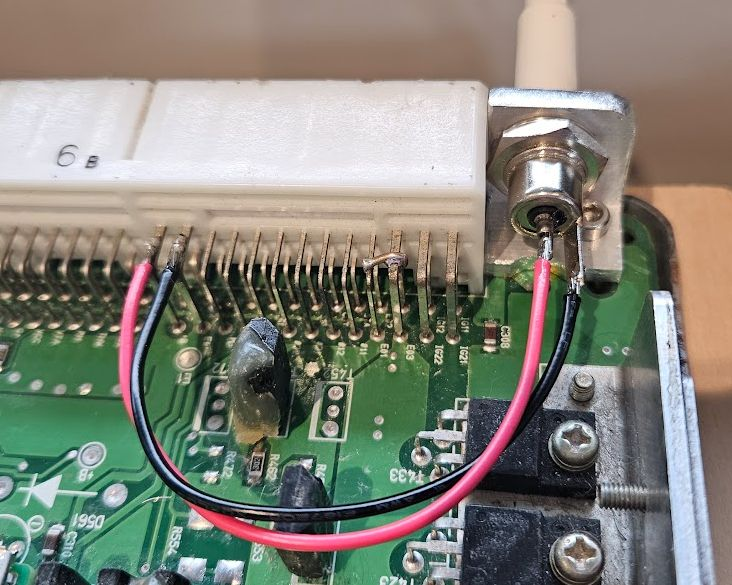

# Bench Testing

The way the power system is designed, the ignition key always does what a rider would expect:

* If the ignition key is turned ON, both the ECU and the umod4 get powered
* If the ignition key is turned OFF, neither the ECU nor the umod4 get powered

There is one additional power state though:

* If a 5V USB power supply is connected directly to the Pico2-W's micro USB connector, then the umod4 board gets powered even if the bike is turned OFF

Parking the bike and plugging in a USB supply allows the umod4 to perform wifi operations like log data dumps or OTA firmware updates even if the ignition is OFF.

For the purposes of bench testing, it makes most sense to supply power to the ECU in the same manner as the ignition switch would.
The USB power connection to the Pico2-W can also be used to verify that the umod4 runs even when the main power source is OFF.

Note: the yellow LED marked LED2 on the umod4 indicates the presence of ECU power.
In the situation where the umod4 is powered via USB but the ECU is OFF, the yellow LED will remain OFF to indicate that the ECU is not running.

## Wiring

For a minimal bench test system, all you need is a source of nominal +12V power and GND.
A simple way to power the ECU adds an AC adapter socket to a home-made bracket on the circuit board, as shown below:

### Power

The AC adapter I used has a center-positive pin.
The red wire in the picture represents the positive input voltage.
You can see that it gets soldered directly to the B+ connector pin on the main ECU connector.

### Ground

There are five ground wires:

* E1/E2: electronics ground
* E01/E02: injector driver ground
* E03: ignition coil driver ground

Note that E1/E2 and E01/E02 are all connected together on the PCB itself.
This means that the single black wire in the picture above is actually connecting to all four E1/E2/E01/E02 pins.

For bench purposes, E03 needs its own GND connection.
In the picture above, you can see a tiny wire stub that connects E01 to E03.

__Warning: An ECU wired up like this should not be placed in service on a motorbike!__

## Current Consumption

The entire ECU might draw about 400 mA (peak) with a umod4 board installed (SD card present, GPS running, Pico2W performing WiFi operations).
In normal conditions (no WiFi), the ECU draws just under 200 mA.
For a bit of margin, the bench supply or AC adapter should be capable of supplying 1A.

## Details

### Battery Input: B+

This wire gets battery power from the wiring harness whenever the ignition is turned ON.

The ECU's linear regulator was measured as needing a 0.9V of headroom, meaning that it needs at least 5.9V on its B+ input to ensure that the computer circuitry inside operates at its 5.0V design target.

I could power the test bench ECU at a nominal 12V to 14V input, but that would do nothing except make the ECU's 5V regulator work harder to get rid of the extra input voltage as heat.
When powering my system from an adjustable power supply, I run it at about 8 Volts.
I can also run it from a 9VDC "wall wart" power adaptor.

### Grounds

As mentioned earlier, the ECU has a five separate ground connections.

One reason for this is that when the ECU switches the relatively high power ignition coil loads, they can generate large electrical transients on their GND wires.
The motorbike wiring harness keeps the ECU computer ground path separate from the ignition coil ground path.
This helps keep the coil switching noise from disturbing the computer and analog circuitry inside the ECU.

When powering the ECU using a bench power supply with no ignition coils attached, all 5 GNDs can be wired together for simplicity.

#### E1/E2 & E01/E02

All 4 of these connector pins are tied to the same GND on the circuit board.

#### E03

This is the GND for the ignition coil driver transistors.
For a bench setup, it is fine to connect E03 to the same power supply GND as the ECU uses.

## Bench Testing Enhancements

It might be worthwhile to expand the bench-test setup for more realistic ECU firmware operation.
"More realistic" would be best defined as being able to simulate a rotating engine.
The key to that would be the ability to drive fake cam and crank position signals.

Sensors could be added:
* Air temp (could just be a simple resistor, or maybe a pot)
* Water temp (could just be a pot)
* throttle
* intake pressure (difficult)

Less useful sensors:
* fall sensor
* clutch

Additional outputs:
* fuel pump relay
* ignition coils
  * could be 2 or all 4
* injectors
    Might just be a blinking light
* tachometer
