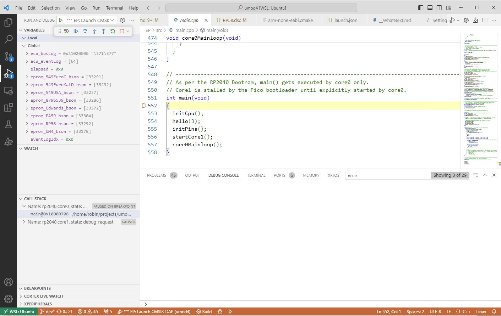

# Debugging

## WP

The WP can be debugged by attaching a Raspberry Pi SWD debug unit to the 3 debug pins on the Pico2W.

Debugging has a complication in that in order to support OTA flash programming, the flash memory is partitioned into a pair of image 'slots'.
Each slot can contain a WP image.
Each of these images is built to execute at the *same* start address in the flash.
But neither of these images is actually sitting at that start address.
When an image gets booted, the image loader programs an RP2350 memory address translation manager so that the slot containing the image to be run will appear at the correct starting address in the address space.
This address translation, and the images moving around the address space, are handled entirely by the bootloader: the debugger is not aware of any of this.
That means that if the debugger is invoked in the normal fashion to load a file, it will put the image directly at the image's run-time start address, not the start of the slot address.
The resulting loaded image can be debugged, but because it was not written to its proper slot, it will overwrite and destroy the flash partitions.

To avoid destroying the partition information, images can be debugged in two ways: by attaching to running firmware, or using a special partition-aware debugger image loader.

### Partition-Aware Loader

The partition-aware loader always erases slot 1, then places the image to be debugged into slot 0.
Since slot 0 contains the only valid image, the bootloader will always choose it when deciding which slot to actually boot.

### Attach To Running Firmware

If the software is already loaded to the WP using something like 'F1','Tasks: Run Task','Wp: Flash and Run (Force BOOTSEL via SWD)', then the debugger can attach to that running firmware.
To do that, use the 'run and debug' control in VS Code to select the option '*** WP: RP2350 Attach (no flash)'.
Once attached, the debugger will stop the WP firmware.
From there, the best thing to do is reset the WP, set any desired breakpoints, then start it running.

## EP

Debugging the EP is simple: select the target "*** EP: RP2040 Launch CMSIS-DAP".
The RP2040 has no address translation mechanism, and only supports a single image.
The debugger will always load it to the proper location in Flash.

There is one catch however.
As part of normal umod4 operation, the WP uses the EP's SWD interface to interact with the EP.
If a debugger is attached to the EP's debug pins, the debugger will conflict with the WP: both will attempt to drive the SWD pins.
To get around that, the SPARE2 IO on the WP has special meaning: if SPARE2 is grounded, then the WP will not use the SWD interface.
To debug EP operation:

* Power off the test system
* Ground SPARE2
* Connect the debugger to the EP SWD pins

At this point, you can power up the test system and debug.
When you are done debugging, detach the debugger, let SPARE2 float again, and reboot the WP.

## ECU

The ECU's 68HC11 is an old-school processor that does not support in-circuit debugging.
Even so, the umod4 provides some debugging help.
Because the EP's EPROM emulation is a software construct, the emulation software can help us out.
Specifically, the EP maintains a 32KB circular buffer of every HC11 bus access, even if the access does not target the EPROM address space.
Each bus access uses 4 bytes of RAM, so the buffer holds the last 8K of HC11 bus accesses.

It is a bit of a pain to manually decode what the HC11 was doing, but the bottom line is that the data is there, should you need to see something.

Triggering is not trivial either: you need to set a breakpoint in the EP to detect when to stop so that you can inspect the HC11 buffer. But again, it's way better than nothing.

## RTT IO

The umod4 supports RTT IO mechanisms.
RTT IO is special in that it does not require any hardware other than the SWD debugger connection.
Output is written to RAM buffers in the processor being debugged.
The debugger process on the PC uses the SWD debug interface to periodically read these output buffers while the target is running.
Because RTT only needs a small RAM buffer, the umod4 software supports a number of IO channels.
The WP takes this one step further: because the WP always has SWD access to the EP RAM, the WP software reads the EP's RTT buffer via SWD and forwards that output to a buffer on the WP, which makes EP output accessible during a WP debugging session.

----

## Debugging

*For documentation purposes, here's some of the next steps.
From here on, you would need a umod4 PCB and a slightly modified ECU*

The umod4 project contains a '.vscode/launch.json' file which tells VS Code how to work with the debugger hardware.

Sadly, there is a bug in either CMake or VS Code or both which results in VS Code not knowing how to find the executables produced by the CMake 'ExternalProject_Add()' commands.
Hopefully, this will get fixed at some point.
But for now, the 'launch.json' file is modified so that it creates an explicit command to flash and debug the EP and WP portions of the umod4 project.

### Getting WSL To See a Debug Probe

Ownership of USB devices is one of the few non-seamless issues for WSL under windows.
When you plug a USB device into a Windows machine, Windows owns it by default, as opposed to WSL.
There is a software package that allows you to tell Windows to give control of a specific USB device to WSL.

Plug your [Raspberry Pi Pico Debug Probe](https://www.raspberrypi.com/documentation/microcontrollers/debug-probe.html) into a USB port on your Windows machine.

Using your terminal app, open a Windows powershell or cmd prompt in administrator mode.
Do NOT use a linux terminal window!
Type the following:

```text
winget install --interactive --exact dorssel.usbipd-win
```

It will download and run an installer.
Do what the installer says.

Still from your powershell 'administrator' window, type "usbipd list" as below.
You will get back something like this, obviously depending on the USB devices that are attached to your own machine:

```text
PS C:\Users\robin> usbipd list
Connected:
BUSID  VID:PID    DEVICE                                                        STATE
6-2    062a:4102  USB Input Device                                              Not shared
8-2    2e8a:000c  CMSIS-DAP v2 Interface, USB Serial Device (COM5)              Shared
8-3    046a:010d  USB Input Device                                              Not shared
8-4    2357:012e  TP-Link Wireless USB Adapter                                  Not shared
8-5    0bda:2550  Realtek Bluetooth 5.1 Adapter                                 Not shared

Persisted:
GUID                                  DEVICE
```

The debug device will be the one with "CMSIS-DAP" in its name.
In this case, its busID is 8-2.
It will be different on your system.
Make a note of the busID, then do the following in your powershell administrator window:

```text
usbipd bind --busid 8-2
```

The 'bind' operation is a one-time administrator-level operation that tells Windows that it is allowed to share the device with WSL from now on.

You can now close the powershell administrator window and open a regular (non-administrator) powershell window as one of the tabs inside your terminal app.

To connect the debugger to WSL, use the regular powershell window to type the 'list' and 'attach' commands as shown below:

```text
PS C:\Users\robin> usbipd list
Connected:
BUSID  VID:PID    DEVICE                                                        STATE
6-2    062a:4102  USB Input Device                                              Not shared
8-2    2e8a:000c  CMSIS-DAP v2 Interface, USB Serial Device (COM5)              Shared
8-3    046a:010d  USB Input Device                                              Not shared
8-4    2357:012e  TP-Link Wireless USB Adapter                                  Not shared
8-5    0bda:2550  Realtek Bluetooth 5.1 Adapter                                 Not shared

Persisted:
GUID                                  DEVICE
PS C:\Users\robin>usbipd attach --wsl --busid 8-2
```

At this point, Windows will have given control of the debugger to WSL.
If you reboot your machine, or if you unplug the debugger and plug it back in, you will need to repeat the powershell 'list' and 'attach' commands to give control back to WSL.
The busID can change on reboot, so pay attention to what 'list' tells you!

Note that you can run the 'list' and 'attach' commands directly from WSL, too.
All you need to do is add '.exe' to the name of the usbipd executable and WSL will run it for you:

```bash
robin@Morty:~$ usbipd.exe list
Connected:
BUSID  VID:PID    DEVICE                                                        STATE
2-3    0e8d:0717  RZ717 Bluetooth(R) Adapter                                    Not shared
6-2    046a:010d  USB Input Device                                              Not shared
9-4    05e3:0749  USB Mass Storage Device                                       Not shared
13-1   062a:4102  USB Input Device                                              Not shared
13-2   2e8a:000c  CMSIS-DAP v2 Interface, USB Serial Device (COM4)              Shared
13-3   0764:0501  USB Input Device                                              Not shared

Persisted:
GUID                                  DEVICE
1233ac94-08c9-4b05-a20e-61277db49988  USB Mass Storage Device, RP2350 Boot
50f32737-6c0a-4714-80b7-961249a24ad1  USB Mass Storage Device
62bd4070-d4bd-4f0d-9dd8-812659c32930  CP2102 USB to UART Bridge Controller
7db22147-fe16-4ce6-a5cc-ffd1ab5b2553  CMSIS-DAP v2 Interface, USB Serial Device (COM3)
```

### Starting the Debugger

If this is the very first time you are installing software on a WP, you need to partition its flash memory system so that it can do OTA firmware updates later.

#### Laptop Development System

Take your laptop out to your motorbike where the umod4 is installed.
Connect a USB to MicroUSB cable between the laptop and the WP umod4.
This cable will power the WP and let your PC talk to it.
In VS Code, hit 'F1', then type 'tasks: run task', and hit return.
From the list of possible tasks, select "WP: Flash and Run (Force BOOTSEL via SWD)".

If things go well, a bunch of commands will get run inside the terminal windows on your VS code.
These commands partition the flash, and install WP firmware.
The important part is the partitioning of the flash: the debugger can install the firmware, but it cannot directly partition the flash.

#### Desktop Development System

Sorry, you will still need a laptop but just for these next steps.


With the power off, attach debugger cables to the WP processor.

At the moment, there is a bug in VS Code CMake that does not allow executables from subprojects to be found, meaning that you can't select them as part of starting the debugger in the normal fashion.
To get around that, when you are ready to debug, type "F1", then "Debug: Select And Start Debugging".
That will bring up a window of all the launch configurations as menu choices.
Click the one named '*** WP: RP2350 Partition-Aware Debug'.

And finally, you should see something like this:



There you are: the EP code has been flashed into the EP processor on the umod4 board.
The debugger has stopped execution at the first line of main() (that's why it is highlighted in yellow).
The EP processor is ready to load an EPROM image and start feeding those instructions to the ECU when you hit "F5".