# Getting Started With Umod4

_The assembly process defined in this doc is based on the premise that the umod4 boards will NOT have their male-male SIP pin strips installed when they arrive from the assembly house.
To ensure the best possible pin alignment, this means that the ECU should be modded first._

Getting a umod4 installed is a case of "some assembly required", but it is not as difficult as it might first appear.
The steps below will be covered in detail:

1) [ECU mods](#ecu-mods)
1) [Umod4 hardware prep work](#umod4-hardware-prep)
1) [Umod4 initial software installation](#umod4-initial-software-installation)
1) [Mounting umod4 into ECU](#install-umod4-board-in-ecu)
1) [Next Steps](#next-steps)

## Parts

### Round-Pin SIP Sockets

SIP sockets come in strip form.
There are many choices out there.
DigiKey part #[25-0513-10](https://www.digikey.com/en/products/detail/aries-electronics/25-0513-10/4298) are very high quality.

Here is a detailed dimensional drawing of that part:

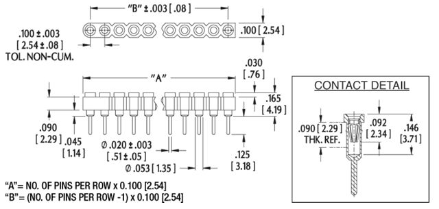

The key specs on the connector:

* height from PCB to top of socket 0.165 inch
* 0.1 inch pin spacing
* 0.020 pin diameter
* gold plated contacts

Do not get connectors that are much different in height!
I would say no more than about +- 10 thousandths difference in height, max.

These ones come in strips of 25 pins and can be cut to length.
Use good quality flush-cutters to cut them!

You need two 20 pin strips for the Pico2W, one 12 pin strip for the CN1 connector, and a 5 pin strip for the GPS mount.
That's 57 pins worth, or three of the 25-pin strips.
I would get a couple spares though because sometimes when you trim them, the plastic fractures leaving the pin on the end without enough support.

### Round-Pin Male-Male Interconnect Strips

The male-male interconnect strips that allow the umod4 to plug into the ECU sockets are harder to find.

The pins should be round, approximately 0.020 in diameter.

These ones from DigiKey (ED6864-64-ND) are very high quality: [Mill-Max 350-10-164-00-006000](https://www.digikey.com/en/products/detail/mill-max-manufacturing-corp/350-10-164-00-006000/357045?s=N4IgTCBcDaIMwFYAMBaAjKtA2ALCpqBWBSIAugL5A).

They come from DigiKey in strips of 64 pins and can be cut to length.
One 64-pin strip is enough: the system needs 28 for the EPROM, 12 for CN1, and 5 for the GPS module for a total of 45 pins.

I have also used male-male interconnect strips from LCSC in Taiwan, part number [C2764600](https://www.lcsc.com/product-detail/C2764600.html?s_z=n_q_C2764600&globalKeyword=C2764600).
These ones worked well, too.
Note that these strips are only 20 pins long, so make sure to get enough.
Again, get some spares in case something bad happens as you trim them to length.

## ECU Mods

All gen 1 ECUs were shipped with an uninstalled connector __CN1__, as seen below (top, center):

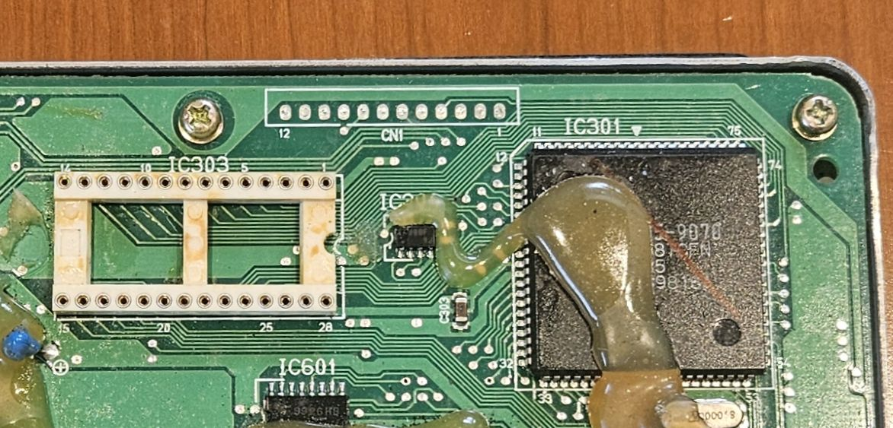

The CN1 connector gives the umod4 access to extra power & ground pins, but most importantly, access to the ECU processor's RESET signal.

Adding this socket is pretty easy as PCB rework goes, but if you are not confident in your skills, find someone who is and buy them a beer to do it for you.

__WARNING: be static safe when working with the ECU:__
* __Wearing a ground strap is strongly recommended whenever you handle the ECU or umod4 PCBs!__
* __Use an anti-static bag for the ECU and umod4 PCBs. Keep them in a bag when not in use!__

### Process

Start by removing the ECU from bike.
If you have never done that before, pay attention to the locking tabs when disconnecting the two big wiring harness connectors from the ECU.

With the ECU out, take it to a workbench and perform the following steps:

1) __Remove the ECU cover__ (4 screws)

1) __Remove ECU circuit board from ECU__ (7 screws)

    Remember: be static safe! Keep the board in a static bag while you are not working on it.

1) __Remove Solder From CN1 Solder Pads__

    Use a soldering iron and a solder sucker to remove the solder from all 12 holes on connector CN1.
    My technique is to clamp the board vertically, then melt the solder from one side of the PCB and use the solder sucker from the other side.

    If you have trouble getting the last bit of solder out, it can help to start over: add some solder to the hole, then try the solder sucker again.

    The goal is to end up with nice clean, solder-free mounting holes, as seen below:

    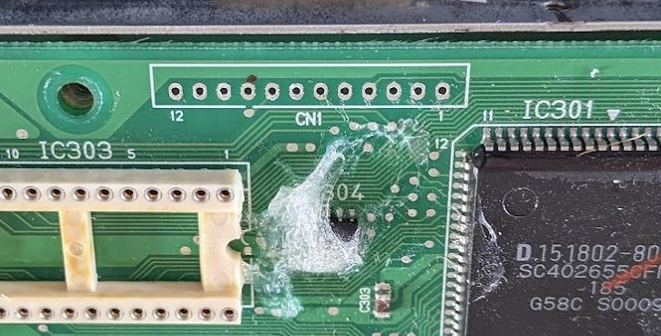

1) __Install Round-Pin SIP Socket Strip onto ECU PCB__

    Trim one of your round-pin [SIP sockets](#round-pin-sip-sockets) to be 12 pins long, and place it into the CN1 connector holes.
    It should fit in very easily.
    If not, you might need to clean more solder from one of the holes.
    It needs to face __UP__, the same direction as the EPROM socket.
    You will be soldering on the back side of the ECU PCB.

    To hold the new strip socket while it gets soldered, I use a rubber band around the whole ECU PCB to hold it in place. The rubber band does not need to be super-tight: it just needs to be strong enough to hold the SIP socket steady while you solder the first pin.
    Adjust the socket under the rubber band so that it sits as vertically as you can get it.

    After soldering one pin somewhere in the middle of the strip, verify that the SIP socket is both vertical and pressed tightly against the ECU PCB. It is OK to make adjustments by remelting the initial pin you soldered and adjusting the socket with your finger to get it where you want it.

    Once you are happy with your alignment job on the first pin, solder all remaining pins on the SIP socket.

    After soldering: do a visual inspection of your joints!
    Use magnification if you can, like a jeweler's loupe.
    Bad solder joints can cause all kinds of crazy/intermittent problems, especially in a high-vibration environment like a motorbike.

    When complete, your ECU should look like this:

    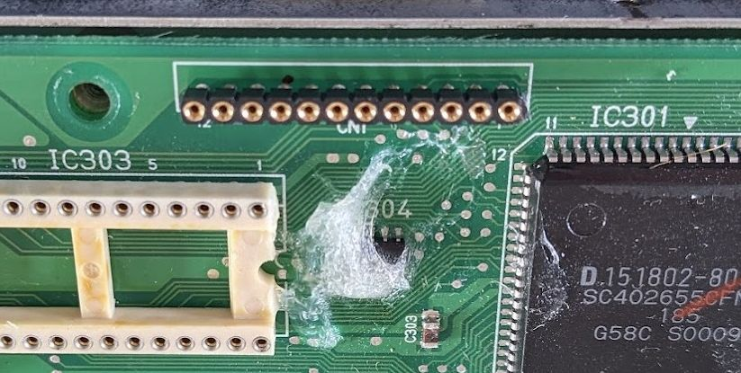

## Umod4 Hardware Prep

Depending on how many parts were installed at the PCB assembly house, you might need to install a few final parts on the umod4 board itself.

An example of that work for the initial run of 4V1a boards follows in this section.

### 4V1a PCB Prep

This was the first shipment of boards received from JLCPCB.com:

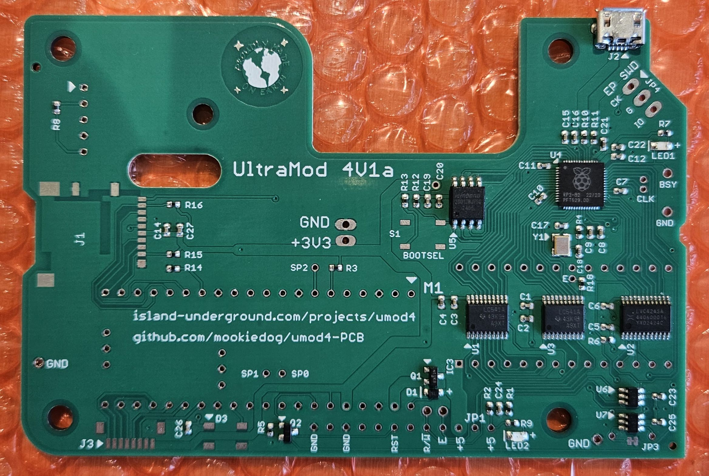

For various reasons, not all the parts got installed at the factory.
For example, the supplier was out of stock for the SD Card holder (J1), so the boards arrived without them.

Other parts that are easily hand soldered, I do myself at home to save money.
Those parts would cover things like the WS2812 RGB LED, all the 0.1 square pin headers, and the male-male round-pin SIP interconnect strips.

Still other parts like the ground test points are not required unless the board is being used for hardware development purposes.

The final class of parts to be added are called "bodge parts".
These parts fix PCB bugs or add functionality to the PCB.
The 4V1a board has a feature bodge to add a disk activity indicator LED.
It is not required for correct system operation, but it is a really nice visual feature.

#### SIP Sockets

__Reminder: ALL SIP sockets on the umod4 are meant for 0.020 round pins, not 0.025 square pins!__

##### Pico2W SIP Sockets

The Pico2W module needs a pair of 20-pin strips.
To ensure proper spacing and alignment of the two SIP sockets, use a spare socket strip inserted between the two strips as a spacer jig:

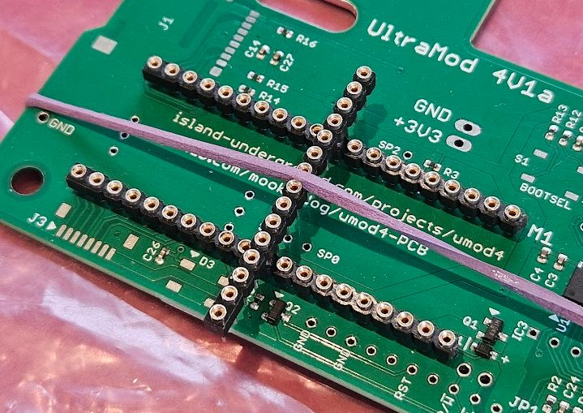

The spacer that spans the two strips keeps the strips to be soldered perfectly spaced and perfectly vertical.
The rubber band holds the SIP strips flush to the PCB.
Turn the board over and solder them up.
Do a visual inspection!

##### GPS Socket

Reuse the rubber band to attach the GPS socket:

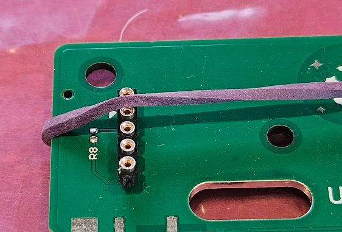

Lightly stretch the rubber band one way or the other to get the strip as vertical as you can, then flip the board over and solder pin 1.
Remove the rubber band and inspect it.
If you need to adjust it, now is the time.
Once you are happy, solder the rest of the pins.
Do a visual inspection!

#### Square Pin Headers

The square pin headers are only used for hardware test and software debugging purposes.
There is no need to add them unless you want to get deep into the embedded SW/HW development world.

They are meant for standard 0.1 inch spacing 0.025" square pin header strips for:

* +3V3, GND (2 pins): allows for easy measurement of power & GND
* EP SWD (3 pins): allows connecting a debugger to the EP
* BSY (1 pin): allows a scope or logic analyzer watch the timing of the fake EPROM cycles

Also: if you ever want to connect a debugger to the WP, you should add a 3-pin right-angle header to your Pico2W module as shown below:

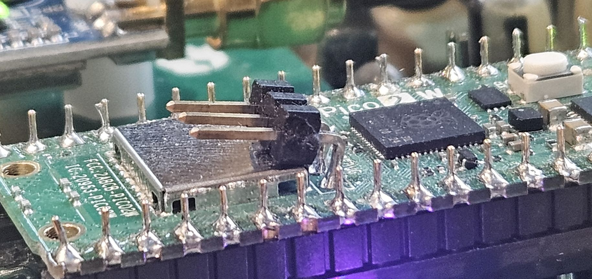

Before soldering, I mechanically wedge the connector with something squishy to get the horizontal pins to angle up slightly.
I find that the slight upwards angle makes it easier to attach on the debugger's "squid pins" for a debug session.

#### Test Points

Again, you really don't need to add the test points unless you will be doing hardware testing or development.
But if you do, I like using [Keystone 1035](https://www.digikey.com/en/products/detail/keystone-electronics/1035/315151?s=N4IgTCBcDaINYFMCeBnALgewHYIAQEYAGAZgFYQBdAXyA) parts for GND test points, as seen below:

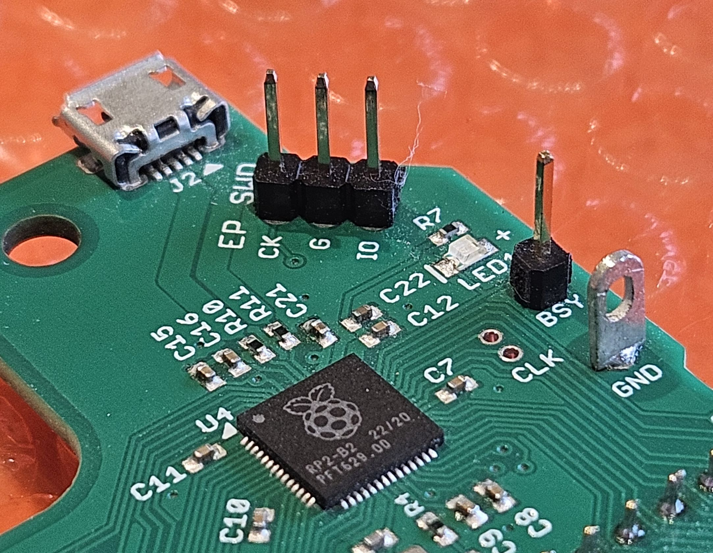

If you don't feel like getting the specific Keystone parts, 0.025 square header pins work well too.

#### SD Card Socket

_This part only needed to be soldered manually because the assembly house happened to be out of stock on the day that I ordered the boards._

The socket is a Hirose DM3AT-SF-PEJ, available from DigiKey or LCSC.

Should you need to solder this part, it takes a bit of skill.
I use solder paste in a syringe to apply solder to each pad, then place the socket on top of it all.
It is the accurate placing of the socket onto the pads that is the hardest part of this job!
If the placement goes badly, it is best to remove the socket, wipe off all the solder from the PCB with a Q-tip, and start over.

Once it is placed accurately, I solder one data pin, then verify that nothing moved.
If things look OK, I solder the rest of them.

After soldering, I use regular solder wire to add just a bit more solder to the mounting tabs at the board edge side for extra mechanical strength.
I also add a bit of solder manually to the card detection contacts on the side.
Bad detection connections can result in the system thinking that the card got removed and re-inserted which causes all kinds of issues.

I recommend using a jeweler's loupe or a microscope to check the solder job.
Poor solder joints typically make themselves known by causing intermittent failures due to temperature changes or vibration effects.

#### Unused Parts

__S1__: there really is no need to install S1, the 'bootsel' button for the EP.
The SWD method of programming the EP via the WP has been so successful that the 4V2 PCB is going to retire the EP's BOOTSEL button and its USB connector J2.

I would not bother installing it at this point.

__J3__: this 8 pin connector is not used, and will not be used by future PCB versions.
It has been removed from the 4V2 PCB design.

#### Add Disk Activity LED

Early on, I decided to add a disk activity LED to the 4V1a PCBs.
This addition is OPTIONAL, but recommended.

As bodges go, this one is very simple.
This is where it goes:

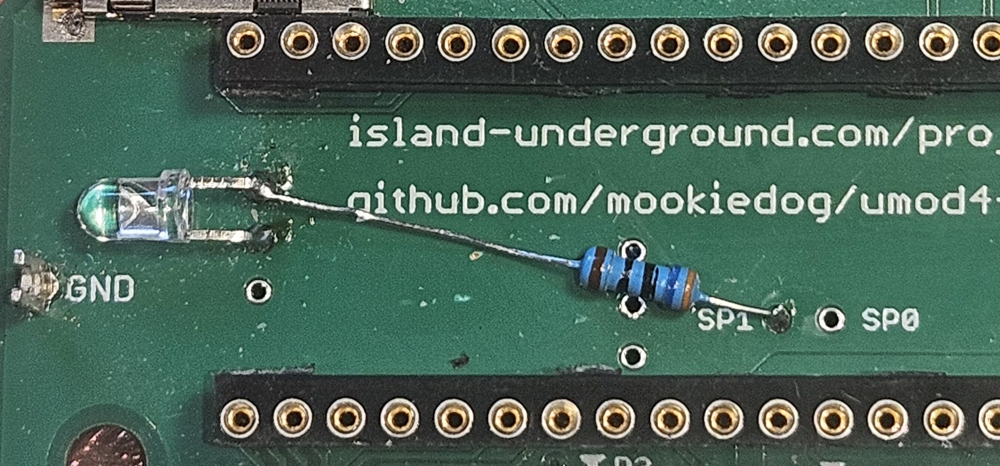
The disk activity LED is mechanically soldered to the upper 2 of the 3 vias shown above.
The middle via is connected to GND on the PCB.
The upper and lower vias are not connected to anything.

This means that the LED cathode needs to go to the center GND via, and the positive anode goes to the upper via.
In almost all cases, the LED anode is the longer of the two LED pins.
Using pliers, bend the LED leads 90 degrees.
As per the photo, leave enough horizontal length so the LED will not be visually obscured when the Pico2W module is mounted on top of it.

Once the LED is soldered in place, add a current-limiting resistor from the via marked 'SP1' to the upper (anode) connection to the LED.
The resistor should limit the current to about 5 mA.
In my case, I used an emerald green LED with a Vf of 2.7V, so the resistor was calculated as (3.3V-2.7V)/.005A = 120 Ohms.

If you use an LED with a Vf much different than 2.7V, calculate the resistor value accordingly.
Do NOT attempt to drive the LED with more than 5 mA of current: the Pico GPIOs really should not drive more than that.

If you are being super-serious about the bodge, you would put a dab of hot-melt glue, or some electronic-safe RTV to hold down that resistor and its leads.

Here is a 4V1a with everything mounted, all ready to go:

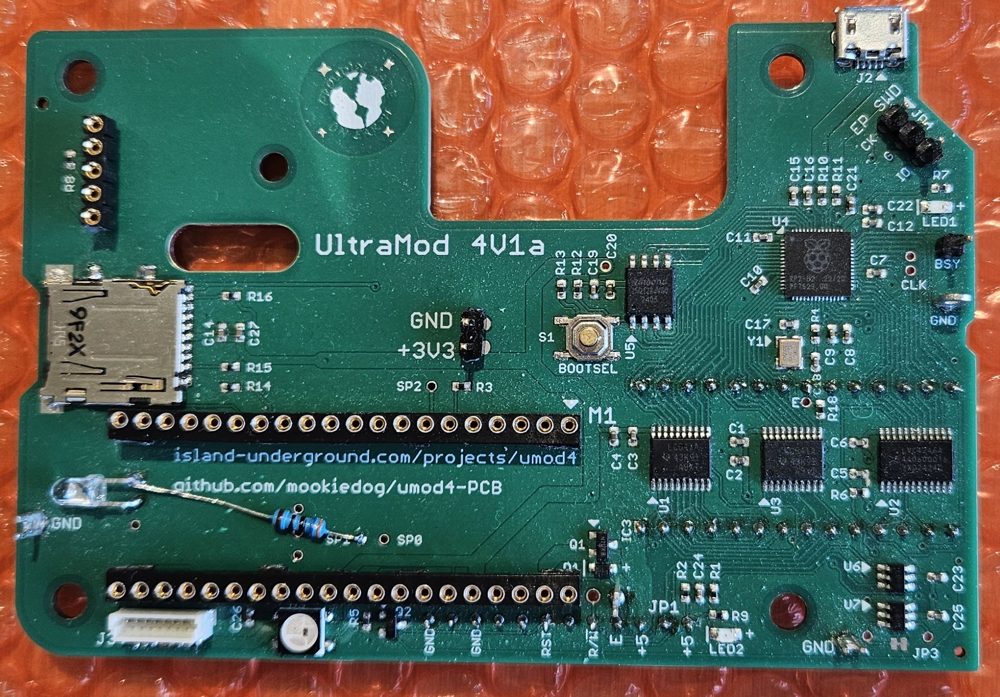

### GPS Prep

All of the GPS modules I have obtained from Ali Express arrive with 0.025" square pin headers already soldered into them.
Since the umod4 board has a round-pin socket for the GPS, these headers need to be replaced.

I do it destructively, using flush cutters to cut off excess pins, then break the plastic between each pin.
This allows the old pins to be unsoldered and removed one at a time.
Use a solder sucker to clean out the old holes.

Trim off a strip of 5 of the [male-male interconnect](#round-pin-male-male-interconnect-strips) pins.

The GPS module itself will be on the backside when you are done.
Insert the male-male strip so that the side of the strip with the metal flush to the plastic is flush with the GPS board.
The conical side of the pins should face away from the PCB, as shown below:

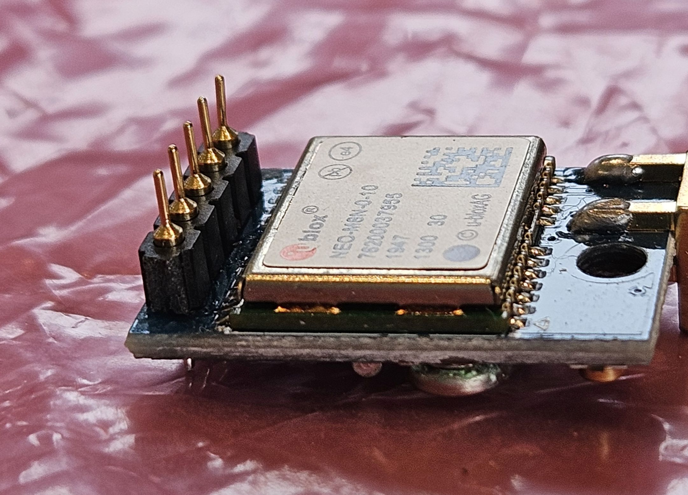

Solder the interconnect strip to the GPS.

#### GPS Mount

A mounted GPS is not required to install the software, but you __must__ screw it down before mounting the umod4 in an ECU.
You need a retaining screw for the GPS.

I use a nylon screw, spacer, and nut to mount the GPS to the umod4. A 12mm metric M3 screw or a 1/2 inch #4-40 machine screw will do.
The spacer should be approximately 8mm tall.
Make sure to use a plastic/nylon spacer to avoid causing potential electrical shorts on the GPS module pins.

Before adding the mounting screw and spacer:

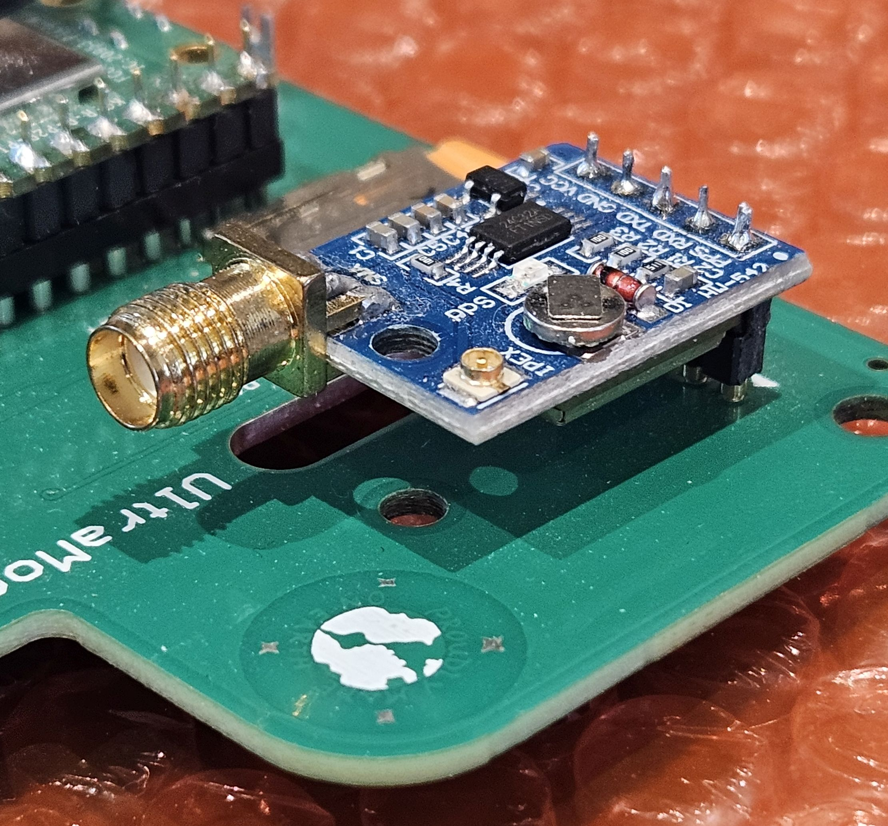

## Umod4 Initial Software Installation

_The setup below should be enough to initially install software onto the umod4 board, and to run the server and visualizer tools afterwards. It is very experimental though - if you find issues let me know robin@island-underground.com_

At the moment, the umod4 system is primarily aimed at usage by a software developer, meaning that they would have the entire [build system](./BUILDING.md) set up and running on their machine.
If you have the full development system running, skip the next section for non-developers.

### Non-Developer (EXPERIMENTAL!)

It may be possible to get a umod4 running without a full development system.
Certain bits of software do need to be installed though, as described below.

__The umod4 requires a linux machine, or a Windows machine with WSL (Windows Subsystem for Linux) installed:__

* Windows machines must [install WSL](./BUILDING.md#install-wsl2)

* Windows machines must [install the terminal app](./BUILDING.md#windows-terminal-app)

* Install the avahi tools, as described in the [build document](./BUILDING.md#avahi)

* Open a bash terminal window and make yourself a [local bin directory](./BUILDING.md#create-a-local-bin-directory)

* Install a prebuilt 'picotool' utility. Prebuilt binaries can be found [here](https://github.com/raspberrypi/pico-sdk-tools/releases). There may be more recent versions available, but the following instructions will get you an X86 version that should work fine:

```bash
cd ~
wget https://github.com/raspberrypi/pico-sdk-tools/releases/download/v2.2.0-2/picotool-2.2.0-a4-x86_64-lin.tar.gz
mkdir -p ~/.local/bin/picotool
tar -xzf ~/picotool-2.2.0-a4-x86_64-lin.tar.gz -C ~/.local/bin/picotool
```

Run the following commands to add the extracted picotool directory to your PATH variable:

```bash
echo 'export PATH=$PATH:~/.local/bin/picotool' >> ~/.bashrc
source ~/.bashrc
```

* Make a projects directory

```mkdir -p ~/projects```

* Get the current umod4 codebase installed in your new projects directory.
This is the easiest way to get all the files needed to run the server and visualizer tools:

```bash
git clone https://github.com/mookiedog/umod4 ~/projects/umod4
```

__T.B.D.__

Obtain binary files for WP.uf2, EP.uf2, and partition_table.uf2.
__For now, you will need to send me an email or something until I get a release process set up.__

Put them in a directory together somewhere.
Your home directory ~ is fine.

Skip down to [Powering the Umod4](#powering-the-umod4).

### Developer

Start by making sure that you have built the most recent firmware.
Sync your source tree with the github repository:

```bash
cd ~/projects/umod4
git status
```

If the output says "nothing to commit, working tree clean", you are safe to proceed.
The "git pull" will bring all updates from the remote repository into your tree:

```bash
git pull
```

To be totally sure that everything gets built properly after a remote update, you should completely rebuild the entire project:

* Delete your 'build' directory: left click 'build' in the VS Code file explorer window and press the ``del`` key.
  When it asks for confirmation, __double check__ that it is going to delete the 'build' directory and not something else!
* Type ``F1``, then ``"cmake: clean rebuild"``
* The rebuild must complete with "exit code 0" (no errors)

The up-to-date firmware is now ready in your build directory.

### Powering The Umod4

The umod4 is designed to take power from the ECU (if the ignition is ON), or from the WP's micro USB connector.
The USB power option allows the umod4 to be powered with the ignition turned OFF.
This is what allows the wifi interface to remain active while the bike is parked in the garage.

A side effect of this dual-power mechanism is that the umod4 runs just fine all by itself without being plugged into an ECU.
This means that you can perform the initial software install on a bench instead of trying to do it mounted on your motorbike.

__Again: Make sure to put the umod4 on a static-safe surface while working with it.
The static-safe bubble wrap it came in is a good choice.__

Leave the micro SD card out to begin with.

Find a micro USB __data cable__.
Some USB cables are power-only.
__They will not work!__

With the micro USB data cable detached from everything, connect the umod4 to your development system in the following sequence:

* Insert the cable into a USB port on your development system PC
* Hold down the BOOTSEL button on the WP (located near the micro USB connector)
* While holding BOOTSEL down, insert the micro-USB cable end into the Pico2W (it's the red cable, below)
* Once the USB cable is fully inserted, you can release BOOTSEL

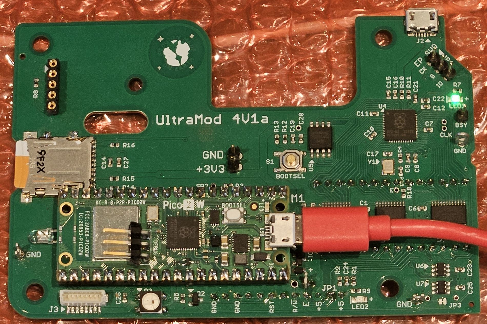

With no software in the device, you will see the DBG_BSY LED glow dimly as soon as you plug it in (upper right, above).

A Windows system will pop open a file explorer window showing a mass storage device called 'RP2350' with exactly two files on it:

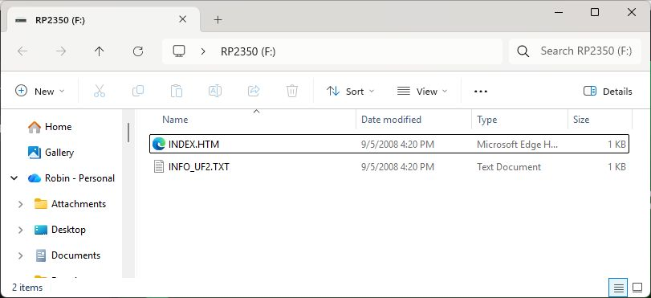

If you do not see an RP2350 Mass Storage explorer window open up, it is quite possible that you are not using a USB _data cable_.
Try different USB cables if you need to until you see the explorer window open up.

### WSL2 Only: One-Time USB Setup

_If you are on native Linux (not Windows/WSL2), skip this section._

Before `flash_WP` can talk to the device, Windows must grant WSL permanent access to it.
This is a one-time step per machine — once done, it survives unplugging and reboots.

In your WSL bash terminal, run:

```bash
~/projects/umod4/tools/setup_usb_wsl
```

A UAC prompt will appear on the Windows desktop — click __Yes__ to allow it to run as Administrator.
The script will print a summary showing which devices were successfully bound.

You only need to run this again if you plug in a new type of USB device that wasn't connected the first time you ran it.
For example, if you later add a Raspberry Pi Debug Probe for flashing and debugging, plug it in and run the script again to bind it.

### Install WP Firmware

If you are a non-developer and put the appropriate uf2 files in your home directory ~, cd to your home directory and type the following command:

```bash
~/projects/umod4/tools/flash_WP -e ~
```

If you have a full development system working, cd to your home directory, then type the following command:

```bash
~/projects/umod4/tools/flash_WP -e ~/projects/umod4/build/WP
```

Either way, the flash_WP script will start running.

#### Flash_WP Output

The flash_WP command is a bash script that partitions the WP's flash memory and then loads the initial WP firmware image.

If you see an error message like this, it means that your WP was not in BOOTSEL mode:

```txt
Scanning for RP2350 Boot device via usbipd...
Error: No 'RP2350 Boot' device found in usbipd list.
Make sure WP is in BOOTSEL mode (press&hold BOOTSEL while powering up).
```

_If you get that error, unplug the micro USB cable from the WP, and repeat the BOOTSEL power-on sequence from the previous section until you see that RP2350 Mass Storage window open._

Assuming that the script detected the WP properly, it will start running.
Over the next minute or so, the script will completely erase the WP flash, repartition it, then verify that the rebuilt partitions are present.
Once the partitions are in place, the script will load the WP image into the first image partition, verify the image, and reboot to start the new image running.
The output of the script should look like this at the end:

```txt
<lots of snipped messages...>

Loading WP image to slot 1...
Downloading into partition 1:
  00010000->00207000
Loading into Flash:   [==============================]  100%
Verifying Flash:      [==============================]  100%
  OK

Rebooting device...
```

After the reboot, the WP firmware will be running for the first time.
You should see three LEDs in operation:

* the big RGB LED will be glowing red, meaning "No Micro SD Card installed"
* the small green WiFi indicator LED on the Pico2W near the USB connector will be flashing slowly (about once per 2 seconds)
* the small LED1 in the upper right corner of the board will still be glowing dimly because the EP software is not loaded to drive it yet.

Now that the WP is running, it is worth installing your micro SD card.

__WARNING: if this card was previously formatted for use with some device other than a umod4, the umod4 is going to reformat it immediately after insertion. ALL DATA WILL BE DESTROYED!__ If the card was previously used in a umod4, it will NOT be reformatted and all data on the card will be retained.

The umod4 is designed to hotplug SD cards, so you can do it with the power on.
Insert the card with the electrical contacts facing down towards the PCB.
The WP software will detect the card immediately.
The RGB LED will go through a couple of color changes as WP sees the new card, tests it, and mounts the file system.
When the file system is mounted and ready for use, the LED will turn magenta.
Magenta is the color you always want to see on that LED!

After mounting the filesystem, the disk activity LED will probably flicker a couple times as the WP gets to work and creates a new log file.

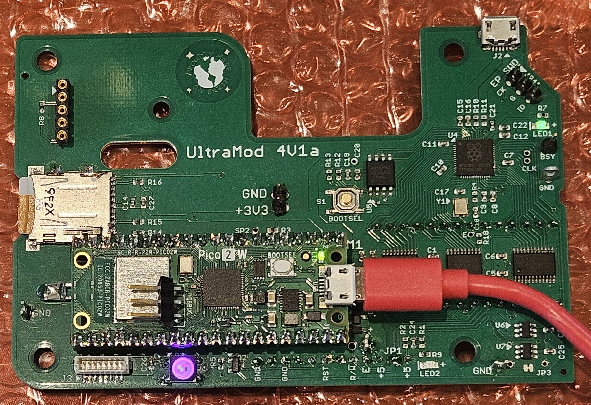

#### Slow-Flash WiFi LED

The slow-flashing WiFi indicator LED (right beside the WP's micro USB connector) means that the WP is in "Access Point Mode", broadcasting its own network.
This is because the umod4 does not know how to connect to your home network yet.

### Connect umod4 To Home WiFi

The next step involves getting the umod4 connected to your home wifi.
This process is called "provisioning" the umod4.

You can use a phone or a laptop with a wifi interface.
The instructions here assume you use a phone.

Open your phone's wifi settings and scan for WiFi networks to connect to.
You will see one called "umod4_XXXX", where XXXX matches the last 4 digits of your umod4's MAC address.
In the example below, the umod4 AP-mode network shows up as "umod4_1EA3":
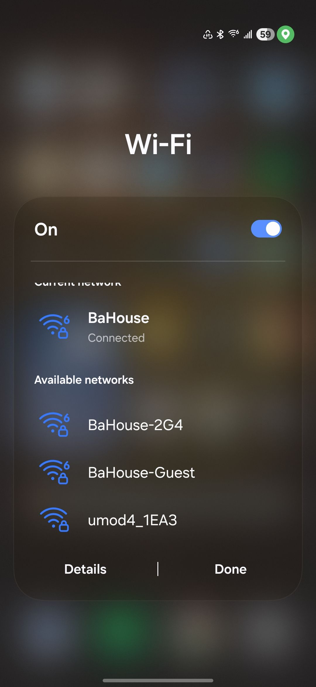

Ask your phone to connect to that WiFi network.
The default password is exactly the same as the WiFi name/SSID (case is important!).

Your phone may complain that the new wifi connection has no internet access and discourage you from connecting to it.
That's OK, connect to it anyway:

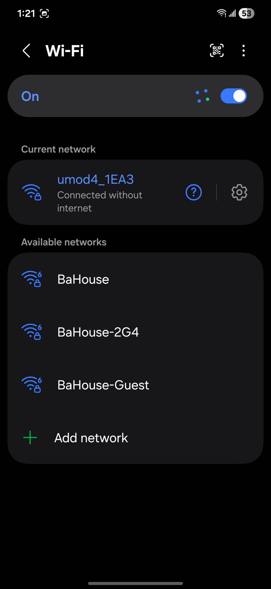

Once connected, open a web browser on your phone.
In the address bar, navigate to the following IP address: ``192.168.4.1``.

You will see the umod4's configuration page:

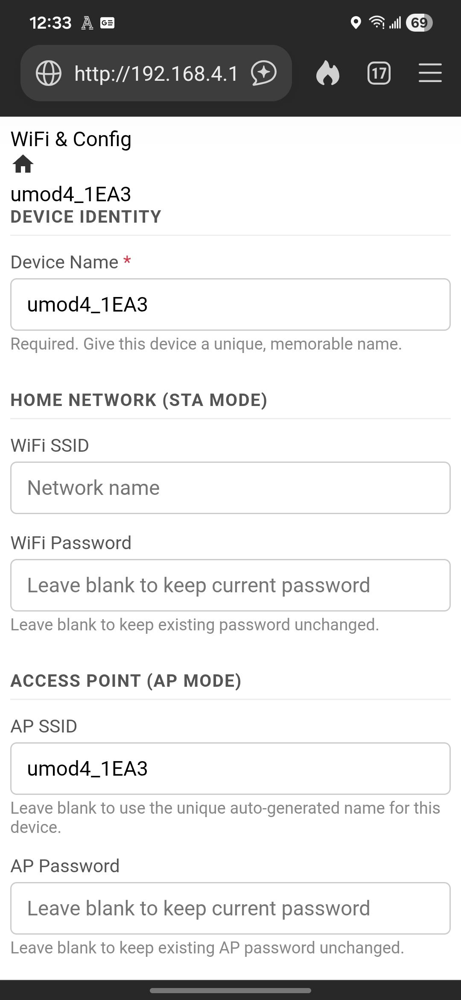

Pick a new name for your device.
Keep the name simple: no unicode or emoji chars!

The section titled "HOME NETWORK (STA MODE)" is where you enter the credentials for your home network.
Enter your network name and its password in the proper boxes.
Do NOT hit "Save and Reboot" yet.

Next, you can change the umod4's AP network name to something more memorable if you want.
But even if you do not change the AP network name, you __MUST__ give it a new, __strong__ password: __this network will get broadcast where ever your bike goes!__

_FYI: it is easy to change the AP Network name and password later so don't freak out about picking the best name possible right now._

Once you have entered all the configuration fields, click on "Save & Reboot" at the bottom of the page.

You should see a new page on the phone saying that it is now connecting to the home network.
The WP will reboot.
This time, the WiFi LED should come solid (no more slow-flash) meaning that the WP is connected to home WiFi.

At this point, you can find out the IP address of your new umod4 board on your home network.
Replace 'Tuono' with whatever you named your umod4:

```bash
avahi-resolve-host-name -4 Tuono.local
```

It will come back with something like:

```bash
Tuono.local        192.168.1.11
```

For fun, go to a browser on your PC and enter that IP address in the browser address bar.
Your umod4 actually hosts a small website with all kinds of fun things to do:

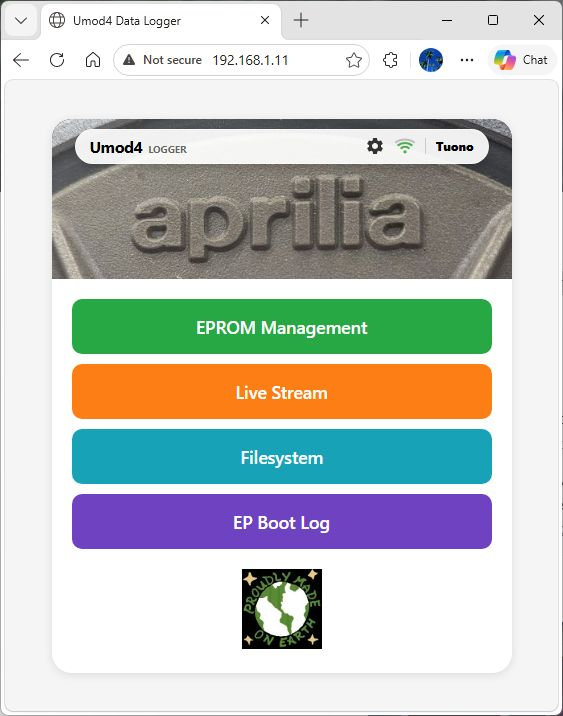

Your webpage won't have a cool background image yet - that's something you can customize on your own umod4.

Feel free to click around a bit. But don't get too distracted though, the next step is to install EP firmware, below.

### EP Software Installation

Now that the WP is on your home network, you can flash the EP firmware over WiFi.

For non-developers, type the following command, substituting the name you gave your device during WiFi provisioning. This also assumes that you put the EP.uf2 file in your ~ directory:

```bash
cd ~/projects/umod4
./tools/flash_EP <your-umod4-device-name> ~
```

If you have a full development system working, type the following command, again putting in the real name you gave your device during provisioning:

```bash
~/projects/umod4/tools/flash_EP <your-umod4-device-name> ~/projects/umod4/build/EP
```

The script will connect to your device, upload the EP firmware, then program it via SWD.
When it completes, the EP is running the new firmware and the umod4 is fully installed.

You will know that the EP firmware is running because the BSY LED will start flashing very brightly 2 times per second.
This is the EP telling you that the ECU is not powered, or in this case, that the ECU is entirely missing!

## Install umod4 Board in ECU

With all the software installed, and server communication established, it is finally time to install it in the ECU.
There are a few steps, but nothing very hard.
The point of the soldering process described below is to ensure that your umod4 board ends up perfectly aligned with your ECU.

1) __Install Round-Pin Male-Male Interconnect Strips Into ECU Sockets__

    __Critical:__ The male-male interconnect pins have one side where the metal sticks out, and one side where the metal is flush to the plastic. The side with the metal flush to the plastic is the side that faces __up__ to mate flush with the umod4 board.

    Here is a picture showing the male-male pins.
    The strips are plugged into the static foam opposite to each other so you can see the difference between the two sides:

    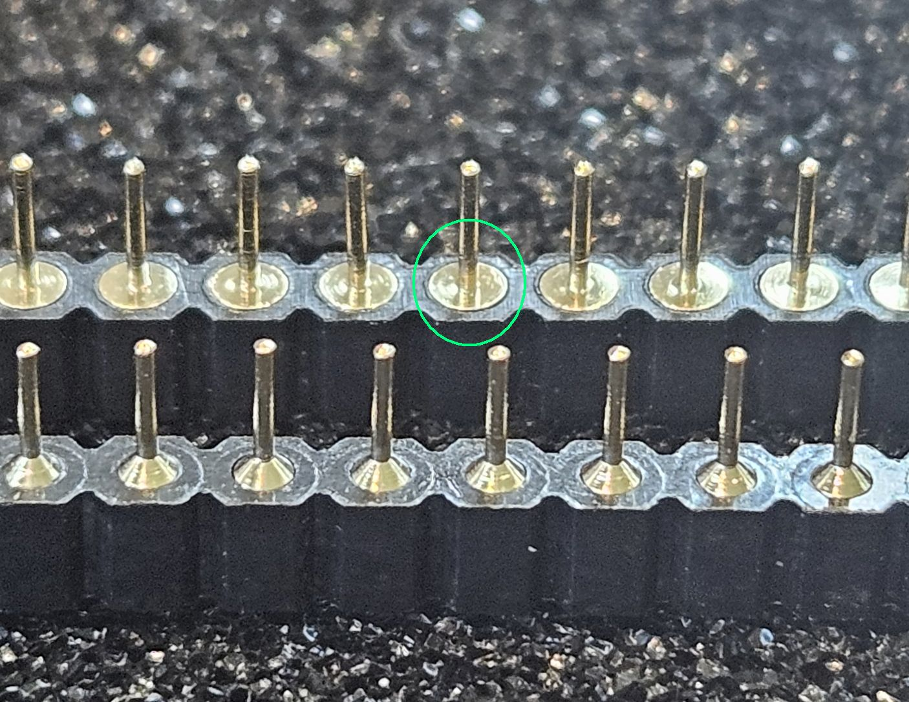

    The side of the strips with the metal flush to the plastic is shown with one of the pins circled in green.
    You can clearly see the conical part of the pin on the strip below.
    The conical side of the strips will get inserted into the sockets on the ECU.

    __AGAIN: the male-male pin strips should have their conical sides facing down to the ECU sockets. The flush metal side of the strip mounts flush against the umod4 board.__

    This is what it should look like when the pins are installed in the sockets.
    The metal-flush side of each strip is __UP__:

    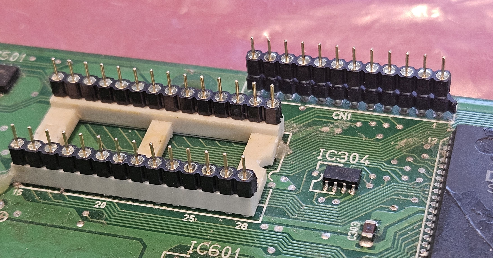

1) Place Umod4 onto ECU Male-Male pins

    I find it best to hold the umod4 at a very slight angle so that the pins in the EPROM socket at the far left of the photo engage first, then tilt the board flat to engage the rest of the pins.
    You might have to wiggle the board a tiny bit to get the CN1 pins to get started into their holes.

    Once mated, visually inspect to make sure that:

    * the male-male strip is flush to the umod4 PCB
    * you have a pin sticking through __every__ hole as shown below:

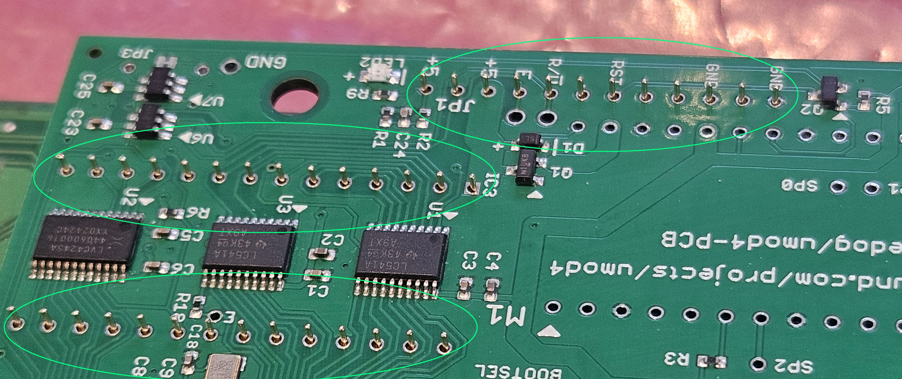

If so, you are ready to solder. Pick a pin in the middle of the male-male strip to solder first. Apply a bit of pressure to the umod4 board for the first pin you solder to guarantee that strip is flush to the umod4.
Inspect that your first solder joint has the connector flush to the umod4. If not, fix it with some pressure on the top of the umod4 while re-melting the joint. When you are happy, solder all the pins.

Soldering the pins in this fashion means that your umod4 has perfect alignment with your ECU and its new CN1 strip socket.

1) Carefully remove the umod4 board

    __Never be in a hurry to remove the umod4 (or any chip, for that matter!).
    Go slow and be careful. Bent pins can be repaired, but it is best to avoid bending them in the first place!!__

    I find it works best to use a medium-sized flat blade screwdriver, but __not__ as a pry bar.
    Insert the screwdriver blade between the board and the EPROM socket.
    Then: do __not__ pry upwards but slowly rotate the screwdriver to apply the pressure that separates the board from the socket.
    Rotational pressure is much easier to control than using the screwdriver like a prybar!

    Once lifted off, put the board in a static bag.

1) Replace ECU back into bottom carrier

    Do NOT use the original steel screws for the 4 locations where the umod4 board mounts.
    Instead, use the four 8mm nylon standoffs.
    Screw them into the ECU by hand, finger tight.

    __Do NOT overtighten the standoffs! They are nylon, not steel! Breaking off the threaded portion of a nylon standoff into the ECU mounting boss would be a big mistake! 'Snug' is fine!__

    The standoffs should look like this when you are done:

    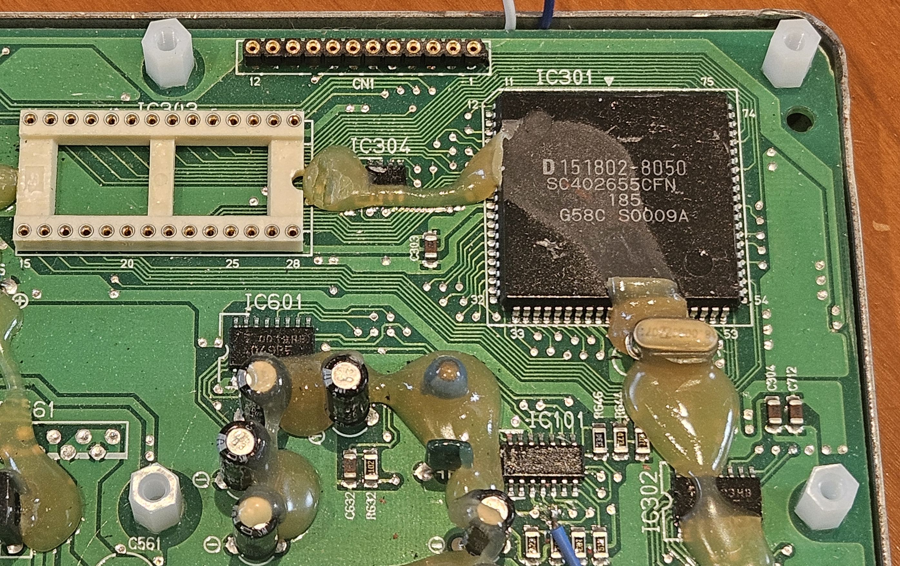

1) Mount the GPS on the umod4

    See [Mount GPS](#gps-mount).

1) Reinstall the umod4/GPS onto the ECU PCB

    This is not hard, but it is slightly trickier than installing a plain EPROM because now you need to line up three sets of pins.
    In your favor: the pin alignment is perfect because that's how you soldered it!

    __Carefully__ get all 3 rows of pins lined up with their socket holes on the ECU PCB.
    Triple check that __all__ pins are correctly lined up and starting into their corresponding socket holes before applying the pressure to seat them all.

    When the umod4 board is seated into the 3 socket strips, it will sit flush on the 4 nylon standoffs.

    Once seated, use 4 nylon screws to attach the umod4 to the standoffs.
    Again, lightly tighten the nylon screws with a screwdriver.
    It would not be a disaster to break off a mounting screw because the standoffs are replaceable, but there is no need to overtighten them!

    It should all look like this:

    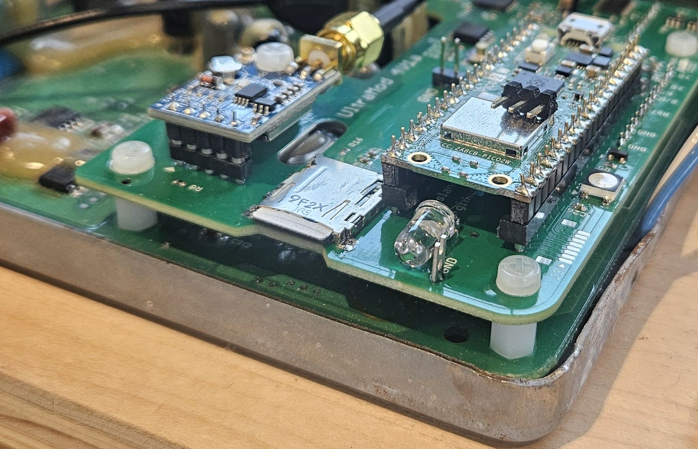

1) Screw the GPS antenna cable to the SMA connector on the GPS module (as in the picture, above).

And that's it.

The ECU cover will not fit over the umod4 board anymore, so don't bother with it.

## Install ECU On Bike

Reinstall the ECU in the motorbike and reconnect the two big wiring harness connectors.

If you turn the ignition ON, you will hear the fuel pump come on, then shut off a few seconds later.

That's your feel-good moment: it means that the EP booted, constructed a "limp-mode" ECU image for the ECU, then booted the ECU.
If you hear your fuel pump cycle on then off like normal, it means that a few million ECU CPU cycles just executed properly using your new umod4 as its EPROM!

## Garage Power

I recommend leaving your umod4 powered via USB cable at all times when the bike is in the garage.
You don't actually _need_ to power the umod4 24x7, but without power, it will have no wifi connection, so no OTA updates, no automatic log file downloads, etc.

My technique is to leave a 4-foot micro USB data cable permanently plugged into the WP's micro USB socket.

When I go for a ride, I coil the cable under the seat.

When I get home again, I put the Tuono on its battery maintainer, pop the rear seat, uncoil the umod4 USB cable and plug it into a USB supply near the bike.
The umod4 will come to life.
The EP will flash the BSY LED at 2Hz because the ECU has no power.
The WP will mount the SD filesystem and turn the RGB LED to magenta.
At the same time, the WP will ping the server, then get to work uploading the new ride logs.
The disk activity LED will flicker as the logs get uploaded.

## Next Steps

The next steps are all performed using the server program and wifi.
You will set up what EPROM image you want the bike to run when you turn it on.
And finally, you can go riding again!

## Factory Reset

Should you really want to do a "factory reset" on a umod4, it is possible.

### WP

Put the WP in bootsel mode by plugging it into your PC while holding down the BOOTSEL button.

Run the following command to completely erase the WP:

```bash
picotool erase
```

This command erases everything to do with the WP: the device name, network credentials, firmware, everything.
To get it working again, follow all the instructions related to [umod4 initial software installation](#umod4-initial-software-installation) in this document,

### EP

__T.B.D.__ At the moment, only the WP can get erased back to a true factory reset.

For the moment, if you really wanted to flush everything out of your EP, it would be enough to use a browser to visit your bike's website, then:

* erase all the images in your image library
* delete all entries in your image selector

That deletes any EP personalization from your device.
Completely removing the EP firmware is not necessary.
