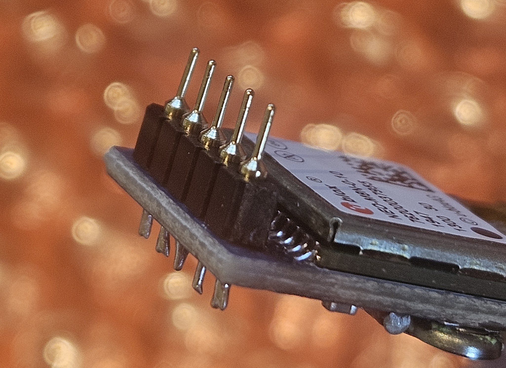
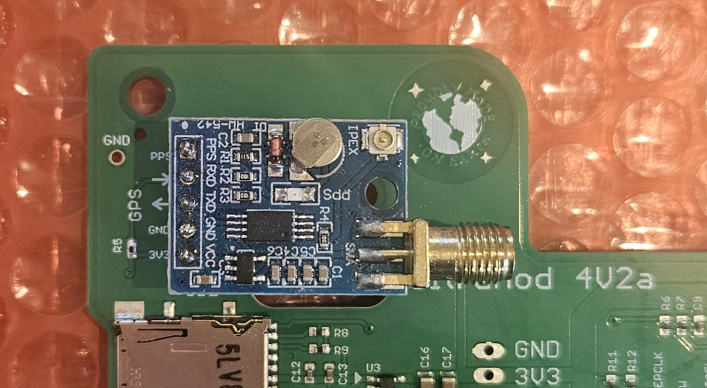
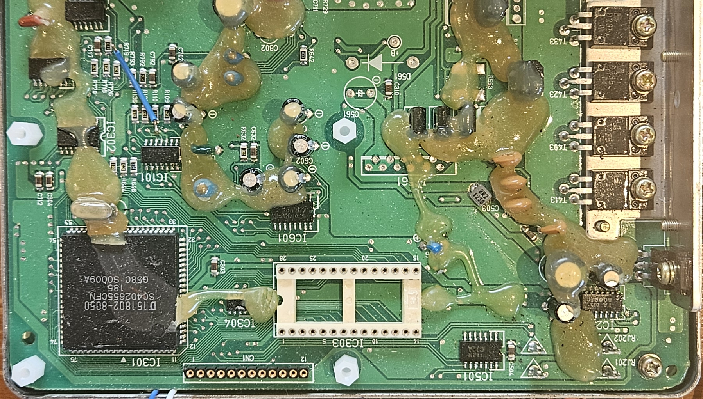
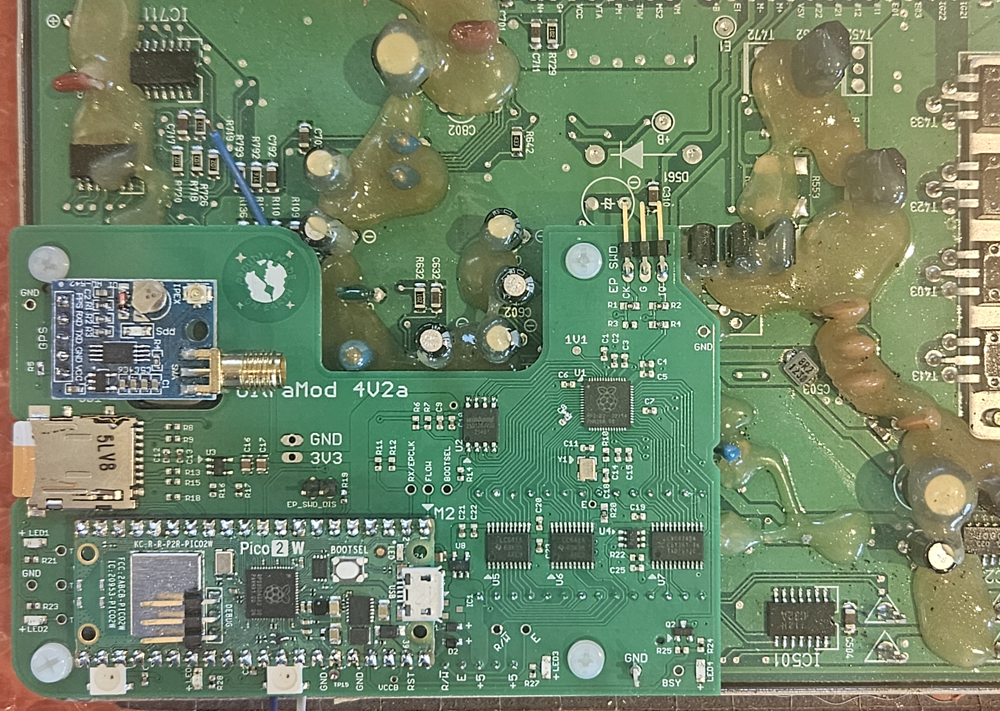

INSTALLATION.md

# Installation and Bringup

This doc describes how to install a umod4 and bring it up for the first time.

Things you will need:

* A PC (laptop or desktop, Windows or Linux)
* A micro USB cable
* WP firmware: A "WP.uf2" file loaded onto your PC
* A stock ECU that has been modded to add a SIP socket for CN1
* A "double sided" Ublox NEO-M8N GPS module
* A Pico-2W module

## Preparation

### GPS

IMPORTANT: the GPS modules may come with square pin headers mounted on them. If so, you MUST remove them and replace them with a 5-pin **round pin** header.

There are 2 key points to pay attention to:

1) When installing the round-pin male-male strip, one side of the strip has conical metallic protrusions from the socket, and the other side is flush with the plastic socket strip.
Mount the flush side to the GPS board.

2) The silver cover marked UBLOX faces down towards the umod4 board.

Make sure the new round-pin header gets installed just like the photo, below:

Insert the GPS into the socket on the umod4.

Verify that the silver ublox cover faces DOWN. It should look exactly like this:

Use a nylon screw and spacer to hold the GPS to the umod4. Do this before mounting the umod4!

### Pico2W

**needs round pin headers on all 40 pins**

## Installation

Once the GPS is mounted to the umod4, the installation process can begin:

* Remove the ECU from the bike
* Remove the old EPROM

    Use a flat-blade screwdriver and ROTATE it to lift the EPROM: do not pry it up.

* Replace 4 of the screws holding the ECU to its mounting place with nylon standoffs, as shown below:

**WARNING: Do not overtighten the nylon standoffs.** Barely more than finger tight is just fine.

* Insert the umod4 PCB into the sockets.  It is best to locate the board using the new CN1 socket strip because it is easiest to see when you are lining things up.

Before seating the umod4, double check that the pins line up perfectly with CN1 and the EPROM sockets.
If everything is OK, apply enough pressure to the top of the umod4 over top of the socket area to seat the pins.

* Verify that the umod4 is seated properly, then install 4 nylon screws to hold it to the spacers.

* Put an SD card into the umod4. It can be any size, but bigger is not necessarily better. A 32-64G card works just fine. The SD holder is a positive latching push-push socket.

* Install the Pico2W module. Pay particular attention to have the USB connector facing the middle of the ECU, as shown below.

At this point, it should look like this:

I did not screw down the GPS in that photo. You should have done it though or else you will need to remove the umod4 board to do it.

## Power Up

The umod4 is designed to run even when the ECU has no power. This allows a umod4 to be powered with a USB adaptor so it can use WiFi even when the bike is turned off and parked.

To load WP software the very first time into a blank Pico2W module takes a few extra steps.
You will need a laptop (windows or linux).

Connect the USB cable as follows:

1) Start by plugging the USB cable into your laptop, making sure the micro USB end is **not** inserted into the Pico2W.

2) There is a tiny button on the Pico2W labeled "BOOTSEL". While pressing and holding that button down, plug the micro USB end of the cable into the Pico2W.

Your laptop will recognize the Pico2W as a Mass Storage device. Give it a few seconds. If it is not recognized by your PC, unplug the micro USB end from the Pico2W, and try again making sure to hold BOOTSEL pressed down while you insert the micro USB cable end into the Pico.

Locate the WP firmware on your PC/laptop. It will be named "WP.uf2". Drag and drop that file onto the Pico mass storage device.

It will take a minute to flash the first time. When flashing completes, the WP will start running automatically. You will see some of the LEDs on the umod4 light up. In particular, one of the RGB LEDs will change color a few times, then settle on magenta. That means that the SD card is recognized, mounted, and the filesystem is ready for operation.

You will also see a pale green LED on the Pico module blinking slowly, about once per second. That is the WP telling you that it does not know the WiFi credentials for your home WiFi network.
