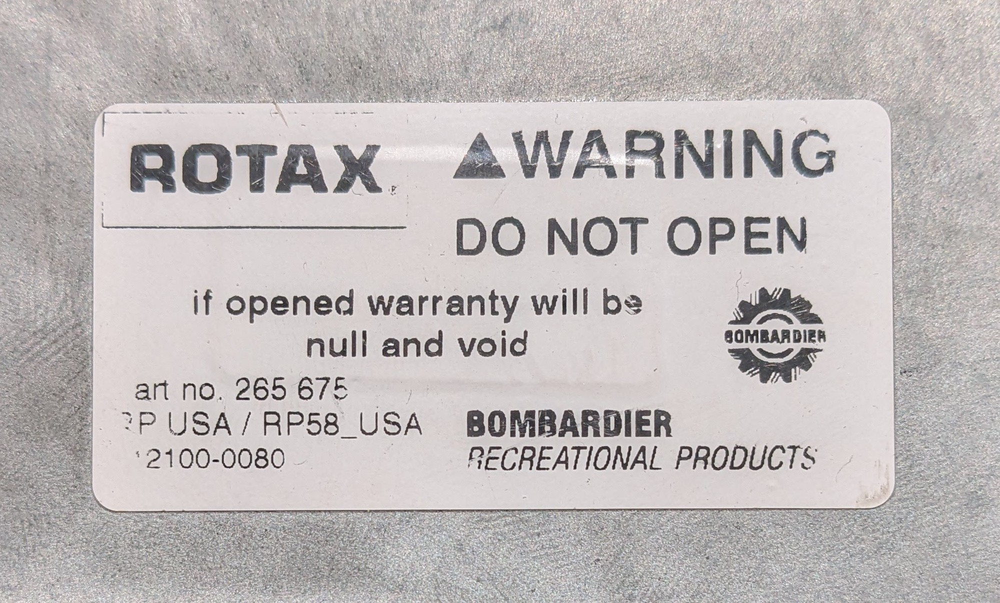
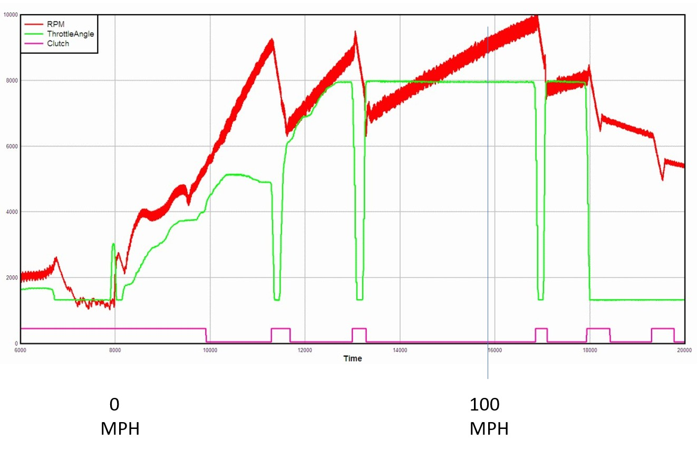
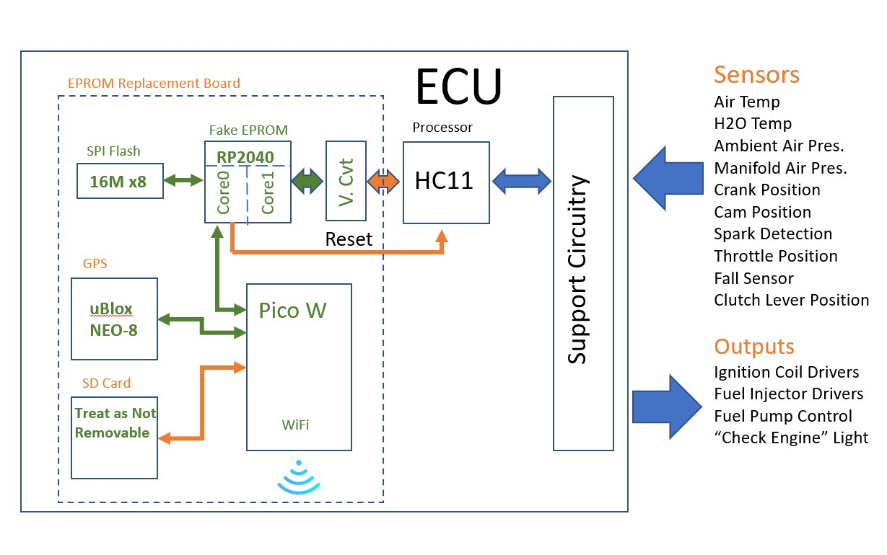
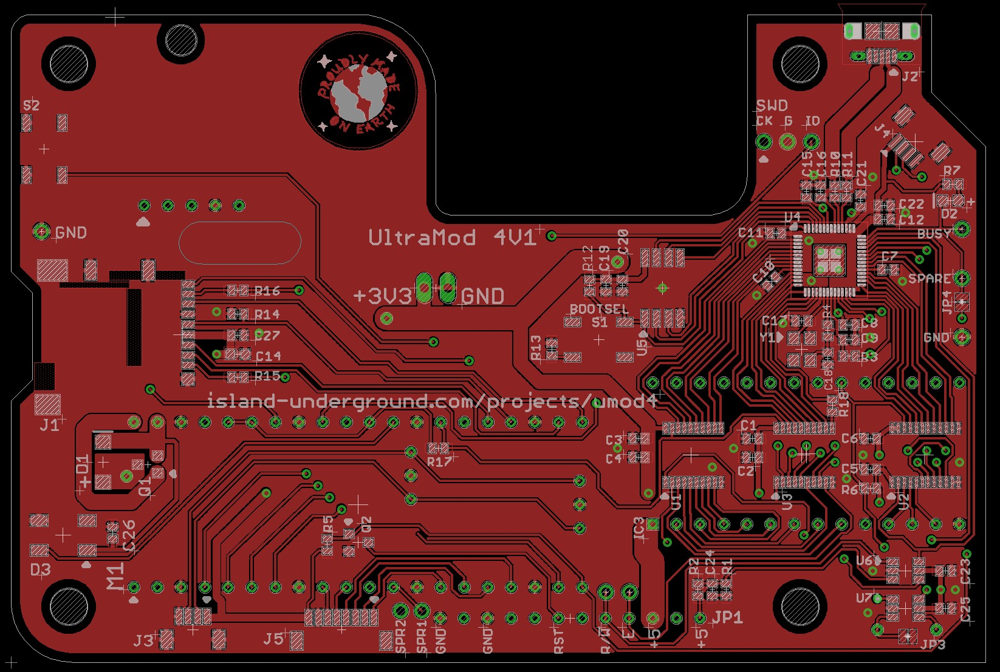
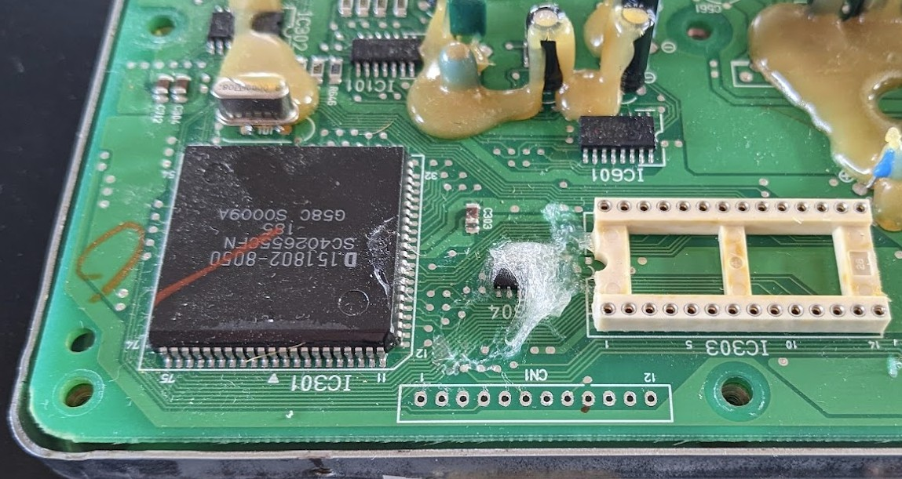
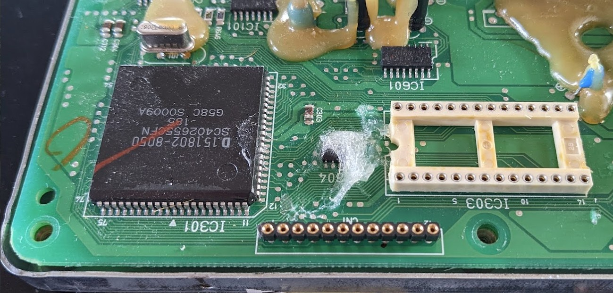
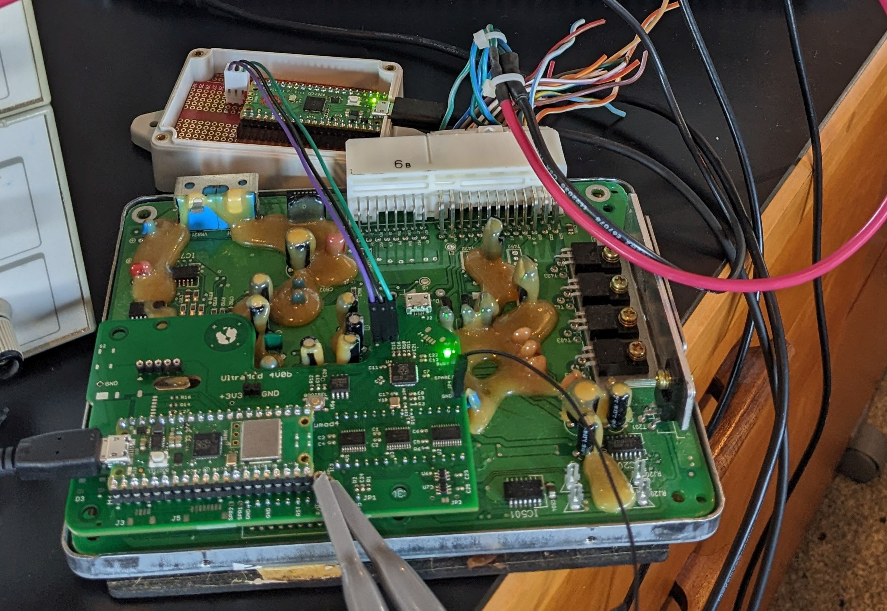

# Umod4: The UltraMod, Version 4

## History

This project has been ongoing since about 2004. It all started as a project to reverse engineer how the fuel injection system worked on my spanking new 2003 Aprilia Tuono. To make a long story short, it was pretty successful and I had a ton of fun figuring things out.

Along the way, "figuring things out" turned into a project that allowed me to stream real-time ECU data out of the fuel injection computer. The ECU data stream was then combined externally with a GPS position and velocity data stream, giving me my own personal racing datalogger.

One result from that work is an annotated version of the original ECU codebase. Obviously, it is my interpretation of what is going on inside the ECU codebase. In addition, it is not complete, either. But if you have ever had the desire to stare at some impenetrable 68HC11 assembly code, check out the [ultraMod source code](ecu/src/ultraMod.S)!

Once the version 3 hardware was working back in 2006-ish timeframe, I had to go riding. Here is a graph generated from a datalog from way back when. For this graph, the only data I included was RPM, throttle position, and the state of the clutch switch.  It shows me doing a 0-100MPH run:

You can learn many things from that data log. Mostly, it proves that I'm slow: it took me about 7.9 seconds to go from 0 to 100MPH. A better rider than me would have given it a lot more throttle (green trace) in first gear. You can see I was modulating the clutch around 4000 RPM or so. A better rider would probably have been using a higher RPM and might have slipped the clutch a bit longer before letting it lock up. It took me forever to get the throttle wide open in second gear. I was shifting at about 9500 RPM (1000 RPM below redline, not optimal!) and clearly, my shifts are slow. It's all proof as to why my day job was in software, not as a drag racer.

The RPM (red trace) may look surprisingly thick & ragged, if only because a 60 degree V-twin's crankshaft rotation speed is surprisingly inconsistent through the course of any adjacent pair of crankshaft rotations. The Umod4 logs the timing of the crankshaft rotation in increments of 1/6 of a rotation. The graph makes it clear that the crank does not rotate at a nice smooth speed: the 60 degree V-twin means that the crank is speeding up and slowing down as it makes a single rotation. Those effects are more pronounced at larger throttle openings. When I closed the throttle at the end of the run, you can see that the RPM becomes more consistent (the line gets thinner).

## Umod4 Updated

This UltraMod4 project revisits the original hardware design and brings it about 20 years into the future. Fortunately, Moore's Law has been active during the interim. The expensive and obsolete 32Kx8 Flash chip from the Ultramod V3 has been discarded in place of a $1 processor that is fast enough to emulate an EPROM. Making the EPROM into a software construct opens the door to some new, interesting features when writing custom ECU software. See the EP (Eprom Processor) [README](EP/README.md) for more info on what a software-based memory chip can do.

The latest V4 hardware supports the following features:

* EPROM Processor (EP)
  * RP2040 Dual-core Cortex M0+ processor
  * One core pretends to be the EPROM for the Gen I ECU
  * One core passes the ECU data stream to a secondary processor for logging
  * 16 Megabytes of Flash for holding potentially hundreds of ECU images
  * ECU images can be selected before going for a ride
* Wireless Processor (WP)
  * Correlates the ECU data stream with GPS position and velocity information, then logs the correlated data stream
  * Bluetooth - The main user interface to the Umod4
    * EPROM image selection
    * real time ECU and system status
  * WiFi - A faster interface used for:
    * Dumping ECU data logs to a server after a ride
    * Uploading new ECU firmware images
    * Uploading new Umod4 firmware images

The software for a lot of these features still needs to be developed.

## Block Diagram

The Umod4 replaces the EPROM in a stock ECU with a circuit board to extend the capabilities of the overall system:

The SPI flash is the non-volatile storage that replaces the original EPROM. As mentioned earlier, the SPI Flash has room to contain hundreds of ECU code images.

The "V-Cvt" block performs voltage conversion between the ECU's legacy 5 volt logic domain and the Umod4's 3.3V logic domain.

The SD card is used to log the data stream arriving from the ECU. The NEO-8 GPS provides position and velocity location. The Pico-W logs everything to the SD card. The WiFi and Bluetooth interfaces on the Pico W will control Umod4 operation in some future software revision.

The GPS module is a generic uBlox NEO-8 from Aliexpress. The NEO-8 can report position and velocity data 10 times a second.

The board also contains a socketed Micro SD card. The card is treated as non-removable. This is partly because it is a bit of a pain to physically access it when the ECU is mounted on the bike, but mainly because the goal is offload logs using WiFi whenever the bike gets parked at home.

## PCB Hardware

The circuit board design is on Github, located [here](https://github.com/mookiedog/umod4-PCB). It is designed to be fabricated at JLCPCB.com. The part selections and circuit board CAM setup is ready to go for the JLCPCB process. This is kind of important because the RP2040 processor is not suited to soldering by hand. It works better to spend a few bucks and have JLCPCB perform the fabrication process using commercial pick&place machines and a real reflow oven.

I am developing software using the second revision of the PCB, named 4V1.
It contains all the changes and improvements found while doing the 4V0 bringup.
While developing the software, a list of changes for a potential 4V2 board is becoming clear.
There has been no critical need to make the 4V2 yet: the 4V1 is serving well so far.
A 4V2 PCB update would be essentially feature-driven, not for bug fixes.

### Installation

Installing a Umod4 PCB requires populating a connector in the original ECU PCB. There is an unused connector marked "CN1" located beside the HC11 CPU. The solder needs to be removed from the connector holes as seen here:

Then, a new connector strip is added. The connections on this new strip are critical. First off, they add 2 more power and ground connections so that I am not trying to power everything on the board through the single power and GND connections on the EPROM socket. Secondly, the new connector gives me access to three critical signals required for working with the HC11 processor on the ECU:

* HC11 RESET: allows the umod4 to prevent the ECU processor from running while it sets up the ECU code that it will present to the ECU
* HC11 E clock: Synchronizes the timing between the umod4's fake EPROM interface and the ECU's processor clock
* HC11 RW signal: lets the umod4 know if the current bus operation is a read or a write. Depending on the specific write address, writes can represent requests to log data, or they can be treated as RAM accesses to special areas inside the EPROM image which act like RAM instead of EPROM. This allows the ECU firmware to expand its RAM space, which was pretty limited in the original system at only 512 bytes.

With the new CN1 connector strip added as shown above, the Ultramod4 board can be installed. It gets held in place with 4 screws and standoffs (not shown in this picture). The board in this picture is an original 4V0:

The little white box with the three wires just above the ECU is a hardware debugger that was used to develop and debug the "Fake EPROM" software in the RP2040.

The fake EPROM is a busy little thing. The ECU sends it read and write requests 2 million times a second. Each request needs to be performed properly and within the HC11's timing requirements. It has to be verifiably perfect in its timing and operation. The last thing I want is a software bug that makes my engine stop running. While my bike is straddling some railway tracks. With a train coming...

The 4V1 board made a few substantive changes.
One of them was to rotate the Pico processor module end for end so that a USB cable could be plugged into the board permanently while the ECU was mounted on the bike.
The other end of the cable sits under the seat.
When parked in the garage, the cable can be plugged into a nearby USB power supply.
This source of power allows the 4V2 board to operate even though the bike is turned off.
And that is how it will be able to do things like dump ride logs over a wifi connection, or get OTA firmware updates.

## Status

As always, things are in a state of flux. On the plus side:

* The entire project is in a Github repository
* The fake EPROM code works great:
  * The Tuono runs fine!
  * I can mix and match maps from EPROMs with my data-logging codebase (at build time)
  * The EPROM image loader works with both normal and protected EPROMs
* Data logging works: ECU data and GPS data are written to a single, time-correlated logfile, currently using LittleFS as the file system.
* The WP module is now using a Pico2W. The extra speed and RAM space is much appreciated.
* A log [Visualizer](./tools/README_Visualizer.md) is taking form!
* A new [4V2 revision](https://github.com/mookiedog/umod4-PCB) of the PCB is being planned

Since the Bluetooth interface is not yet developed, the choice of what EPROM or combination of EPROMs to run is a built-time option.
The loader can "mix and match" my special data-logging firmware with the maps out of any Aprilia EPROM that is compatible with the RP58 codebase.
In short, that means that basically any Aprilia EPROM codebase except the early small valve engines can be converted to have data-logging capabilities.

### Next Steps

The next steps mostly revolve around getting the Visualizer features fleshed out.
After that, I really want to make some progress on:

* Getting wireless OTA firmware updates working so I don't have to carry a laptop out to the garage to reflash the two umod4 processors
* Using WiFi to get log files automatically uploaded to a server after a ride

I think that OTA updates will take precedence.
Now that winter is here, I will be updating umod4 software way more than I go for rides.

## Further Reading

At the moment, this repository contains a number of pieces that make up the project:

* The [EP](EP/README.md) (EPROM Processor): the 'fake' ERPOM used by the ECU
* The [WP](WP/README.md) (Wireless Processor): the system that provides the user interface control over the Umod4
* The [ECU](ecu/README.md): this is the special data-logging firmware
* The [eprom_lib](eprom_lib/README.md): contains JSON descriptions of a number of stock Aprilia EPROMs. These get converted into BSON documents containing the original description, plus the binary data for the EPROM, should you have a .bin file for an EPROM.
* The log [decoder](tools/README_LogDecoder.md) and [visualizer](tools/README_Visualizer.md) tools

Check out the README.md files in each of the repository subdirectories.

For a real challenge, try [building the software system](BUILDING.md) yourself.
It's not much use without a circuit board, but if you are a software person, you might give it a shot just for fun.

## Clarity

Just to set expectations, **this project is all just for fun**.
I am not trying to build a product.
I do not want to build a product.
Any decent product needs support, support takes time, and I am jealous of my time.
Time is best spent on fun things.
Which is not support.

## ...As Always

