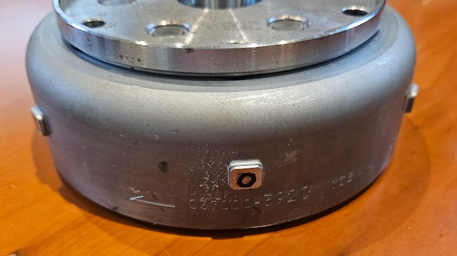
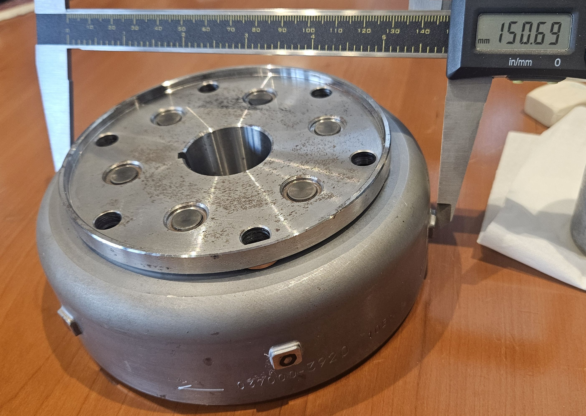
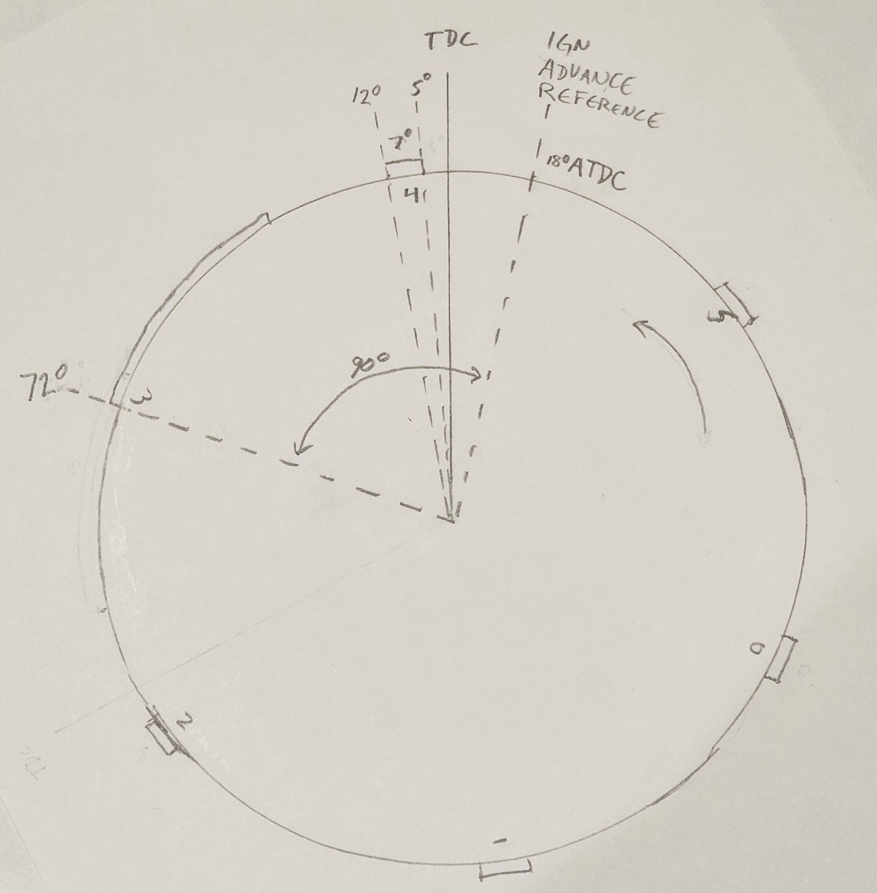
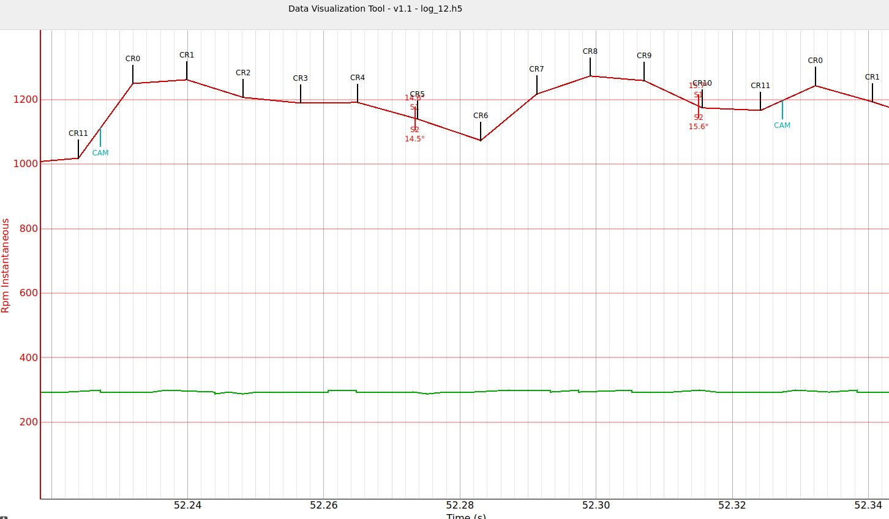
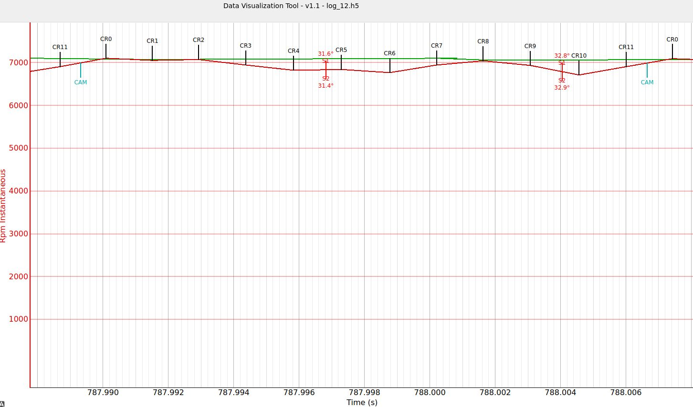

# Ignition Processing

This document will explain how the ignition tables in the Aprilia RP58 firmware are constructed and used by ECU firmware.
The ignition tables enable the ECU to calculate how much spark advance it should be applying as it prepares to fire each cylinder during engine operation.

## Crank Timing Analysis

Before getting into the spark advance calculations, it is important to understand how the ECU sees the crankshaft as it rotates.
The ECU gets signals from the crankshaft 12 times per revolution.
These signals are generated by metallic protrusions sticking out from the alternator rotor that pass under a variable reluctance sensor.
The sensor detects two situations:

* when the leading edge of the protrusion passes directly underneath the sensor
* when the trailing edge of the protrusion passes directly under the sensor

There are six protrusions on the rotor, numbered 0 through 5.
The photo below shows CR0, the first protrusion.
CR1 would be the protrusion at the right side of the photo.
CR5 would be the protrusion at the left side of the photo.
CR2/3/4 are around the back of the rotor.
The rotor has an arrow indicating its direction of rotation:



The leading edges of the protrusions are spaced exactly 60 degrees apart.
This is known from various sources throughout the Aprilia documentation.

For the most part, the ECU firmware only cares about the timing related to the leading edge of a protrusion.

### Crank Sensor Protrusion Measurements & Calculations

Certain ECU calculations require knowing the size of the protrusions, measured in degrees.
This is not documented anywhere, so measurements were made to enable those calculations:

* The diameter of the protrusions across their top face measures out at 150.7mm
* The width of the narrow protrusions at their top face measures out at 9.15mm



The circumference of the circle corresponding top the top face of the protrusions must be Pi * 150.7mm, or 473.4mm.
This means that the width of a protrusion in degrees can be calculated as (9.15/473.4)*360, or 6.96 degrees.
That is so close to 7.0 that it would be reasonable to assume that the protrusions were manufactured to be nominally 7 degrees wide.

### Relationship of Protrusions to Crankshaft Position

Facts:

* The Rotax V990 Shop Manual (Aprilia PN 8140587) page 2-6 states that when the bike is being started, ignition advance is 5 degrees BTDC
* Examination of the RP58 firmware shows that when the engine is being started, the ignition coils will be fired at the trailing edge of CR5 (front cylinder) or the trailing edge of CR10 (rear cylinder).

Adding those two facts to the measurement calculations allows us to make the following statements:

* the trailing edge of CR5 must be located at 5 degrees BTDC
* the leading edge of CR5 must be at (5+7) or 12 degrees BTDC
* the leading edge of CR4 must be 60 degrees ahead of CR5, or 72 degrees BTDC

A picture can be generated showing the complete relationship between the crank protrusions and the crankshaft position in regards to front cylinder TDC. Apologies for the hand drawing - I might make a better one some day:



## Ignition Tables

The RP58 codebase contains four tables related to basic ignition processing.
These tables are:

* L91E5: Ignition map 18x29 Restricted ALPHA/N cyl 1 (Front)
* L93EF: Ignition map 18x29 Restricted ALPHA/N cyl 2 (Rear)
* L95F9: Ignition map 18x29 Derestricted ALPHA/N cyl 1 (Front)
* L9803: Ignition map 18x29 Derestricted ALPHA/N cyl 2 (Rear)

In general terms, these tables allow the ECU to decide what spark advance it should be using on the next firing cycle.
The columns in the table are based on how far open the throttle is.
The rows in the table are based on how fast the engine is currently turning.

The Lxxxx numbers represent the precise starting address of the tables in the EPROM's actual location in the address space.
The EPROM sits in the HC11 address space from 0x8000 to 0xFFFF.
In terms of an EPROM programmer, you would need to subtract 0x8000 to get the table starting offsets.
For example, table L9803 would be at EPROM offset 0x9803 - 0x8000, or 0x1803.

The tables are 18x29, where each table entry is a single byte.
The precise meaning of that byte will be covered below.
For now, just know that it can be used to specify a spark advance.

### Columns: Throttle Angle

The throttle opening is used to select the columns used for interpolation.
A fully closed throttle would interpolate between the first two columns, and a fully open throttle would interpolate between the last two columns.
In between, things are not so simple.
The issue is that the TPS measures an angle, and it measures it in a linear fashion.
The tough part is that the engine is much more susceptable to throttle changes at small throttle openings.
Consider that if the throttle is at idle (flowing minimal air), and it is cracked ever so slightly open, a tiny change in the rotation angle could easily double the amount of air flowing in.
Conversely, if the throttle is already 95% open, that same amount of rotational change that caused the amount of air to double at idle will have almost no effect on anything.

What this all means is that the tables will be biased so that they contain lots of data at small throttle angles, and much less information about large throttle angles where the changes don't matter so much.

The following is taken from the UM4 source code, describing how the rotation of VTA gets massaged into table column numbers:

```; Conversion of raw VTA Throttle angle to an interpolation table column index.
; "% open" is defined as a linear relationship between the min and max raw VTA ADC readings
; corresponding to when the butterflies are fully closed and fully opened.
;
; Table    Massaged 8P8       Throttle Opening
; Column                      (rotational sense)
;   0:     00.00 .. 00.FF     0.00% to  0.57% open \
;   1:     01.00 .. 01.FF     0.57% to  1.14% open  \  linear across the range of 0.00 to 2.27%
;   2:     02.00 .. 02.FF     1.14% to  1.70% open  /  Column step size is 0.57%
;   3:     03.00 .. 03.FF     1.70% to  2.27% open /

;   4:     04.00 .. 04.FF     2.27% to  4.54% open \
;   5:     05.00 .. 05.FF     4.54% to  6.81% open  |  linear across the range of 2.27 to 9.09%
;   6:     06.00 .. 06.FF     6.81% to  9.09% open /   Column step size is 2.27%

;   7:     07.00 .. 07.FF     9.09% to 12.73% open \
;   8:     08.00 .. 08.FF    12.73% to 16.37% open  \
;   9:     09.00 .. 09.FF    16.37% to 20.00% open   | linear across the range of 9.09 to 27.27%
;  10:     0a.00 .. 0a.FF    20.00% to 23.64% open  /  Column step size is 3.64%
;  11:     0b.00 .. 0b.FF    23.64% to 27.27% open /

;  12:     0c.00 .. 0c.FF    27.27% to 41.66% open \
;  13:     0d.00 .. 0d.FF    41.66% to 56.06% open  |  linear across the range of 27.27% to 70.45%
;  14:     0e.00 .. 0e.FF    56.06% to 70.45% open /   Column step size is 14.39%

;  15:     0f.00 .. 0f.FF    70.45% to 80.30% open \
;  16:     10.00 .. 10.FF    80.30% to 90.15% open  |  linear across the range of 70.45% to 100%
;  17:     11.00 .. 11.FF    90.15% to 100.0% open /   Column step size is 9.85%
```

The important takeaways:

* 4 columns are devoted to the first 2.27% of throttle operation
* only 6 columns are devoted to cover the final 73% of throttle operation!

It's all about managing the small throttle openings!!
This is also why the TPS sensor only needs to be calibrated for its fully-closed ADC value.
Inaccurate determination of a fully closed throttle due to TPS calibration problems matter _far_ more than the same amount of error around wide open throttle.

### Rows: Engine RPM

The RPM rows in these tables are much simpler than the throttle angle columns.

_The tables are only used for situations where the engine is running at at least 800 RPM.
The ECU processes spark events completely differently when the engine is operating below 800 RPM._

The first row represents 800 RPM, and subsequent rows increase the RPM amount by 400.

### Table Values

Each table entry defines a fixed point number in 0P8 format.
The 0P8 fixed-point format can represent values from a minimum of 0.0 (0/256) to maximum of 0.996 (255/256).
The resolution of the 0P8 format is 1/256, or 0.00391.

### Interpolation

The ECU uses the table to perform a double interpolation, one for throttle angle and another for RPM.

Double interpolation works like this:

1. for a given current RPM, find the two RPM rows that bound the current RPM measurement
1. perform a column-based throttle opening interpolation using the column values on the lower RPM row
1. perform another column-based throttle opening interpolation, this time using the column values from the higher RPM row
1. using the actual RPM and the lower and higher RPM rows, interpolate between the values calculated in steps 2 and 3

The resulting double-interpreted table value is what is used for spark calculations, described in the following section.

## Spark Advance Calculations

For the front cylinder ignition, the CR3 event processing will calculates the desired spark advance for the next firing event that will occuring sometime during mid-to late CR4 or early CR5.

An examination of the ignition calculation firmware shows that the spark advance is not calculated relative to TDC as one might expect, but to an arbitrary crankshaft reference point located exactly 90 degrees after the start of CR4.

We know that CR4 starts at 72 degrees BTDC, so the ignition reference point will be 90 degrees later at 18 degrees __after__ TDC.
The table values specify how far ahead of the _reference point_ that the spark should be fired, not how far ahead of TDC.
The table entries represent a 0P8 fixed point fraction, meaning that it will always have a value >= 0.0, and < 1.0.
Multiplying this fraction against the 90 degree span starting at CR4 and extending to the reference point, tells the ECU where to fire the spark.

Some examples might help clarify how these table values work:

* A table value of 0xFF (255) means the maximum spark advance possible, relative to the reference point.
  The spark should be fired (255/256) * 90 degrees ahead of the reference point.
  That would be 89.6 degrees ahead of 18 degrees ATDC, or 71.6 degrees BTDC, just after CR4 begins
* A table value of 0x80 (128) would be fired (128/256) * 90 degrees ahead of the reference point.
  That would be 45.0 degrees ahead of 18 degrees ATDC, or 27.0 degrees BTDC
* A table value of 0x00 (0) means the minimum spark advance possible, relative to the reference point.
  The spark should be fired (0/256) * 90 degrees ahead of the reference point.
  That would be 0 degrees ahead of 18 degrees ATDC, or 18 degrees ATDC

The manner in which the spark advance is defined by the table means that it can define advance values that are well outside the useful range.
For example, no Rotax 1000 engine is going to be firing its spark out at the extremes like 71.6 degrees BTDC or 18 degrees after TDC.
However, having such wide ranges simplifies the firmware processing a bit by letting it ignore certain error checks, but it does imply that care should be taken when generating the table data as to not request spark events that could damage the engine.

## Spark Table Formulas

Putting it all together, we can generate formulas that allow a user to convert table entries to the spark advance they represent, or convert a desired spark advance to a table entry value.

All ignition table entries are unsigned bytes, with values ranging from 0 to 255.

To convert a desired spark advance measured in degrees BTDC to a value to be stored in a table entry byte:

    table_entry_byte = ((desired_advance_degreesBTDC + 18) / 90) * 256

To convert a table entry to a spark advance BTDC:

    advance_degreesBTDC = ((table_entry_byte / 256) * 90) - 18

## Spark Scheduling

As mentioned earlier, during CR3 the ECU will calculate a spark advance based on how fast the crankshaft was turning over the last 60 degrees.

During CR4, the firmware will schedule a timer event that will trigger the spark.
It does this by calculating the desired advance time in front of the reference point.
There is an inherent assumption here though: the ECU can't possibly know the exact time that the crank will pass through the reference point.
Instead, the firmware makes an assumption that the time it will take the crank to turn the 90 degrees from CR4 though the reference point will be the same amount of time as it took the crank to turn the previous 90 degrees.
In fact, sharp-eyed readers will note that the firmware doesn't actually measure the time for the last 90 degrees.
Instead, it measures the time for the last 60 degrees then it multiplies that by 1.5 to get an estimated time for 90 degrees.

In any case, the estimation that the next 90 degrees will be proportionally accurate based on the previous 60 degrees of rotation, is just that, an estimation.

The basic assumption is that the firmware assumes that the crankshaft rotation speed is relatively consistent.
This is only sort of true.
To a first order, unless the crank is speeding up because it is in the middle of a power stroke, it has to be slowing down.
That's physics.

Just to show you what is going on, here is an Aprilia Rotax twin engine idling at approximately 1200 RPM, showing 2 full rotations of the crank:



The CR markers indicate the starting point of each CR event.
It can be seen that the crank is speeding and slowing by about 20% while making a single rotation.
Also note that the measured spark advance is displayed as S1/S2 for the dual plugs in the engine.
At idle, it would appear that this engine was running around 15 degrees of advance.

The same effect shows up at high RPMs too.
Here, the engine is at full throttle, spinning at about 7000 RPM:



Having gone to the trouble of showing all of that, it would appear that the firmware completely ignores these effects.
For the purposes of spark advance timing, it just assumes a constant crank rotation speed, and things work out pretty well anyway.
More modern ECUs will get way more information about the crankshaft that the Gen 1 Aprilia.
For example, they might put a sensor on the main camshaft timing gear to watch the gear teeth go past.
That might given them 10 times as much timing data.
But, it also takes a way more powerful processor to deal with all that timing information.
For the Gen 1 Aprilia, it is what it is: 6 crank events per rotation.

Once the advance timing has been calculated in terms of a fraction of the 90 degrees between CR4 and the reference point, it is some simple math to convert that to an equivalent amount of time to wait _after_ CR4 before firing that spark.
The firmware calculates that value and stores it in a special timer "Output Compare" register.
When the free-running CPU timer matches the calculated time in the output compare register, the spark gets fired automatically.
