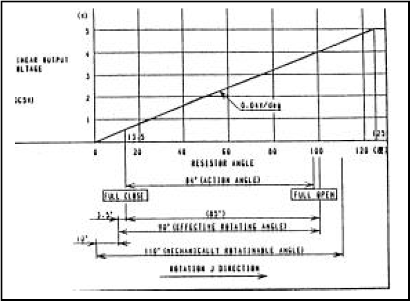
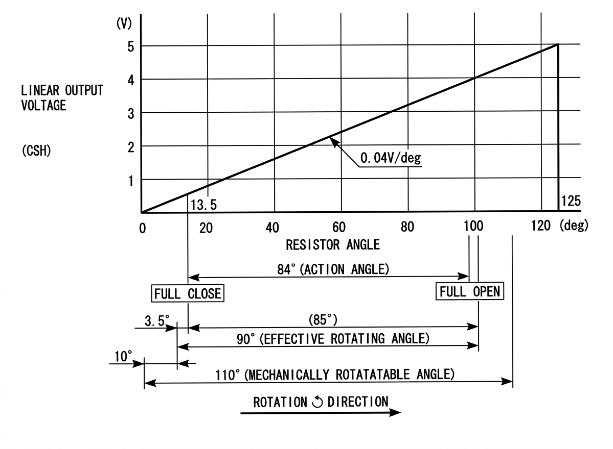
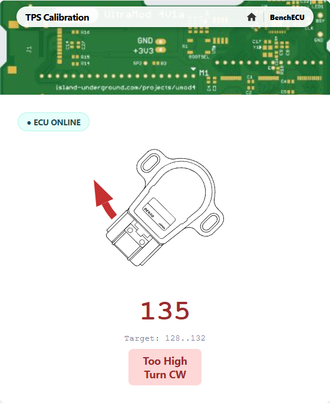

# Throttle Position Sensor Operation

From a rider's point of view, the throttle position sensor (TPS) is the single most important ECU sensor.
It gives the ECU an indication of what the rider wants the engine to do: speed up, slow down, hold steady.

There is extremely little documentation that exists for this sensor.
The original manufacturer does not make it any more, and there are no data sheets available on the web.
The only mention of how this sensor operates is found in the Aprila manual "RSV 1000 Technical Training Course
RSV Mille", found in various places on the web.
It all comes down to a single pixelated image in that manual, reproduced here in all its fuzzy glory:

After spending time with an AI to clean up the image and attempt to decode what it actually says, we get this:

It looks glorious, but as we will see, there are issues with the data it purports to contain.

As we go through this document, we will be sure to document what we know to be a fact versus what can be inferred, and what is more conjecture.

## The Throttle Body

To complicate things a bit, it can be seen in the photo below that the throttle plate "butterflys" are not 90 degrees to the manifold bore when fully closed:

Using calipers, I measured the butterflys as being about 9 to 10 degrees from being perpindicular to the bore.

When the throttle is opened as far as mechanically possible, the butterflys appear to be 90 degrees to the bore, meaning open as far as possible without seeming to go past vertical.

## TPS Sensor Operation

The VTA sensor is a linear rotary potentiometer (fact).
The graph documents the pot response curve as having a slope of 0.04 V/deg, with the output line passing through the origin.

Note that all angles in the TPS diagram are "resistor angles".
This is the rotation angle of the pot's wiper shaft, NOT the angle of throttle plate in the throttle body bore.
These are related but not equal.
The throttle butterflys can only move from about 10 degrees to 90 degrees, or about 80 degrees total.
The diagram describes the "Action Angle" as being 84 degrees, which would seem to describe the range that the throttle butterflys can move.
The TPS sensor is designed for more movement than that: it can apparently move through an angle of about 110 degrees.
This allows the TPS sensor to be aligned with the butterflys so that when the butterflys are fully closed, the TPS sensor is reading a bit above zero Volts.
Likewise, the TPS sensor is capable of rotating a bit more even when the butterflys are fully open.
This means that the TPS will never be able to report values all the way through the ADC conversion range.

### Broken Sensor Detection

The ECU knows that the TPS cannot possibly report values at either the high or low end of the ADC conversion range.
It uses this knowledge as a means of detecting broken TPS sensors:

* if the TPS sensor returns an ADC of 0 (TPS output 0V), it means that either the TPS output connection is broken, or the 5V supply to the TPS is missing
* if the TPS sensor returns an ADC of 1023, it means that the TPS ground wire is open

## TPS Calibration

The ECU firmware needs to know the precise relationship between the TPS shaft and the throttle butterflys.

The TPS DIAG calibration mechanism built into the ECU is designed to allow a mechanic to set the relationship between butterfly angle and TPS angle exactly where the ECU firmware wants it.

Decoding the ECU firmware shows exactly how this process works.
When the throttle is fully closed, the ECU's DIAG firmware wants to see the ADC converter report a value in the range 128..132.
Values in that range will display "0" on the dashboard.
Values below 128 will display "+1" on the dashboard, and values above 132 will display "-1".

## Discrepancies

The diagram published in the Aprilia doc has some discrepancies with what I can measure.
The measurements below are from a motorcycle which was reporting "0" (TPS is calibrated), and in fact, had never had its TPS adjusted from the factory:

|TPS Reading Situation| ADC Counts|
|--|--|
|Idle screw backed out | 128/129|
|Idle screw at normal idle position| 134|
|Throttle wide open|799|
|Throttle wide open, twisting as hard as possible|801|

The DIAG "0" reading with the idle screw backed out matches up perfectly with a calibrated TPS reading between 128 and 132 ADC counts.

### #1: "Fully Closed" Throttle angle

The diagram shows a fully closed throttle at 13.5 degrees.
According to the diagram, that would be 0.54V, or 111 ADC counts.
This absolutely cannot be true if the ECU firmware calibrates a fully closed throttle to be 128 ADC counts.
A reading of 128 ADC counts must be 0.625V, assuming a perfect 5.0V supply.

### #2: Action Angle

The "action angle" is specified as being 84 degrees.
If my measurement on my spare throttle body is accurate, the fully closed throttle plate is about 9-10 degrees off being flat.
If I add 84 degrees of 'action angle' to that, I end up at 94 degrees, which is past vertical.
That seems unlikely: the mechanical stop would definitely be designed to keep the throttle from going past 90 degrees open.

### Takeaway

The 13.5 degree angle when closed cannot be correct.
The 84 degree action angle cannot be correct either.

It may be that the picture in the technical manual was a generic sensor response curve, and perhaps not specifying exactly what is going on in the Rotax 1000.

In spite of the discrepancies, I am going with the following two statements:

1) Fully closed throttle reports 128-132 ADC counts: a hard fact from DIAG calibration
2) Fully open throttle reports 799 counts (measured, but not proven)

The statement that really matters is "128 counts at fully closed".
Small changes matter at small throttle openings!
The difference between fully closed and a happy idle RPM is only 4 ADC counts.

Conversly, when the throttle is almost wide open, a fraction of a degree equating to those same 4 ADC counts is a completely meaningless difference in airflow.

## Ratiometric Throttle Measurements

We define that the throttle is 0% open when the butterflys are fully closed at the TPS calibration point.
We also define that the throttle is 100% open when the butterflys are at their mechanical limit, 90 degrees to the throttle body bore.

An advantage of defining the throttle opening in percent is that the TPS and the ADC use the same reference voltage (+5V).

The TPS is driven by Vcc (+5V), which is also used as the ADC reference Vref.
This means that the measurements of TPS voltage are ratiometric with respect to Vcc.
The output of a percentage calculation is independent of Vref.
Inaccuracies in the supply voltage will not matter.

## The Conversion Formula

To convert a throttle opening from ADC to percent:

    percent_open = (ADC - 128) / (799 - 128) * 100

This formula makes an assumption that the minimum value reported by the ADC will be 128 counts.
If the ADC reading were to go over 799, this formula would return a value slightly over 100%.
This is not a problem for the ECU firmware, because any throttle opening readings over the maximum value for a table get clamped to the maximum value as part of table processing.

## New TPS Calibration Mechanism

As a result of going through all this TPS analysis, a new TPS calibration mechanism was added to the WP firmware.
It performs the exact same calibration procedure as the standard ECU firmware, but it does not require connecting the DIAG wire.
To use it, turn the bike's ignition on, then navigate to the bike's home webpage and select "TPS Calibration".
Your phone will walk you through the calibration process showing you how to adjust the sensor in real time:

