# Visualizer Operation

The '[viz](src/viz.py)' program is what allows a user to look inside a log and see what happened.
The general goal is to allow users to:

* Select the specific ECU data streams they are interested in examining
* Navigate through time to select the area of the log they are interested in
* Zoom in and out to see detail as required

At this point, it is best to just show some pictures.

Here is a log of me starting up on a fairly cold November day, letting the bike warm for a long time, then going for a short ride.

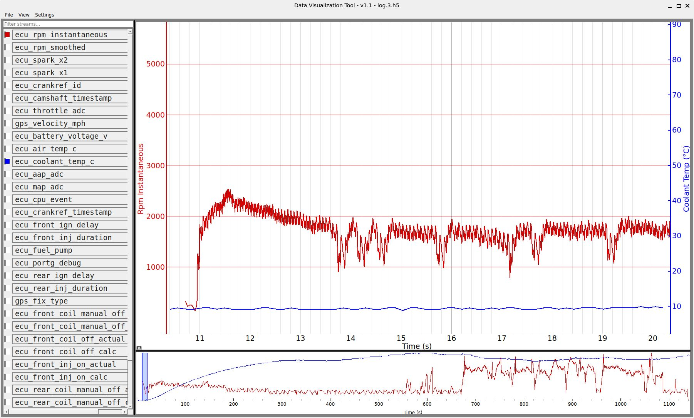

## Data Streams

The pane on the left shows all the data streams that can be visualized.
In this example, we are looking at instantaneous RPM (red) and coolant temperature (blue).

As an engine rotates, the crankshaft speeds up and slows down.
In the most general terms, if a crankshaft is not speeding up during its power stroke, then it is slowing down.
This constant change in rotation speed is one of the reasons you feel vibration when an engine runs.
The rotational speed reported by the tachometer on the dashboard is heavily filtered so that you are seeing a nice, smooth RPM report.
When trying to observe the minute details of engine operation though, we want to see how the speed varies during a single rotation.
In the case of the Rotax 1000cc twin, the ECU tracks the position of the crankshaft 6 times per rotation, meaning that every 60 degrees, the ECU knows precisely where the crankshaft is.
By measuring the time between subsequent crankshaft position events, the ECU can calculate what the rotation speed was during that fraction of a crank rotation.
For the purposes of viewing logs, this is defined to be the crankshaft's 'instantaneous' RPM.

## Navigation Window

The narrow strip at the bottom is called the Navigation View.
The navigation view shows the entire log (timewise).
You can click and drag a box in the navigation window (or in the graph window) to zoom in on any area you want.
Clicking inside the blue box in the navigation window allows you to quickly pan the upper graph screen to anywhere in the log.
The program suppports infinite "undo" that undoes the entire sequence of zoom or pan operations you might have performed before.
In all, you can quickly move around the log, quickly take a detailed peek at something, then "undo" to pop back to the previous view you.

In this case, the navigation window shows you that I warmed the bike up for nearly 10 minutes (600 seconds) before heading out.
The bike is clearly warming up as evidenced by the slowly rising blue line (coolant temp) in the navigation window.
The navigation window shows the coolant temp stops rising when it hits about 75C, which is where the thermostat begins to open.
The thermostat clearly does its job, and coolant temperatures hold at 75C for a bit.
Once the entire cooling system gets up to 75C, the coolant can begin getting hotter again.

You can see the revs rise twice as I left my driveway, then three more times as I drove down the road away from my house towards the main road.

I had to wait for at idle for nearly 90 seconds before traffic opened up and I could turn left onto the main road.
After that, revs rise and fall as I drive around.
As the bike gets some velocity under it and some cold air moving through its radiator, you can see the coolant temperatures drop right back to 75C again.
The thermostat does its job though, and never lets the coolant temperature go below 75C.

The ride was a short loop through the local neighborhood, just to test the latest logging software. And at end, the RPMs are back to idle as I get the bike parked in the garage.

## Details

The navigation window always shows the entire ride, but there will be plenty of times when detail is even more fun.

To see the detail in a ride log, look for that narrow blue box in the navigation window.
The data inside that blue box corresponds to what you see in the big graphic window.

You can click and drag the blue box anywhere in the navigation window to quickly pan to any part of the log.

If you click and drag in the navigation windown, you can select an area to look at in the main window.
A bigger selection area zooms out, and smaller selection area zooms in.
You can also click and drag in the main window to zoom in on an area.
Keyboard shortcuts also work to zoom in and out, and to pan the whole main window left or right:

* "ctrl +" to zoom in by a factor of 2
* "ctrl -" to zoom out by a factor of 2
* "ctrl \<arrow-key\>" pans right or left by 15%
* "shft \<arrow-key\>" pans right or left by 50%

Once zoomed into a particular level of detail, the arrow keys make it easy to see what came before or after without changing the zoom level.

Looking at that first graph in more detail:
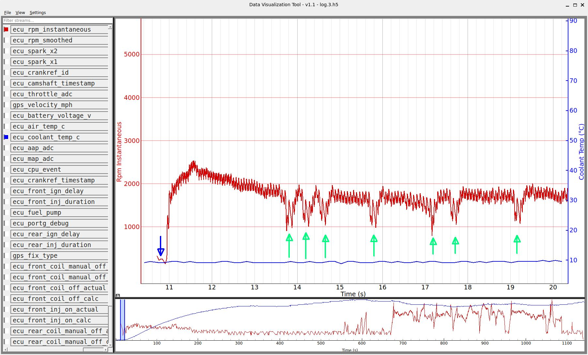

The blue arrow shows the engine turning slowly as the starter cranks it over.
Note: the blue and green arrows were added manually to aid in the descriptions below.

After only a bit of cranking, the engine fires right up.
In about 2 rotations of the crankshaft, the RPMs jump from below 500 RPM to nearly 2000 RPM.
The RPMs picked up even more until I adjusted the handlebar fast idle control to slow it down a bit.

What is really interesting though is the 7 green arrows.
I put those in because as the bike started that day, it was missing.
That's really unusual: it does not normally do that.
The green arrows clearly show the engine missing - slowing down for a rotation or two, then speeding back up again to where the RPMs should have been all along.

And this is where the visualizer starts to prove its worth.
Zooming in on that very first green arrow, we see this:
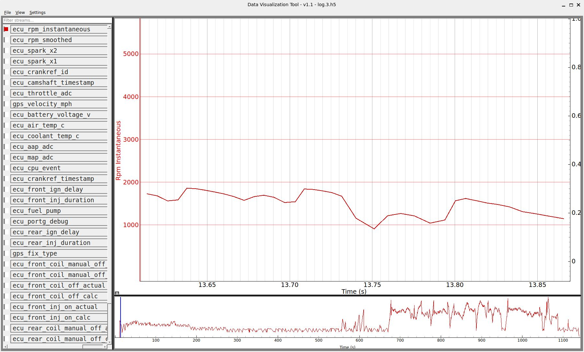

It can be seen that the rotation speed of the crank drops from nearly 2000 RPM to below 1000 RPM in the span of 2 rotations.

To analyze why that is happening, here is a diagram from the Aprilia doc describing the sequence of events that occur as the engine goes through the first full two rotations of the crank (one complete 4-cycle sequence) when starting up:

The graph line N (NNUM) in the Aprilia documentation is what I call the CRID, or **C**rankshaft **R**eference **ID**entifier.
The falling edge of the cam sensor signal tells the ECU that the next crank sensor event will be CR0.
From there, each subsequent crank sensor event increments the CRID count up to 11.
At that point, the next cam sensor arrives and the CRID count starts over at CR0.
The important aspects of the Aprilia diagram show that the power stroke for the front cylinder starts on CR5 and runs through CR7.
For the rear, the power stroke starts on CR10 and runs through CR0.

I'm proud of this next bit: one of the graphical ECU streams the log visualizer can display is the CRID.
Not only that, it can be displayed in relation to the instantaneous RPM:
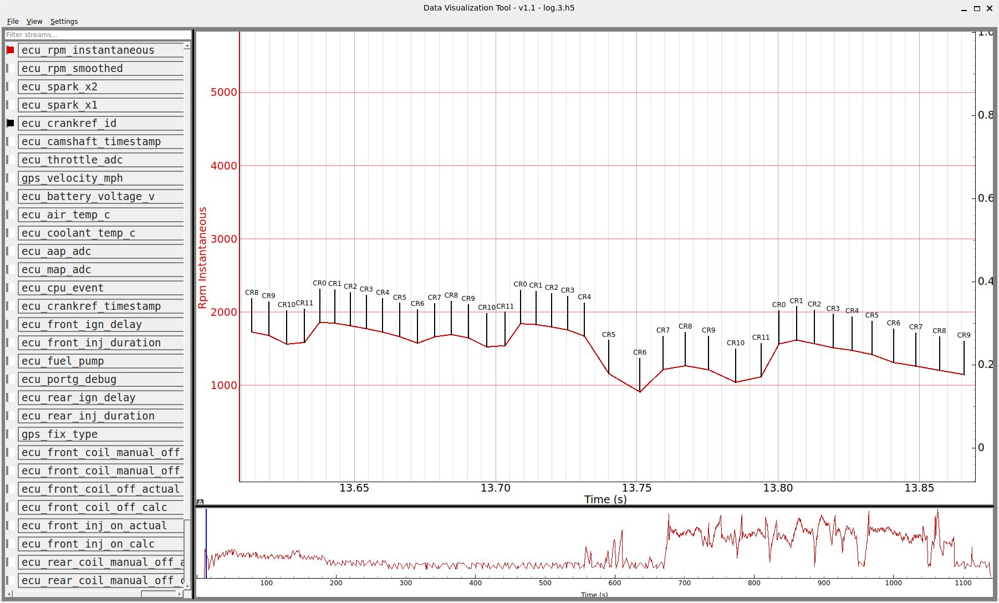
Those markers on the RPM data indicate the start of each CR event, as per the Aprilia doc.

So what does it all mean?
Firstly: the power stroke may not be entirely intuitive, at least at idle speeds.
Starting from the left side of that graph, you can see CR10,11, and 0 which represent the power stroke of the rear cylinder.
You can see that the crank barely speeds up at all during CR10, even though it represents the first 60 degrees of the power stroke.
At low engine speeds, essentially all of the increase in speed of the crank occurs during CR11, the middle 60 degrees of the power stroke.
It actually makes sense: if you think about it.
When the piston is at the top of its stroke, the pressure in the cylinder might be really high, but the ability to turn that pressure into mechanical rotation is almost nothing because the rod itself is vertical.
The piston gains the most mechanical advantage to turn the crank after the crank has rotated 60 more degrees to begin CR11.
The final 60 degrees of the power stroke in CR0 is not just wimpy, the crank is actually slowing down!
That's partly because the rod is becoming vertical again so there is little mechanical advantage to twist the crank.
It's also due to the fact that the temperature and pressure in the cylinder has dropped dramatically because the increase in volume in the cylinder as the piston sweeps downwards.
Finally, it's because at idle speeds, the engine has hardly any mixture to burn, so peak pressure is probably not very high, and then its over and done with pretty quick.

The takeaway is that when things are running properly at idle speeds, the crankshaft will clearly increase its rotational velocity during:

* CR6, when the front cylinder fires
* CR11, when the rear cylinder fires

Now check out the detail in the circled areas in the screenshot below:
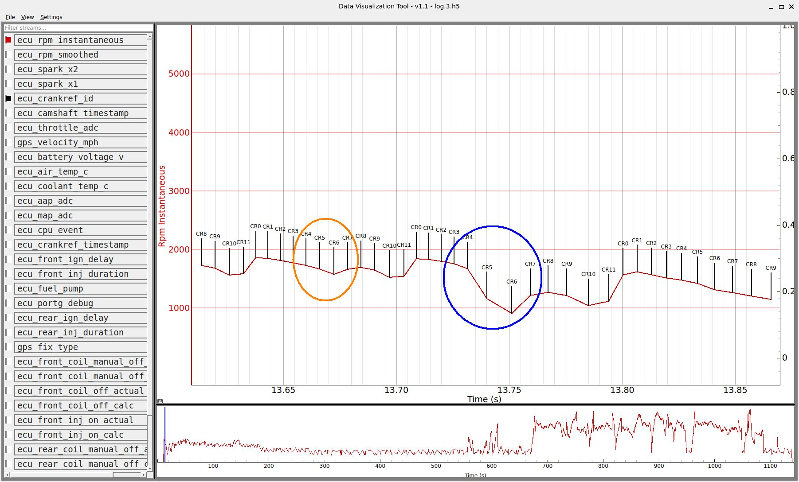

There are a few things to note.
If you look inside the orange cicle, you see a proper firing cycle.

* All CRIDs 3/4/5 are all approximately the same width
* They are all slowing though, as it has been some time since the last firing event, so the crank can only be slowing down since then
* CR6 shows the increase in engine RPM, which is exactly right because it is the maximally effective portion of the power stroke
* The crank generally slows down after CR6, all the way until CR11 when the rear cylinder fires and speeds it up again

So what happened when the engine "missed", inside the blue circle?
A few things are obvious:

1) The duration of both CR4 and CR5 are a lot wider than CR3. The crank is slowing down. That is __NOT__ how the previous cycle CR4/5 looked where CR3/4/5 were about the same duration.
1) Interesting Fact: the front cylinder did __not__ misfire: the crank clearly speeds up during CR6. Had it been a genuine misfire, CR6 would have been slower than CR5.
1) Even More Interesting Fact: CR5 took an extra long time compared to the previous CR5. Normally, you will see the crank slow slightly during CR5 because it was just completed the compression stroke. The spark should have lit off the cylinder just prior to TDC, but the increasing pressure is unable to spin the crank faster just yet.

So why was the CR5 circled in blue _so_ much slower?
Well, the log contains even more data to look at.

The ECU has [circuitry that detects the high-voltage kickback](https://github.com/mookiedog/ApriliaGen1ECU/blob/main/ECU_s2.png) that occurs when the coils fire.
In theory, this circuitry detects that a spark occurred.
In practice, this may not be _precisely_ true.
There are plenty of reasons why a coil could fire, but result in no spark at the sparkplug:

* The sparkplug boot fell off
* Cracked insulation on a high-voltage wire
* Fouled sparkplug tip

But assuming that those abnormal situations above were not happening, the spark sensor circuit really does indicate that a spark occurred.
The standard ECU firmware uses these "coil fired" signals to verify that sparks are happending.
If it failes to see them, it will blink the EFI light on the dash.
For the purposes of the umod4 datalogger, it gets even better.
The ECU's processor actually captures the precise time that the coil fired.
That allows the UM4 logging firmware to logs the precise time of every single coil/spark.

The visualizer allows this "spark occurred" data stream to be graphed.
Enabling the spark data stream yields some interesting results:

The tags marked 'S2' indicate when plug #2 fired.
The ECU also tracks when plug 1 fires.
Typically, the time difference between S1 and S2 events is a very small number of microseconds.
For simplicity, the graph above only enables plug #2.

Looking at the first 3 spark firing events, it can be seen that they line up almost exactly with the start of CR10 or CR5, meaning that they are firing when the piston basically right at TDC (Top Dead Center).

But if you look at the problem event, you see something different.
In short, CR4 takes unusually long to complete, which has the side effect that the spark occurs significantly in advance of TDC.

And _that_ means that pressures in that cylinder are going to be extra high before the piston has even got to the top yet.
The extra high pressure will slow the crank down more than normal as it tries to get over the top to begin the power stroke.

The next spark timing event shows that it is a tiny ahead of CR10, but apparently not enough to cause a noticible problem.
The final spark event in that view is right where it should be.

The net result is that that the "misses" were not actually misses, but the result of a spark that fired a bit too early.

Why _that_ happened, I do not know yet.
There will always be mysteries.

There are plenty more ECU data streams, too.
Here is an example showing the cam sensor signal.
As mentioned earlier, the cam sensor indicates that the next CRID will be CR0.
It can be seen doing exactly what it should be doing right here:

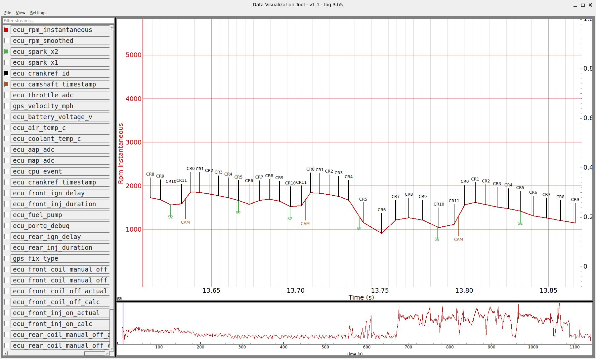

## GPS Data

The umod4 is not just about ECU data streams.
It also contains a Neo-8 GPS module.
The idea is that position and velocity data can be captured and correlated with ECU operation.
This means that a log will be able to tell me where I was, how fast I was going, correlated precisely with what my throttle hand was doing, and how the RPMs were responding to the throttle.

Much fun ensues!

The basic issue is getting GPS data on the screen.

For that, I added a visualizer view menu option that would display all the GPS info from a ride as data points on a Google Map webpage.
Clicking on view/"Show Ride On Maps" will cause a browser window to open, with a Google Map view showing an overview of the entire ride.

This is what I got from my test ride:

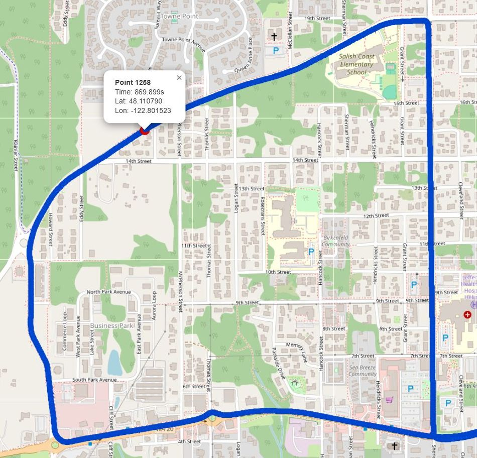

The level of detail is pretty significant since the GPS reports 10 times per second:

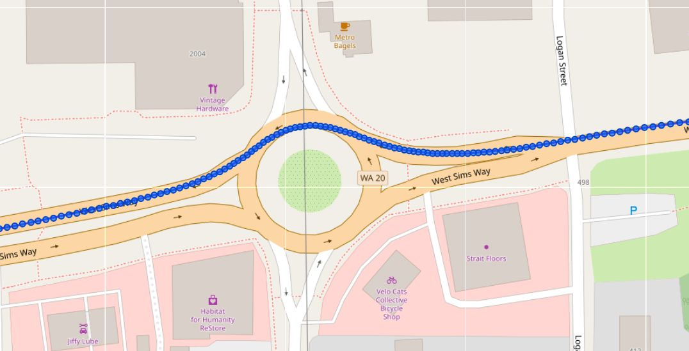

Each of those blue dots is a position and velocity report.
This particular ride map is probably the least interesting one you will ever see since the speed limit in town is basically 25 MPH.
But, it was my first GPS-tagged ride log ever!

I even got to use GPS data as a debug aid.
Case in point: to get another log test file, I went for another ride the next day.
It was equally cold, and I nearly froze my hands off.
The bike started up without the peculiar engine misses like the day before.

It was a mostly uneventful test ride, except for one thing.
At one point, I was turning right by a local grocery store.
As I started accelerating through the turn, the engine missed.
I made a mental note of that.
After getting home, I looked up my ride visualization.
It was a longer trip, hence the frozen fingers.
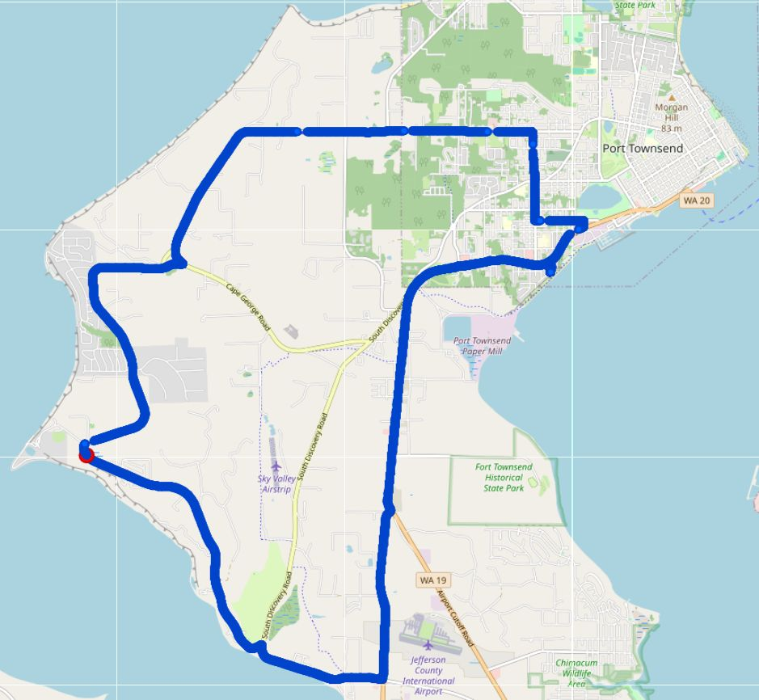

I used Google Maps to zoom in and find that right turn by the grocery store:

Clicking on any of the blue dots gives me time information for that dot.
The map tag indicates that I was turning the corner approximately 1889.7 seconds into the ride.
In the navigation view, I panned to that time area in the log, then zoomed in:
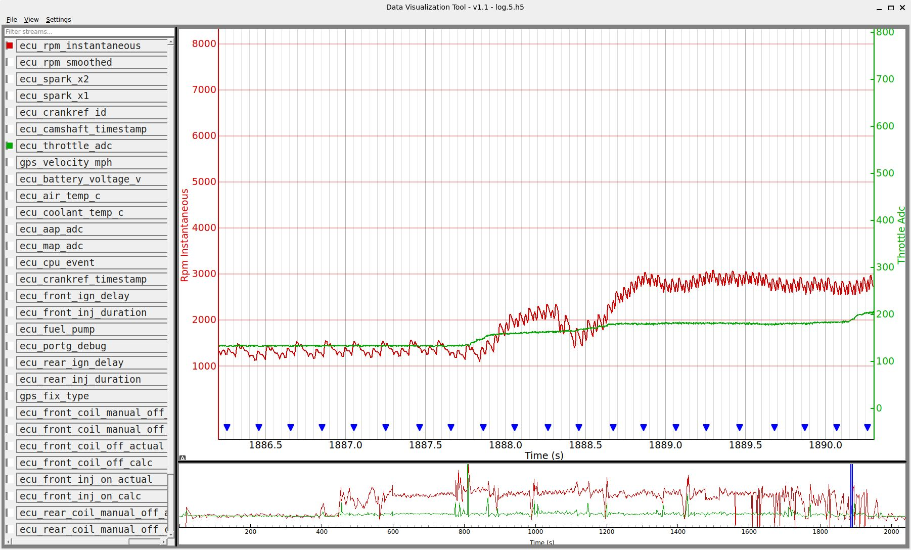

From there, it was not hard to eyeball the instantaneous RPM data and locate the engine miss I had felt.
Above, you can see me sitting at the corner, throttle closed (green graph line).
Then you can see me feed in a bit of throttle, and accelerate through the corner.
The engine clearly misbehaves pretty much exactly where the green throttle line intersects with the red RPM trace at 1888.4 seconds.
Zooming in on that event makes things clear:
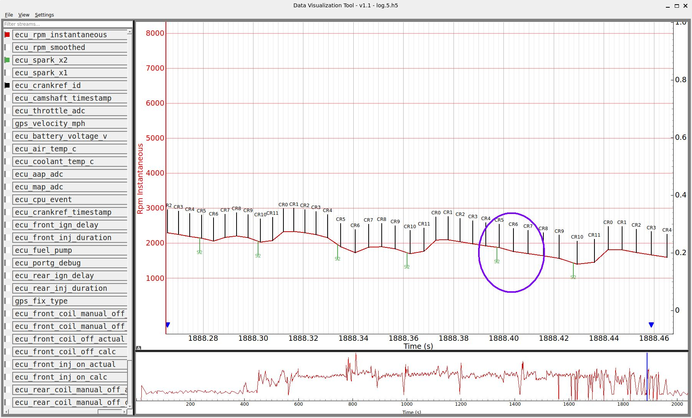

Check out CR6 in the circled area: that is where the crank would normally be speeding up during a front cyl power stroke.
Instead, the crank slows down!
You can see that the spark occured just before CR5, and the width of CR5 generally matches CR2/3/4, so this is not the same problem as the misses after starting in the ride the day before.
My interpretation is that this specific event was an engine miss, pure and simple: the spark happened, but there was no bang!
Given that the Rotax engine has dual plugs, and therefore two chances to get the charge lit off, it feels more like something weird happened with the fueling.

Or not.

I have a good friend who spent his entire career as a professional mechanic.
His sage advice was that "90% of fueling problems are ignition related."

## Higher Engine Speeds

At one point in the ride below, I pinned the throttle for a few seconds to get a log that would let me see what the engine was doing under those conditions.

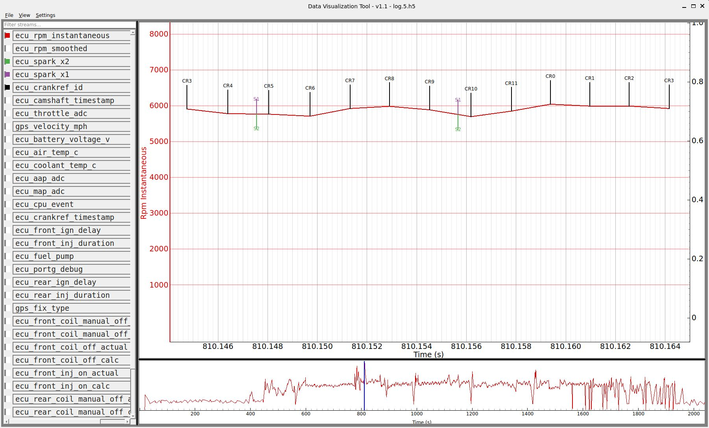

There are some interesting things to see there.

First off, the spark advance at appoximately 6000 RPM is clearly visible.
Instead of firing the sparks roughly coincidental with CR5 and CR10 like they do at idle, the ECU is firing them earlier.
This allows time for the flamefront to propagate through the mixture, so that peak pressures will occur when the piston is where the ECU wants it.

Secondly, unlike the idle situation where the crankshaft only showed an increase in rotational speed during one CR period, the crankshaft clearly speeds up during two of them now: CR6 & CR7, CR10 & CR11.

What is confusing to me at the minute is that front and rear cylinders don't seem to be acting the same. CR6 and CR7 are the 2nd and 3rd portions of the front cylinder power stroke, while CR10 and CR11 are the 1st and 2nd portions of the rear cylinder power stroke.
Obviously, I don't have answers for everything yet.

## Fuel Injectors

I added a feature to display the fuel injector pulse widths.

Here is the bike starting up.
You can see the ECU give a little priming shot to both cylinders as soon as the ECU gets its first signal from the cam sensor.
If you scroll back up on this page to the Aprilia diagram, you will see the ECU doing exactly what the diagram indicates:
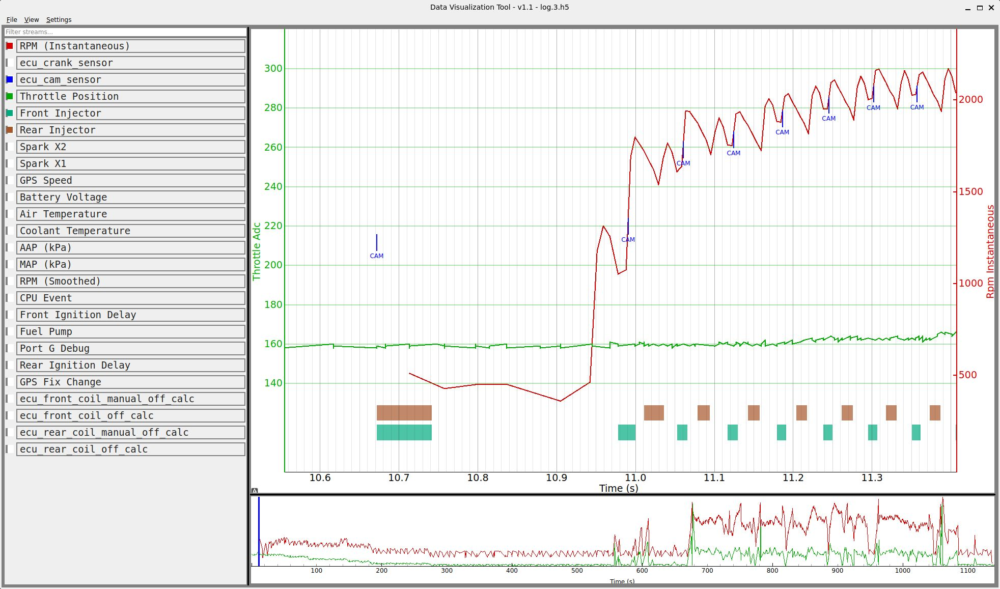

This next screen shows the bike at a bit over 7K RPM with the throttle fairly wide open:
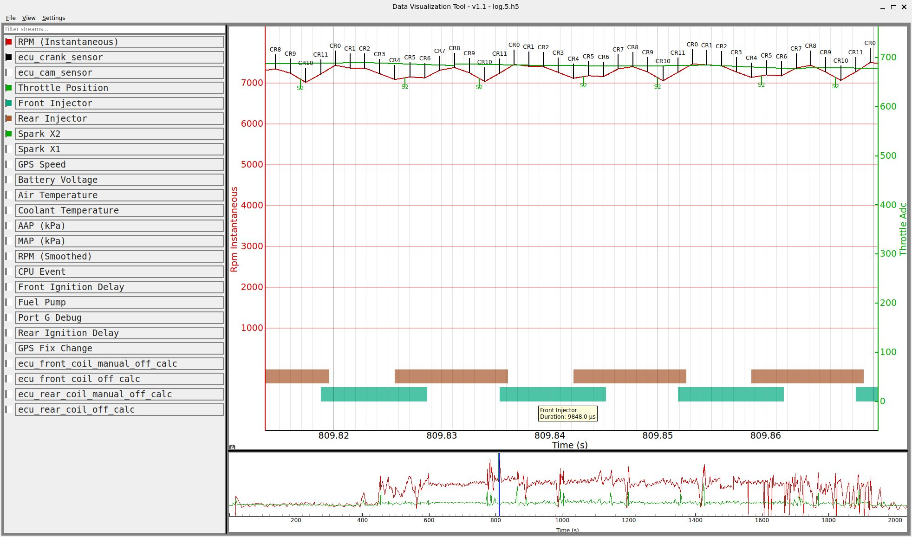

Hovering over an injector event will light up a tooltip telling you the pulse duration in microseconds.
You can see that the duration is a lot longer then when the bike was warming up in the previous image.
It makes sense: the engine is making serious power at this point!

## Wrap

So there it is.
After 20-some years of off and on development, I am finally getting some big pieces that I have wished for for years. Creating a log visualizer was a **huge** step forward.

Since day 1, I had always dreamed of getting a system like this out for a track day.
Truthfully, it's taken so long to get all this working that I think my track days are over.
It's a bit of a bummer because I would have loved to have a log of me going around Laguna Seca, immortalized as a couple hundred megabytes of data.

Oh well, I would have been going slowly anyway.
I always rode in the 'B' group with the rest of the slow guys.
But to my secret delight, I was never the slowest person at the track.
Just before I got the Tuono, I took my 15+ year old Yamaha V-Max to a Reg Pridmore Class Ride at Laguna Seca.
It was a great day.
The class photographer snapped me scraping the centerstand going through turn 3:
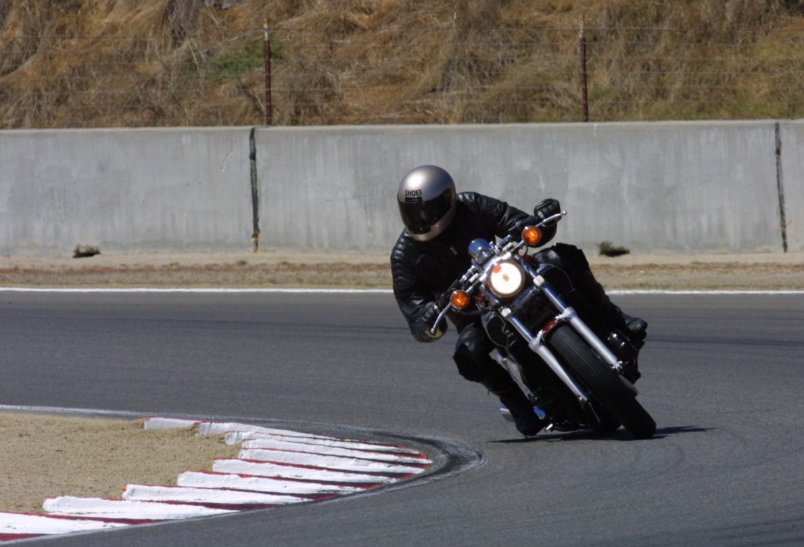

Not that it is too hard to scrape the centerstand on a V-Max.
During one break back in the classroom, the instructor asked if anyone was scraping parts.
I raised my hand.
I got a dismissive wave, and he said "Anyone else?"

The best part of that day?
Catching up to someone riding an Aprilia Mille (really!) in turn 2.
I followed them through 2, realized I was faster, got myself set up and then passed them through turn 3.
On a V-Max!!
It is proof that a 1985 V-Max can turn.
They just don't _like_ to.

## Acknowledgements

As mentioned earlier, I have imagined having a graphical log visualizer for years.
What held me back was the prospect of spending many months figuring out how to learn to work with all the graphics systems.
It was not something that I want to spend my limited brainpower on.
The big breakthrough occurred when I decided to treat the vizualizer as an experiment.
Specifically, to see if I could get a visualizer built in conjunction with the AI service, Claude Code.

I will say this: the great AI experiment was certainly not without its problems and false starts.
But on the plus side, this whole visualizer only took about 3 weeks to get from a simple idea to its current state.
It was a really interesting experiment.
Some things that seemed complicated to me were trivial for Claude.
For example, I asked Claude to display the GPS data from the log on a Google Map.
That probably took about 2 minutes and it worked perfectly, the first try.
On the other hand, getting tool tips to display injector durations properly took a couple hours of frustrating AI-interaction hell.

But clearly, I could not have made this visualizer on my own except maybe in a timeframe measured in years.
All in all, AI was good for something!

It's a brave new world out there.
